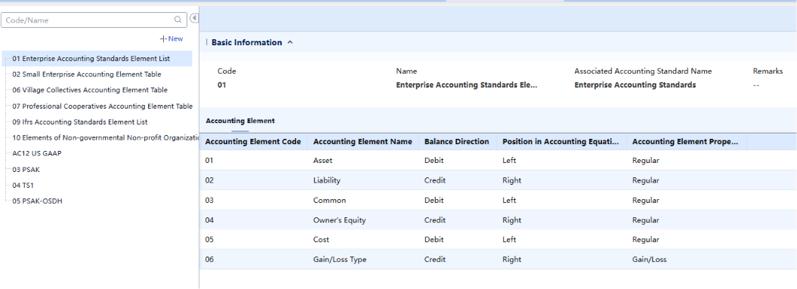
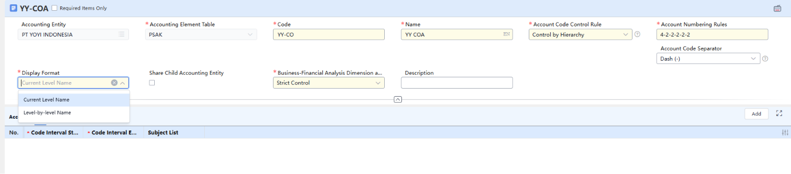
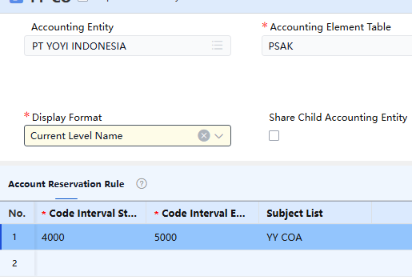
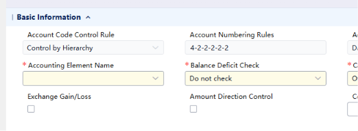
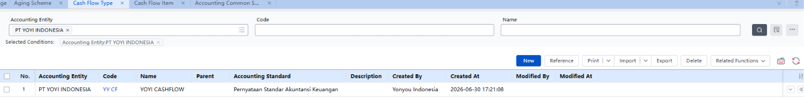
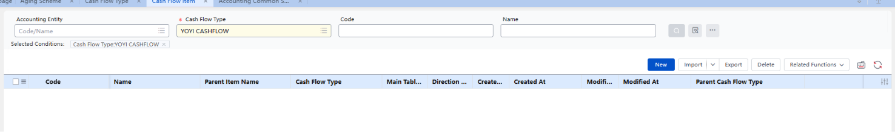
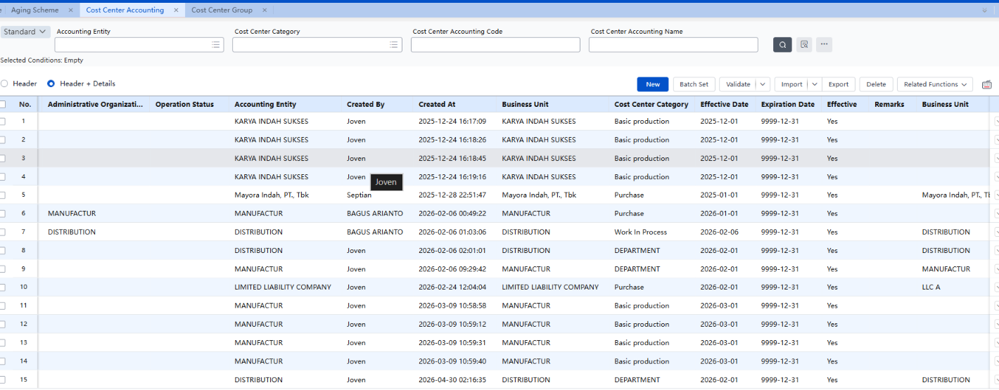
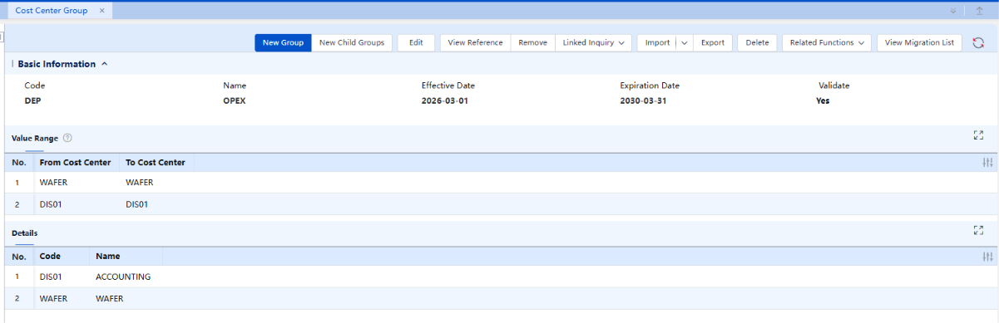
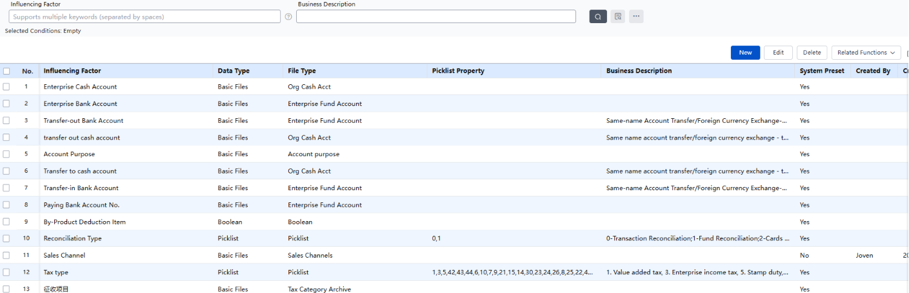
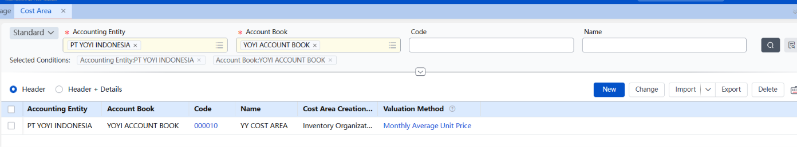

## 1. Fondasi Akuntansi: Double-Entry & Logika Debit-Credit

Sebelum belajar ERP, ada satu konsep akuntansi yang WAJIB dipahami karena muncul di semua modul: double-entry bookkeeping. Setiap transaksi keuangan selalu dicatat di DUA sisi sekaligus: Debit dan Credit, dan keduanya harus seimbang.

### 1. Aturan Dasar Debit-Credit

| Jenis Akun | Contoh | Bertambah | Berkurang |
| --- | --- | --- | --- |
| Asset (Aset) | Kas, Persediaan, Piutang | DEBIT | Credit |
| Liability (Hutang/Kewajiban) | Hutang Dagang (AP) | Credit | DEBIT |
| Equity (Modal) | Modal Saham, Laba Ditahan | Credit | DEBIT |
| Revenue (Pendapatan) | Penjualan, Pendapatan Jasa | Credit | DEBIT |
| Expense (Beban) | Beban Gaji, Beban Sewa | DEBIT | Credit |

**Catatan:** Hafalkan tabel ini. Ini fondasi yang muncul di semua modul AP, AR, GL ke depannya.

### 2. Contoh Jurnal Dasar

**Skenario 1:** Beli bahan baku Rp 10 juta dari Supplier A, belum dibayar (hutang):

Dr. Persediaan Bahan Baku (Asset)    10.000.000   <- aset bertambah

Cr. Hutang Dagang / AP (Liability)   10.000.000   <- hutang bertambah

**Skenario 2:** Bayar hutang ke Supplier A Rp 10 juta (kas keluar):

Dr. Hutang Dagang / AP (Liability)   10.000.000   <- hutang berkurang

Cr. Kas / Bank (Asset)                10.000.000   <- aset berkurang

**Catatan:** Skenario 2 sering salah dibalik. Ingat: bayar hutang = hutang berkurang (Debit Liability) + kas keluar (Credit Asset).

## 2. Hierarki Setup Keuangan di YonSuite

Sebelum bisa mencatat transaksi (termasuk AP), ada hierarki setup yang harus diselesaikan secara berurutan. Pola konsistennya: TEMPLATE dulu, baru INSTANCE (objek aktifnya).

**Hierarki Setup AACT — YonSuite**

*PT Yonyou Network Indonesia | Rickie | Update per 2 Juli 2026*

*Catatan: nomor "Step" pada draft asli ada duplikasi (Cash Flow Type dan Account Book Type sama-sama diberi angka 3). Di tabel ini nomor dirapikan jadi urutan 1–11 berurutan, isi konten tidak diubah.*

| No | Step | Keterangan |
| --- | --- | --- |
| NOTE | Aging Scheme, Cash Flow Type, Cashflow Item, Voucher Type | Sebelum semuanya dimulai, kita wajib setup AGING SCHEME, CASH FLOW TYPE, CASHFLOW ITEM, VOUCHER TYPE terlebih dahulu. |
| NOTE | Accounting Element | Cek dan pilih Accounting Element yang ingin kita set ke COA. |
| 1 | Chart of Accounts (COA) | Template/kamus kategori akun. Dibuat dulu sebelum apapun. |
| 2 | Account | Isi detail akun-akun di dalam COA (Kas, Hutang Dagang, dll). Setup Aux Item di sini. |
| 3 | Cash Flow Type | Bikin 1 aja sebagai kategori Cashflow account kita. Kategori arus kas (Operating/Investing/Financing). WAJIB ada sebelum setup Account Book. |
| 4 | Cash Flow Item | Bikin beberapa Cashflow Item untuk memperjelas cashflow kita. |
| 5 | Account Book Type | Template/kategori Account Book. Tentukan standar akuntansi, currency, dll. |
| 6 | Account Book | Buku besar aktif — mereferensikan COA + Account Book Type. Buat fiscal period di sini. |
| 7 | Enable Modul di Account Book Settings | Enable GL, AP, AR, Inventory, dll. Dilakukan SETELAH Account Book jadi. |
| 8 | Voucher Type | Jenis-jenis voucher per proses bisnis (Purchase Invoice, Payment, dll). |
| 9 | Account Cross-Reference (Mapping) | Aturan otomatis: kondisi transaksi -> akun Debit/Credit mana di GL. |
| 10 | Event Template | Cetakan struktur jurnal untuk tiap Accounting Transaction — nentuin jumlah baris, Debit/Credit, dan cara isi akun tiap baris (Fixed Value / Accounting Transaction Field / Expression). WAJIB ada untuk setiap transaksi. Kalau baris pakai cara 'Expression', dia manggil Account Cross-Reference (Step 9) sebagai sub-komponen buat cari akunnya. |
| 11 | GL Opening | Input saldo awal GL. Fondasi sebelum Opening AP. |

## 3. Chart of Accounts (COA) / 科目表

### 3. Konsep

COA adalah DAFTAR MASTER akun beserta kode dan aturan strukturnya. Ini template/kamus kategori yang dipakai Account Book sebagai referensi - bukan tempat mencatat transaksi langsung.

**Analogi:** COA = Kamus kategori budget (Makan, Transport, Hiburan). Account Book = buku catatan transaksi aktual yang pakai kategori dari kamus itu.

### 4. Step setup COA (need to know first)

**Pahami dulu Accounting Element Table.** Accounting Element Table Adalah jenis pemetaan jurnal akuntansi yang mau kita pakai.

Standarnya ada berbagai macam, ktia bisa sesuaikan saja sesuai kebutuhan kita atau kebutuhan client.

**Note:**

Pada bagian Display Format, disarankan menggunakan **Current Level Name** untuk lebih simplified suatu penamaan, jika menggunakan Level by-Level name, penamaannya itu akan seperti tangga yg dijabarkan lumayan detail, jadi sarannya sih di **Current Level Name.**

**Interval yang di-set** pada COA adalah limit atau range angka yang akan kita pakai, ini untuk men-prevent jika pada organisasi yang sama ada penambahan COA, setidaknya angka kita tidak bertumpukan dengan angka COA dari orang lain.

**Balance Deficit Check,** disini ada beberapa pilihan, do not check, warning dan error. Katakana jika kita input event entry dengan nominal, dan masuk ke akun ini, jika kita pakai fitur do not check, dari system tetep akan generate, jika warning akan dikasih peringatan sebelum generate, error maka akan langsung error.

### 5. Field Penting di COA

| Field | Pilihan | Keterangan |
| --- | --- | --- |
| Accounting Element Table | IFRS / Enterprise / Small Enterprise / Village / Cooperative | Tentukan standar elemen akuntansi. Untuk PT umum: Enterprise Accounting Standards. |
| Account Code Control Rule | Control by Hierarchy / Fixed Length / Do Not Control | Atur struktur kode akun. PERINGATAN: 'Do Not Control' tidak bisa diubah balik ke Control jika sudah ada data! Defaultnya sih Control by Hierarchy. |
| Account Numbering Rules | Contoh: 4-2-2-2-2-2 | Pola digit per level. Level-1: 4 digit. Level-2: +2 digit (total 6). Level-3: +2 digit (total 8). Dst. |
| Business-Financial Analysis Dimension | Strict / Partial / No Control | Seberapa ketat akun-akun di COA ini WAJIB terhubung ke dimensi analisis (Dept, Project, dll). Strict = wajib diisi tiap transaksi. No Control = bebas. |

### 6. Control Derivation (Parent-Child COA)

**Konsep dasarnya:**
Parent COA = "template induk" yang diwariskan ke semua child. Child COA otomatis dapat salinan semua akun dari parent, tapi dengan batasan tertentu tergantung mode control yang dipilih.

**Yang BOLEH dilakukan Child COA:**
Tambah sub-akun detail di bawah akun yang sudah ada dari parent. Contoh: parent punya akun 1100 - Kas & Bank, child boleh tambah 1101 - Kas Kecil Jakarta dan 1102 - Kas Kecil Surabaya sebagai sub-akun di bawahnya.

**Yang TIDAK BOLEH dilakukan Child COA:**
Modifikasi atau tambah akun baru di level yang sama dengan yang sudah ada di parent. Contoh: parent punya 1000 - Aset Lancar sebagai Level-1. Child tidak boleh tambah 1300 - Persediaan sebagai Level-1 baru yang tidak ada di parent (kecuali mode Weak Control — lihat di bawah).

**Strong Control vs Weak Control:**

Strong Control — lebih ketat. Child COA tidak boleh tambah Level-1 account baru sama sekali. Child hanya bisa tambah sub-akun detail di bawah akun yang sudah diwariskan dari parent. Dipakai ketika perusahaan mau memastikan semua entity punya struktur akun yang identik di level atas.

Weak Control — lebih longgar. Child COA boleh tambah Level-1 account baru yang tidak ada di parent. Child punya fleksibilitas untuk punya akun tambahan yang spesifik buat entity itu, selama tidak mengubah akun yang sudah diwariskan dari parent.

**Analogi:**
Parent COA = menu standar franchise McDonald's pusat. Semua cabang wajib jual menu yang sama.

- Strong Control = cabang hanya boleh modifikasi detail dari menu yang ada (BigMac dengan keju ekstra), tidak boleh tambah kategori menu baru.
- Weak Control = cabang boleh tambah menu lokal baru yang tidak ada di pusat (McRice di Indonesia), selain tetap jual semua menu standar dari pusat.

## 4. Account (Akun Detail) / 会计科目

### 7. Konsep

Account adalah item spesifik DALAM COA. Setiap akun merepresentasikan satu kategori pencatatan (Kas, Hutang Dagang, Persediaan, dll). Hanya end-level accounts (akun paling bawah dalam hierarki) yang bisa dipakai untuk input transaksi.

### 8. Field Penting di Account

| Field | Pilihan | Keterangan |
| --- | --- | --- |
| Balance Direction | Debit / Credit | Arah saldo normal. Asset = Debit. Liability/Equity = Credit. Lihat tabel Section 1. |
| Balance Deficit Check | Error / Warning / Do Not Check | Cek saldo akun saat closing. Error = block closing jika saldo minus. Warning = izinkan tapi beri notif. Contoh: Kas pakai Error (tidak mungkin minus). AP pakai Warning (bisa minus jika lebih bayar). |
| Cash Classification | Cash / Bank / Cash Equivalent / Other | Tag akun untuk Cash Flow Statement dan bank reconciliation otomatis. |
| Exchange Gain/Loss | Checkbox | Tandai akun ini sebagai tempat menampung selisih kurs (relevan untuk AP/AR dengan foreign currency). |
| Controlled App | Checkbox | Kunci akun ini hanya boleh dipakai modul tertentu. Contoh: akun Hutang Dagang dikunci hanya dari modul AP. |
| Business-Financial Analysis Dimension | Checkbox | Link akun ini ke dimensi analisis (Supplier, Customer, Dept, dll). Setup di sini berlaku ke SEMUA transaksi yang pakai akun ini ke depannya. |
| Auxiliary Accounting Item | Pilih dari list preset | Dimensi breakdown detail saldo. DISETUP DI SINI (level account), bukan per-transaksi. Begitu disetup, berlaku permanen ke semua transaksi yang pakai akun ini. |

## 5. Auxiliary Accounting Item & Business-Financial Analysis Dimension

### 9. Penjelasan Simple Business Financial Analysis Dimension

"Business Analysis Dimension itu kayak label yang bisa ditempel ke transaksi, biar nanti bisa ditarik laporan dari sudut pandang bisnis (project/department/region) tanpa peduli transaksi itu jatuh ke akun apa.”

### 10. Penjelasan Simple Auxiliary Accounting Item

"Aux itu nge-detailin satu akun jadi rincian yang lebih spesifik (per supplier, per customer, per karyawan), tapi tetap dalam satu akun yang sama di GL.

**Perbedaan intinya kalau mau dijelasin sekaligus:**

- **Aux** → merinci **di dalam** satu akun (vertikal, per akun)
- **Business Analysis Dimension** → nge-tag **lintas akun** buat sudut pandang bisnis (horizontal, per project/department)

### 11. Masalah yang Dipecahkan

Tanpa Auxiliary Accounting Item: akun '2100 - Hutang Dagang' hanya kasih total Rp 500 juta. Tidak diketahui berapa ke Supplier A, Supplier B, Supplier C. **(Memperdetail suatu voucher)**

Solusi salah (tapi sering kepikiran): bikin akun terpisah per supplier - 2100-01 Hutang ke Supplier A, 2100-02 Hutang ke Supplier B, dst. Masalah: kalau supplier nambah terus, COA bengkak ribuan akun.

Solusi benar (cara YonSuite): akun tetap SATU (2100 - Hutang Dagang), tapi ditempel Auxiliary Accounting Item = Supplier. Tiap transaksi, sistem wajib tag 'supplier mana'. Saldo Rp 500 juta bisa di-breakdown per supplier di laporan TANPA nambah jumlah akun.

### 12. Dimana Aux Item Disetup?

- Di form detail Account (saat setup akun di COA) - bukan per transaksi
- Begitu disetup di level akun, berlaku PERMANEN ke semua transaksi yang pakai akun itu
- Contoh: akun 2100 di-link ke Aux Item 'Supplier' dan 'Department' -> semua AP Invoice yang pakai akun 2100 akan otomatis wajib isi supplier dan department

### 13. Daftar Preset Auxiliary Accounting Item di YonSuite

| Code | Name | Biasa Dipakai Untuk |
| --- | --- | --- |
| 0001 | Department | Breakdown biaya/hutang per departemen |
| 0002 | Project | Tracking biaya per proyek |
| 0003 | Employee | Reimbursement / hutang ke karyawan |
| 0004 | Supplier | Breakdown hutang dagang per supplier (AP) |
| 0005 | Customer | Breakdown piutang per customer (AR) |
| 0006 | Material | Tracking persediaan per material |
| 0012 | Bank Account (custom, dibuat Joven) | Breakdown transaksi per rekening bank |

### 14. Bedanya Aux Item dengan Business-Financial Analysis Dimension

|  | Business-Financial Analysis Dimension | Auxiliary Accounting Item |
| --- | --- | --- |
| Muncul di | Event Entry (input transaksi bisnis) Financial Dimension itu, set list list yang harus di input ketika melakukan event entry (jenis transaksi, department dll) | GL Voucher (jurnal akuntansi resmi) |
| Scope | Lebih luas - bisa include hal non-akuntansi (Business Type, Region, dll) | Lebih sempit - hanya yang relevan secara akuntansi |
| Hubungan | Bisa include Aux Item (1:1 relationship) | Subset dari Dimension yang di-link ke akun |

**Catatan:** Yang ikut ke GL Voucher HANYA dimensi yang di-link ke Auxiliary Accounting Item. Dimensi lain tetap ada di Event Entry tapi tidak masuk jurnal resmi.

Note Tambahan: BFAD berhubungan dengan cashflow

## 6. Account Cross-Reference (Account Mapping) / 科目对照表

### 15. Fungsi

Menentukan AKUN GL MANA yang otomatis dipakai saat sistem generate voucher dari suatu transaksi, berdasarkan kombinasi Influencing Factors (kondisi transaksi) tertentu.

**Analogi GPS:** Account Mapping = GPS yang nentuin 'rute/akun mana yang dituju'(Target Account) berdasarkan kondisi transaksi yang masuk. User tidak perlu manual pilih akun setiap kali bikin invoice.

### 16. Tiga Level Prioritas (Spesifik Menang dari General)

| Level | Prioritas | Keterangan |
| --- | --- | --- |
| Account Book Level | 1 (TERTINGGI) | Paling spesifik - berlaku untuk satu account book tertentu. Menang dari level di bawahnya. |
| Account Book Type Level | 2 | Berlaku untuk semua account book dengan tipe yang sama. |
| Enterprise Account Level | 3 (TERENDAH) | Paling general - level perusahaan. Default fallback terakhir. |

### 17. Retrieval Logic (Cara Sistem Cari Mapping)

- Sistem cek dari yang paling spesifik dulu (top to bottom dalam tabel mapping)
- Begitu ketemu match -> STOP, langsung dipakai (tidak lanjut cek ke bawah)
- Jika semua tidak match -> fallback ke Default Target Account
- Jika Default Target Account kosong -> sistem ERROR, transaksi tidak bisa diposting
- Untuk file type hierarki (misal Department level-1 dan level-2): coba child dulu, jika tidak ada naik ke parent
- PENTING: child harus disetup DULUAN sebelum parent dalam tabel mapping

**Catatan:** Default Target Account itu penting sebagai jaring pengaman - pastikan selalu diisi agar transaksi dengan kondisi yang tidak ter-cover mapping spesifik tetap bisa diposting.

### 18. Scope of Influence (NON-RETROAKTIF) - PENTING

Mengubah Account Mapping HARI INI tidak akan mengubah GL Voucher yang sudah di-generate sebelumnya.

**Analogi GPS:** Ubah rute di GPS hari ini tidak mengubah jalan yang sudah lo lewati kemarin. Voucher = catatan historis seperti struk belanja yang sudah dicetak.

Alasan: Jika voucher lama bisa berubah otomatis, laporan keuangan yang sudah disubmit ke direksi/pajak bisa berubah diam-diam -> melanggar integritas data.

Jika SENGAJA ingin update voucher lama (karena mapping awalnya salah): manual regenerate via menu Business Event Inquiry, TAPI hanya bisa jika transaksi belum diproses lebih lanjut (belum ada payment/settlement yang nyambung ke situ).

### 19. Event Template / 事件模板

Fungsi: cetakan STRUKTUR JURNAL untuk 1 Accounting Transaction (misal 'Purchase Invoice'). Nentuin ada berapa baris jurnal, tiap baris Debit atau Credit, syarat kapan baris itu kepake (Condition Formula), dan yang paling penting: AKUN tiap baris diisi pakai cara apa.

Sama seperti Account Cross-Reference, Event Template juga punya 3 level scope: Tenant Level > Account Book Type Level > Account Book Level (spesifik menang dari general, top-to-bottom, first match wins).

**Tiga Cara Mengisi Kolom "Account" di Event Template:**

| Cara | Penjelasan | Manggil Account Cross-Reference? |
| --- | --- | --- |
| Fixed Value | Akun ditulis tetap/hardcode, tidak berubah apapun kondisi transaksinya. | TIDAK |
| Accounting Transaction Field | Akun diambil langsung dari field yang sudah ada di dokumen upstream (misal field 'Default Payable Account' di Invoice). | TIDAK |
| Expression | Pakai formula. Salah satu opsi formula adalah menghitung akun secara real-time berdasarkan Account Cross-Reference (Account Mapping). | YA — satu-satunya jalur yang manggil Account Cross-Reference |

Kesimpulan: Account Cross-Reference BUKAN tahap terpisah yang jalan setelah Event Template. Dia adalah SUB-KOMPONEN yang dipanggil DARI DALAM Event Template, khusus untuk baris yang dikonfigurasi pakai cara 'Expression'. Kalau baris pakai Fixed Value atau Accounting Transaction Field, Account Cross-Reference sama sekali tidak dilibatkan untuk baris itu.

**Perbandingan Event Template vs Account Cross-Reference:**

|  | Event Template | Account Cross-Reference |
| --- | --- | --- |
| Ngatur apa | Struktur jurnal lengkap: jumlah baris, Dr/Cr, syarat, cara isi akun, aturan transmit ke GL | HANYA tabel lookup: kombinasi Influencing Factor -> 1 akun |
| Wajib atau kondisional | WAJIB - setiap Accounting Transaction butuh ini supaya bisa jadi jurnal sama sekali | KONDISIONAL - cuma kepake kalau ada baris Event Template yang pilih 'Expression' |
| Berdiri sendiri? | Ya, ini node utama/pemilik proses | Tidak, ini dipanggil sebagai sub-langkah dari Event Template |
| Reusable lintas transaksi? | 1 Event Template = 1 Accounting Transaction spesifik | 1 Account Classification bisa dipakai lintas banyak Event Template (makanya ada fitur 'Copy Account Mapping') |

**Contoh Konkret (ilustrasi, bukan data asli sistem):**

Accounting Transaction: 'AP Invoice'. Event Template-nya punya 2 baris jurnal:

- **Baris 1** - Debit 1300 (Persediaan Bahan Baku): cara isi akun = Fixed Value. Akun ini selalu sama, tidak peduli supplier/departemen apa. Account Cross-Reference TIDAK dilibatkan.
- **Baris 2** - Credit 2100 (Hutang Dagang): cara isi akun = Expression. Sistem manggil Account Cross-Reference, cocokkan kondisi (misal Department = Produksi) ke tabel mapping, ketemu akun 2100.
- Kalau besok ada kondisi baru (misal beda department butuh sub-akun beda), cukup update tabel Account Cross-Reference-nya saja - TIDAK perlu bongkar Event Template.

Catatan akurasi: nomor akun (1300, 2100) dan skenario supplier/department di atas adalah ilustrasi untuk menjelaskan konsep, bukan hasil verifikasi dari live system YonSuite. Struktur hubungan (Event Template wajib, Account Cross-Reference dipanggil kondisional) diambil langsung dari Function Description dan Column Description resmi kedua node ini.

## 7. Account Book Setting / 账簿设置

### 20. Account Book Type

Template/kategori sebelum membuat Account Book aktual. **Menentukan standar akuntansi, currency dasar, dan aturan yang diwarisi oleh Account Book yang dibuat di bawahnya.** Pola yang sama: template dulu, baru instance.

### 21. Account Book

**Buku besar-nya,** tempat transaksi benar-benar dicatat. Mereferensikan COA dan Account Book Type.

| Jenis | Keterangan |
| --- | --- |
| Default Accounting Book | Buku utama - mencatat semua transaksi secara resmi. WAJIB ada, hanya SATU per entity. Contoh: laporan standar Indonesia (PSAK). Harus di-enable duluan sebelum Reporting Book. |
| Reporting Accounting Book | Buku tambahan OPSIONAL - format/standar berbeda dari default. Contoh: laporan IFRS atau Chinese GAAP untuk konsolidasi ke parent company di Tiongkok. Tidak wajib jika hanya butuh satu standar pelaporan. |

### 22. External vs Internal Accounting

- External Accounting: pembukuan untuk pihak LUAR (pajak, bank, investor, auditor). Mengikuti standar resmi (PSAK/IFRS).
- Internal Accounting: pembukuan untuk manajemen INTERNAL. Untuk analisis performa per divisi/cabang/profit center.

**Catatan:** Internal Accounting tanpa Profit Center Accounting yang di-enable hanya berfungsi sebagai auxiliary item di GL Voucher - bukan entitas akuntansi independen. Untuk PT YOYI tahap awal: cukup External Accounting.

## 8. Voucher Type / 凭证类型

Kategori/jenis voucher yang dipakai untuk berbagai proses bisnis. Fungsinya: organisasi dan audit trail - auditor atau finance bisa filter per jenis transaksi dengan mudah.

| Code | Name | Fungsi |
| --- | --- | --- |
| 1 (Global) | Post Voucher | Voucher umum/manual - jurnal penyesuaian atau transaksi yang tidak otomatis dari modul lain. |
| 2 (Global) | Transfer Voucher | Pemindahan dana/saldo antar akun atau antar entity. |
| 3 (Global) | Collection Voucher | Penerimaan uang masuk dari customer. |
| 4 (Global) | Payment Voucher | Pengeluaran uang ke supplier. |
| Custom (YY) | Purchase Goods Receipt | Penerimaan barang dari supplier (bisa trigger GL Voucher jika Inventory Accounting enabled). |
| Custom (YY) | Purchase Invoice | Invoice pembelian dari supplier (AP). |
| Custom (YY) | Outgoing Payment | Pembayaran ke supplier (AP). |
| Custom (YY) | Supplier Refund | Pengembalian uang dari supplier (AP). |
| Custom (YY) | Accounts Receivable | Persiapan untuk modul AR yang akan dipelajari berikutnya. |

**Catatan:** Goods Receipt bisa atau tidak generate GL Voucher tergantung apakah Inventory Accounting di-enable dan bagaimana Account Mapping-nya disetup. Bukan selalu otomatis generate voucher.

## 9. Cash Flow Type / 现金流量类型

Kategori untuk mengelompokkan arus kas ke dalam Cash Flow Statement (Laporan Arus Kas). WAJIB ada sebelum setup Account Book - bukan opsional yang bisa nyusul belakangan.

| Kategori | Contoh Transaksi |
| --- | --- |
| Operating Activities (Operasional) | Bayar supplier (AP), terima dari customer (AR), bayar gaji. |
| Investing Activities (Investasi) | Beli/jual aset tetap, investasi ke perusahaan lain. |
| Financing Activities (Pendanaan) | Terima pinjaman bank, bayar dividen, penambahan modal. |

**Catatan:** Accounting Standard yang dipilih di Cash Flow Type harus KONSISTEN dengan yang dipilih di COA (Accounting Element Table). Belum dikonfirmasi ke Willy: PSAK atau Enterprise Standard untuk PT YOYI?

## 10. Glosarium Istilah Kunci

| Istilah EN | Mandarin | Arti Singkat |
| --- | --- | --- |
| General Ledger (GL) | 总账 | Buku besar umum - menampung semua akun dan jurnal debit-credit dari seluruh transaksi. |
| Chart of Accounts | 科目表 | Daftar master akun - template/kamus kategori. Satu COA bisa dipakai banyak Account Book. |
| Account Book | 账簿 | Buku besar aktif tempat transaksi dicatat. GL = Account Book + modul GL yang di-enable. |
| Event Entry | 事项录入 | Input transaksi bisnis - level bisnis, banyak field. Sebelum jadi GL Voucher. |
| GL Voucher | 总账凭证 | Jurnal akuntansi Debit-Credit resmi. Otomatis ter-generate dari Event Entry via Account Mapping. |
| Account Mapping / Cross-Ref | 科目对照表 | Tabel aturan: kondisi transaksi -> akun Debit/Credit mana di GL. Otomatis, tidak perlu manual pilih. |
| Auxiliary Accounting Item | 辅助核算项目 | Dimensi breakdown detail saldo akun (per Supplier, Department, dll) tanpa buat akun baru. Disetup di level Account. |
| Accounts Payable (AP) | 应付账款 | Hutang dagang - kewajiban bayar ke supplier. |
| Opening A/P | 应付事项期初 | Input saldo hutang lama ke sistem baru saat modul AP pertama aktif. |
| Write-off / Settlement | 核销 | Proses matching/pelunasan antara invoice dan payment. |
| Balance Direction | 余额方向 | Arah saldo normal akun: Asset = Debit, Liability/Equity = Credit. |
| Fiscal Period | 会计期间 | Periode akuntansi aktif (bulan/tahun buku). Harus ada dulu sebelum bisa enable modul di Account Book. |
| Cash Flow Type | 现金流量类型 | Kategori arus kas (Operating/Investing/Financing). Wajib ada sebelum setup Account Book. |
| Voucher Type | 凭证类型 | Jenis voucher per proses bisnis (Purchase Invoice, Outgoing Payment, dll). Untuk audit trail. |
| Control Derivation | 管控派生 | Generate child chart of accounts dari parent. Strong/Weak Control. |
| Posting Date | 过账日期 | Tanggal transaksi diakui secara akuntansi. Menentukan masuk fiscal period mana. |
| Document Date | 单据日期 | Tanggal dokumen fisik/transaksi asli terjadi. Boleh berbeda dari Posting Date. |

## 11. Financial File

### 23. Aging Scheme

Master data yang mendefinisikan interval-interval waktu (misal per hari/bulan/tahun) untuk mengelompokkan piutang (AR) dan hutang (AP) berdasarkan umurnya — dipakai untuk aging analysis di modul AR dan AP.

Tiap scheme berisi beberapa baris interval yang saling nyambung berurutan (Period Start baris berikutnya otomatis diambil dari Period End baris sebelumnya), dan invoice yang belum jatuh tempo dianggap belum masuk bucket manapun. Ini setup di level enterprise (bukan per transaksi), jadi sekali di-define, dipakai berulang untuk semua laporan aging yang butuh interval in.

Saran: pada saat setup Aging Scheme yang days, bisa pakai kelipatan 30-60-90-120

### 24. Cash Flow Type & Item

Cash Flow Type

Cash Flow Item

Cash Flow Type only add 1 but for the cash flow item kita harus bikin beberapa macam cashflow item, supaya pembagiannya lebih jelas.

## 12. Cost Center Accounting

### 25. Cost Center Accounting

unit organisasi terkecil yang bertanggung jawab mengumpulkan dan memantau biaya (bukan revenue) di area tertentu, sehingga pengeluaran per unit kerja bisa dipisahkan dan dipantau. Diklasifikasikan jadi 3 tipe berdasarkan fungsinya: Production (langsung terlibat produksi produk utama), Auxiliary Production (biaya measurable seperti listrik/air/gas), dan Management (tidak langsung produksi tapi biayanya bisa dialokasikan ke product cost, contoh: gudang, QC).

Catatan: relasi Cost Center ini ke Department/Auxiliary Accounting Item yang udah lo pelajari sebelumnya **belum terkonfirmasi** dari dokumentasi yang lo kasih — masih perlu dicek terpisah.

### 26. Cost Group

**pengelompokan** di atas Cost Center yang udah ada, buat keperluan **statistik dan analisis**. Jadi urutannya: Cost Center (individual unit) dibuat dulu di node lain → baru Cost Center Group dipakai buat ngelompokin beberapa Cost Center jadi satu grup analisis.

## 13. Auto Accounting Intructions

### 27. Post Setting

### 28. Matching Rule Element

Daftar faktor/kondisi yang bisa dipakai berulang sebagai syarat dalam suatu matching rule untuk account entries — tiap faktor punya tipe data tertentu (Basic Files, Boolean, atau Picklist) yang menentukan formatnya. Ini bukan rule itu sendiri, melainkan bahan/opsi kondisi yang nanti dipilih saat rule matching-nya dibentuk di tempat lain.

Catatan: rule spesifik mana (Account Mapping, Bank Reconciliation, atau lainnya) yang menggunakan faktor-faktor ini **belum terkonfirmasi** dari data yang ada — dokumentasinya tidak menyebutkan secara eksplisit.

### 29. Account Cross Reference

Account Cross-Reference (= Account Mapping) itu rule yang nentuin akun mana yang di-Debit/Credit waktu sebuah transaksi bisnis (Event Entry) di-approve dan otomatis jadi GL Voucher.

**Cara kerja (yang udah kekonfirmasi dari live system)**

- **3 level prioritas**: Account Book Level > Account Book Type Level > Enterprise Account
- **Logic-nya top-to-bottom matching** — sistem cek dari atas ke bawah, match pertama yang ketemu langsung dipake (first match wins)
- **Fallback**: kalau ga ada satupun yang match, sistem pakai Default Target Account. Kalau Default-nya kosong → **ERROR**
- **Non-retroactive**: kalau lo ubah mapping-nya, voucher yang UDAH ter-generate sebelumnya ga ikut berubah. Regenerate manual cuma bisa kalau belum ada proses lanjutan (misal belum ada payment/settlement)
- **Kalau parent dan child sama-sama butuh mapping beda** → child yang di-set duluan di tabel mapping (ini soal Control Derivation Strong vs Weak yang udah lo pelajarin di COA)

## 14. Cost Area

**Cost Area** adalah ruang lingkup logis (bukan fisik) untuk perhitungan biaya inventory, dibentuk dari kombinasi accounting purpose + accounting entity + ledger. Hierarkinya punya 4 level klasifikasi: accounting entity, inventory organization, warehouse, dan inventory organization + warehouse.

**Fungsinya**: membentuk "value sequences" (rangkaian nilai) untuk keperluan pencatatan biaya inventory secara akuntansi/finansial.

## 15. Summary Setup Account

Create COA

1. check accounting element table
2. create new CoA
3. go to “Account" Setting create an account in CoA we just made

Aging Scheme, Cash flow type and items (MUST DO)

1. Create aging scheme, for "day" aging scheme use 30-60-90-120 formula
2. Create Account Type and then enable the account
3. add 1 cash flow type
4. add more than 3 cash flow item untuk kebutuhan kedepan
5. and also create 1 voucher type

Event template dan acct cross reference  (kolaborasi)

Event template - ngasih tau apa yang mau di post

acct cross reference - ngarahin mau dipost kemana

## 16. Study Case: Alur Lengkap dari Transaksi ke GL Voucher

Ini study case yang menghubungkan semua konsep di atas menjadi satu workflow nyata. Skenario: PT YOYI INDONESIA beli bahan baku dari Supplier A senilai Rp 10 juta, belum dibayar.

### 30. STEP 1: Kejadian bisnis terjadi di dunia nyata

Gudang terima barang dari Supplier A. Invoice datang: Rp 10 juta, jatuh tempo 30 hari. Di dunia nyata, hutang itu ADA. Sekarang bagaimana sistem tau soal ini?

### 31. STEP 2: User input di Event Entry (AP Invoice)

User buka modul AP, buat AP Invoice. Ini yang disebut Event Entry - level bisnis, manusiawi, banyak field:

Supplier        : Supplier A

Amount          : Rp 10.000.000

Department      : Produksi

Expense Item    : Bahan Baku

Business Type   : Pembelian Lokal

Project         : Project Gudang Baru

Due Date        : 31 Juli 2026

Tulisan filed yang harus diisi seperti Supplier, Amount, Department, Expense Item Adalah “Financial Business Dimension Analysis”

Semua field ini tersimpan di Event Entry. Belum ada jurnal akuntansi di tahap ini.

### 32. STEP 3: User approve dokumen

Begitu klik Approve, sistem mulai kerja otomatis di belakang layar. Sistem tanya ke dirinya sendiri: transaksi ini harus dicatat ke akun GL yang mana?

### 33. STEP 4: Event Template bekerja, manggil Account Cross-Reference untuk baris yang butuh (otomatis)

Di sinilah Event Template bekerja - dia cetakan struktur jurnal untuk Accounting Transaction 'AP Invoice', berisi 2 baris jurnal. TIAP baris punya cara isi akun sendiri-sendiri (lihat Section 8.5). PENTING: Account Cross-Reference BUKAN tahap terpisah setelah Event Template - dia cuma dipanggil DARI DALAM baris yang butuh (yang pakai cara 'Expression').

STRUKTUR EVENT TEMPLATE 'AP Invoice' yang sudah disetup:

**Baris 1** - Debit akun 1300 (Persediaan Bahan Baku) - cara isi akun: FIXED VALUE. Akun ini selalu sama, Account Cross-Reference TIDAK dilibatkan untuk baris ini.

**Baris 2** - Credit akun ???/belum ditentukan akun yg mana (Hutang Dagang) - cara isi akun: EXPRESSION. Sistem harus manggil Account Cross-Reference dulu untuk tau akunnya apa.

-> Account Cross-Reference dicek: kondisi 'Transaksi AP + Department = Produksi' -> match -> akun 2100

Maka dari Baris ke 2 akan dipasangkan ke akun 2100, sesuai dengan kondisi atau formula yang sudah dibuat pada Account Cross Reference.

Sistem cocokkan kondisi transaksi (Department = Produksi, tipe = AP Invoice) ke tabel Account Cross-Reference. Ketemu match -> akun 2100 dipakai untuk baris 2. Tanpa Account Cross-Reference, baris yang pakai 'Expression' tidak akan tau mau generate ke akun mana - tapi baris yang pakai Fixed Value (seperti baris 1) tetap bisa jalan normal tanpa Account Cross-Reference sama sekali.

### 34. STEP 5: GL Voucher ter-generate otomatis

Dari Event Entry, dipandu oleh Event Template (yang untuk baris 2 memanggil Account Cross-Reference), sistem generate GL Voucher (jurnal akuntansi resmi):

Dr. 1300 - Persediaan Bahan Baku [tidak perlu Aux]      10.000.000

Cr. 2100 - Hutang Dagang [Supplier: A] [Dept: Produksi]  10.000.000

Kenapa hanya Supplier dan Department yang muncul di Cr. 2100? Karena akun 2100 disetup dengan Aux Item: Supplier + Department. Business Type dan Project TIDAK di-link ke Aux Item di akun 2100, jadi tidak ikut ke GL Voucher - meskipun data itu ada di Event Entry.

### 35. STEP 6: Apa yang terjadi dengan Business Type dan Project?

Business Type dan Project tetap tersimpan di Event Entry dan bisa dilihat di laporan event/business analysis. Tapi keduanya tidak masuk ke jurnal akuntansi resmi (GL Voucher) karena tidak di-link ke Aux Item di akun 2100.

**Kenapa didesain begini?:** GL Voucher adalah dokumen akuntansi RESMI yang strict - tidak boleh overload dengan informasi yang tidak relevan secara akuntansi. Business Type mungkin penting untuk analisis marketing, tapi tidak relevan buat auditor yang cek jurnal.

Misal akun 2100 (Hutang Dagang) di-setup dengan Aux Item = Supplier + Department.

Di Event Entry, user isi Dimension: Supplier=PT ABC, Department=Produksi, Business Type=Lokal, Project=Gudang Baru (4 field).

**Hasil di GL Voucher:** cuma Supplier & Department yang muncul — **BUKAN karena Aux Item "milih" 2 dari 4**, tapi karena **cuma Supplier & Department yang kebetulan di-set sebagai Aux Item di akun 2100 itu**. Business Type & Project tetap kesimpen di Event Entry, cuma ga ikut ke jurnal resmi karena ga ada Aux Item yang "nunggu" data mereka di akun tersebut.

### 36. STEP 7: Bayar hutang ke Supplier A (transaksi lanjutan)

Bulan depan, PT YOYI bayar hutang Rp 10 juta ke Supplier A via transfer bank. GL Voucher yang ter-generate:

Dr. 2100 - Hutang Dagang [Supplier: A]     10.000.000   <- hutang berkurang

Cr. 1000 - Kas / Bank                      10.000.000   <- kas keluar

**Catatan:** Hutang Dagang didebit (Liability berkurang = didebit). Kas dikredit (Asset berkurang = dikredit). Ini sering dibalik - ingat tabel debit-credit di Section 1.

### 37. STEP 8: Voucher Type mengatur kategorisasi

Kedua transaksi di atas (AP Invoice dan Payment) menggunakan Voucher Type berbeda:

- AP Invoice -> Voucher Type: PURCHASE INVOICE (nomor urut PU-2026-001, dst)
- Pembayaran hutang -> Voucher Type: OUTGOING PAYMENT (nomor urut PAY-2026-001, dst)

Tujuannya: organisasi dan audit trail. Auditor yang mau cek semua pembayaran supplier tinggal filter Voucher Type = OUTGOING PAYMENT, langsung muncul semua tanpa campur sama jenis voucher lain.

### 38. Ringkasan Alur Visual

DUNIA NYATA         EVENT ENTRY              EVENT TEMPLATE              GL VOUCHER

────────────        ─────────────────        ──────────────────────      ──────────────────────

Terima barang  ->   Input AP Invoice    ->   Baris 1: Fixed Value   ->   Dr. Persediaan 10jt

Supplier A          Supplier, Dept,          (akun 1300, tidak perlu       Cr. Hutang Dagang

Rp 10 juta          Business Type,           Account Cross-Reference)         [Supplier A]

Belum dibayar       Project, dll             Baris 2: Expression ->          [Dept: Produksi]

(semua tersimpan)        panggil Account Cross-Reference (akun 2100)

--- End of Document ---
