## Opening A/P (应付事项期初)

### 1. Konsep

Mekanisme untuk input saldo hutang lama (terjadi sebelum sistem YonSuite aktif) ke dalam sistem baru, agar saldo tercatat akurat dari hari pertama sistem dipakai.

**Kapan dipakai:** Saat cutoff point of module activation - ketika modul AP pertama kali diaktifkan untuk suatu accounting entity.

### 2. Kenapa Perlu

Tanpa Opening A/P: sistem anggap posisi awal = nol hutang. Padahal ada hutang nyata yang belum lunas. Dampaknya:

- Neraca salah - hutang yang ada tidak muncul di laporan keuangan
- Saat bayar hutang via sistem, sistem bingung - bayar hutang yang tidak pernah tercatat
- Aging report dan cash flow projection tidak akurat

### 3. Karakteristik Teknis

- Accounting Transaction Type: 'Opening Confirmed A/P' - DIKUNCI, tidak bisa diubah. Tujuan: sistem bisa bedakan data opening dari transaksi reguler di laporan/aging/audit.
- Counterparty bisa SUPPLIER atau EMPLOYEE (bukan hanya supplier).
- Setelah Opening A/P + Opening Payment + Opening Payment Refund semua di-review: wajib lakukan A/P Opening Account Setup.
- Begitu Opening Account Setup berhasil: data TIDAK BISA diedit/dihapus/ditambah lagi.
- Bisa dibatalkan jika accounting month belum closed.

### 4. Posting Date vs Document Date

| Field | Penjelasan |
| --- | --- |
| Document Date | Tanggal dokumen fisik/transaksi asli terjadi (tanggal invoice dari supplier). Bisa mundur ke tanggal sebelum sistem aktif. |
| Posting Date | Tanggal kapan transaksi diakui secara akuntansi - menentukan masuk ke Fiscal Period mana. HARUS dalam range fiscal period yang valid/terbuka di sistem. |

### 5. Penyesuaian Fiscal Period saat Client Pindah Sistem

Skenario: Client pindah ke YonSuite di bulan Februari 2026. Fiscal period pertama yang di-set di Account Book harus dimulai dari kapan?

Jawaban: JANUARI 2026, bukan Februari 2026. Alasannya:

- Saldo hutang yang mau di-input ke Opening A/P adalah saldo per 31 Desember 2025 (akhir tahun sebelum sistem aktif).
- Agar bisa posting Opening A/P tersebut, sistem butuh punya 'amplop' untuk Januari 2026 sebagai period pertama.
- Jika fiscal period dimulai Februari 2026, tidak ada amplop untuk Januari, dan Opening A/P tidak bisa diposting.

### 6. A/P Opening Account

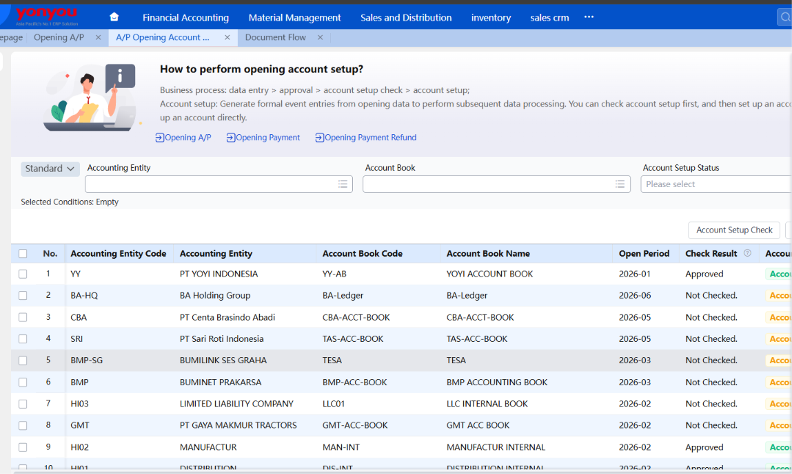

step untuk **mengkonfirmasi data awal AP ledger udah akurat**, lalu melakukan **setup akun** berdasarkan ledger tersebut. Ada opsi mau cek dulu (verification) sebelum setup, atau langsung setup tanpa cek.

## A/P Process

### 7. Regular A/P Process

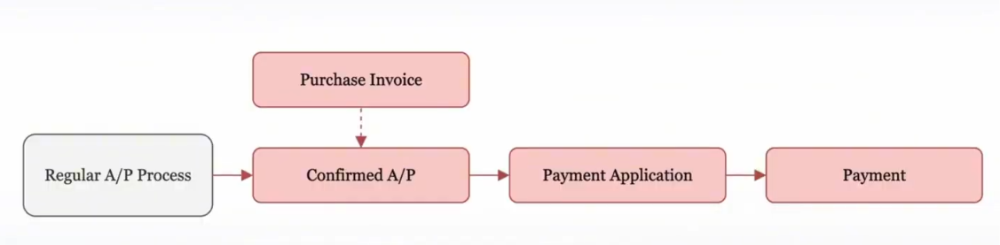

Workflow standard untuk handling invoice supply, approvals dan payments

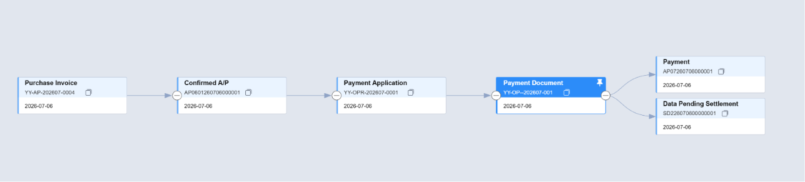

A/P yang melalui purchasing invoice (purchase order)

**Workflow YY Purchase invoice > Payment**

### 8. Manual A/P Process

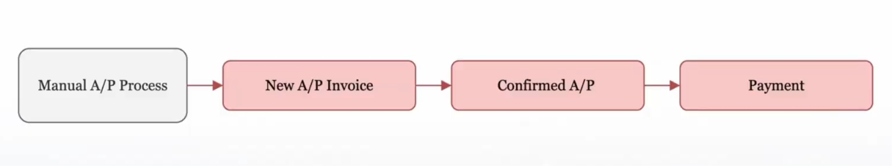

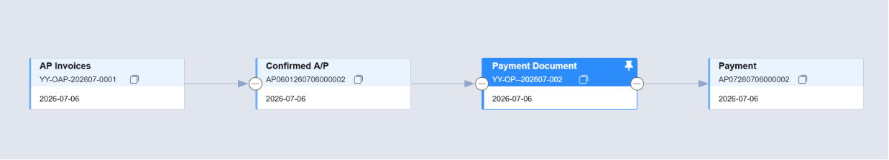

Case yang dipakai jika kita tidak ada melakukan procurement atau tidak ada purchasing invoice, so we just directly create an A/P Invoice.

## A/P Refund

A/P Refund = dipakai Ketika supplier butuh mengembalikan uang kepad akita atau Ketika kita harus melakukan adjustment nominal pembayaran diluar regular purchase process.

A/P Refund is used when:

- Need to reverse or reduce A/P without a new invoice
- Overpaid and the supplier need to return the excess
- Supplier refund cash after user issue a Debit Note

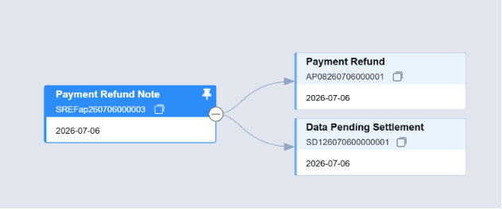

**Payment Refund** menandakan bahwa financial transactions tersebut sudah tercatat ke event, ini secara otomasi sudah reduce A/P balance.

**Data Pending Settlement:**

Jika supplier tidak memberikan uang tunai tetapi mengharapkan refund tetap diterapkan terhadap faktur mendatang atau hutang yang belum dibayar,**Data Pending Settlement** mengelola proses pengurangan. Ini memastikan jumlah yang harus dibayar diperbarui dengan penyesuaian manual dari saldo apa pun.

Dengan flow seperti, financial report dari suatu Perusahaan bisa lebih konsisten, setiap refund, pembayaran dll tercatat di system.

## A/P Settlement

Memastikan Invoice A/P payment tersettle dengan benar, supaya balance tagihan dari supplier bisa lebih akurat.

**A/P Settlement Scheme**

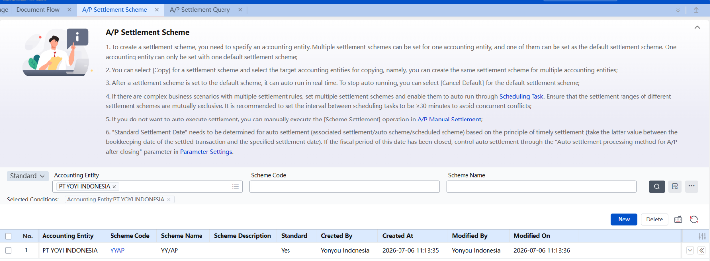

**A/P Settlement is used when:**

- Match and clear A/P Invoices with Payments/Refunds
- Automatically offset positive and negative A/P amounts
- Maintain accurate A/P aging and avoid unmatched transactions

**A/P Settlement can be apply to:**

- Confirmed A/P
- Payment transactions
- Refund transactions
- Mixed currency settlements
- Automatic clearing during month-end

Mekanisme A/P Settlement terkoneksi dengan semua transaksi supplier dari invoice, payment dan refunds memastikan pencatatn updated dan akurat.

**A/P Settlement Query (will show if set the a/p scheme)**

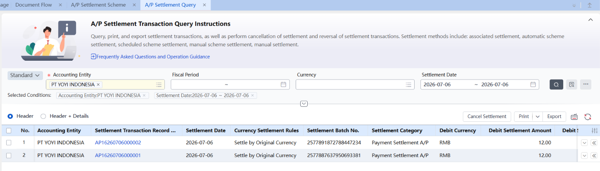

### 9. Fungsi Exchange Gain/Loss

Node ini dipakai untuk menghitung exchange gain/loss (selisih kurs) untuk transaksi akuntansi foreign currency payables dan payment.

Jadi intinya: kalau perusahaan punya utang (payable) atau pembayaran dalam mata uang asing, dan nilai tukarnya berubah antara waktu transaksi dicatat dengan waktu settlement/kalkulasi, node ini yang menghitung selisih untung (gain) atau rugi (loss) dari perubahan kurs tersebut.

Mekanisme Perhitungan — dikontrol oleh parameter

Teks bilang eksekusinya dibatasi/dikontrol oleh parameter "Exchange Gain/Loss Method" di level accounting entity. Ada 3 metode yang disebut eksplisit:

1. Month-end calculation — dihitung di akhir bulan (periodik).
2. Immediate settlement calculation of exchange gain/loss — dihitung langsung saat settlement terjadi.
3. Calculation at the time of foreign currency balance settlement — dihitung pas saldo mata uang asing di-settle.
- Revalue foreign currency payables using the latest FX rate
- Calculate unrealized gain/loss for period-end closing
- Ensure accurate functional currency balances in the financial statements
- Adjust A/P balances to reflect current exchange rate movements

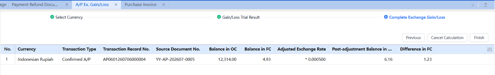

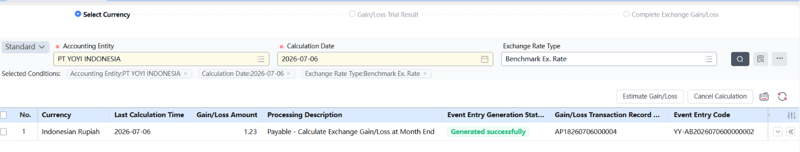

## Month Closing

Memastikan transaksi dalam 1 bulan sudah selesai, berhasil dan akurat dan sudah siap untuk dimasukan ke financial report.

Month Closing ada 2 jenis:

1. A/P Perio Closing
2. A/P Closing

### 10. A/P Account Period Closing

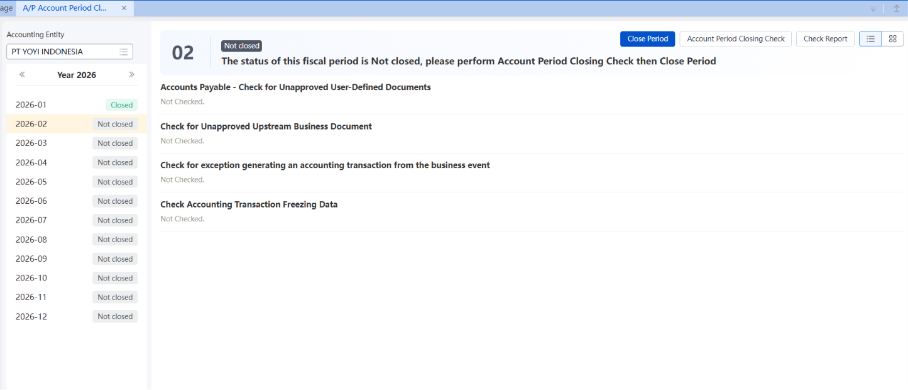

Berikut Adalah peirode periode tiap AP, ada dari bulan 1 – 12. Jika kita klik tombol close period, maka sudah tidak akan ad AP yang tercatat pada periode tersebut

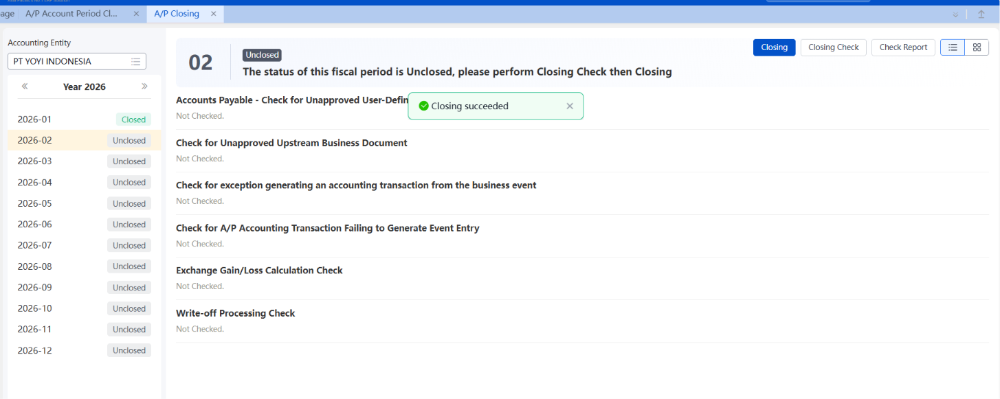

After closing period di AP Acct Period Closing, bisa lanjut closing di A/P Closing.

## A/P Report

### 11. A/P Sub Ledger (DETAIL TRANSACTION LEVEL)

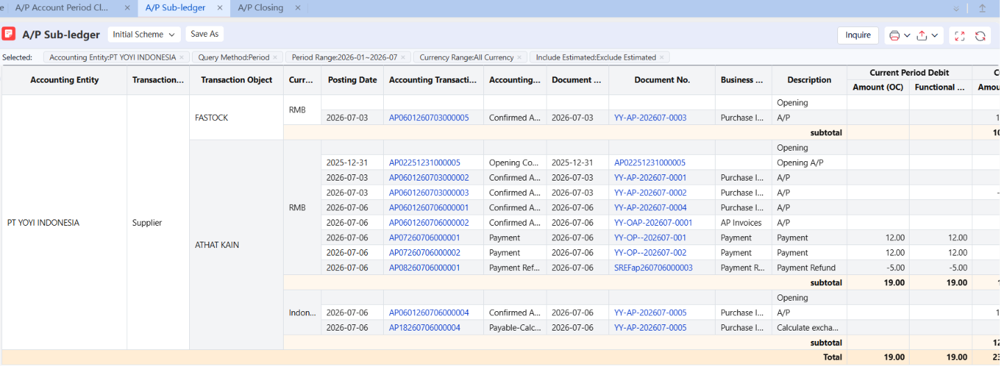

Menunjukan secara detail listing setiap transaksi A/P, purchase invoice atau payment. Pada bagian current period debit dan credit dan closing balance. Report ini dipakai untuk melihat setiap transaksi AP, biasanya dipakai apakah suatu invoice AP sudah settle atau belum, verifikasi nominal dan review perubahan kurs, invetasgasi error pada bulan closing, ini Adalah detail view dari report AP.

### 12. A/P Balance Report (SUMMARIZE BY EACH SUPPLIER)

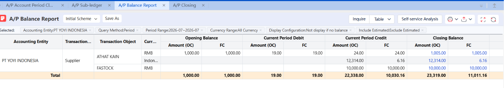

Report untuk melihat summarize supplier. Disini kita bisa track transaksi AP per supplier, biasanya dipakai untuk rekonsialiasi atau management reporting

### 13. A/P Aging Analysis (MONITORING PAYMENT DUE DATE)

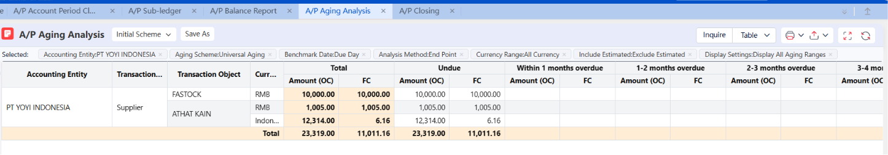

Report untuk mengecek berapa lama kita mengutang kepada supplier. Buat track overdue payable atau prioritize pembayaran, maintain good cash flow control

**Note Error:**

Jika ada masalah pada Generate event entry, cek dulu errornya apa, baru sesuai dengan note errornya untuk solve the problem. Biasanya problemnya ada di :

1. event template (karena event template kita copy paste) khususnya bagian voucher type, kadang kita tidak link voucher type kita.
2. Business dimension analysis, ini harus di setting di accountnya CoA kita, kadang kita enable business dimension ini tapi pada beberapa node mereka ga butuh masukin field yang ada di business dimension.
3. Kadang kadang ada masalah juga dari A/P nya belum dikawinkan menggunakan acct cross reference. Utk A/P Target account bs purchase btw
