## **1. Opening A/R**

***Entry saldo awal piutang saat modul A/R baru diaktifkan.***

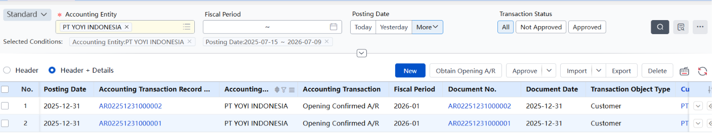

Pas modul A/R baru diaktifkan, biasanya udah ada piutang lama dari sebelum sistem ini dipakai — misalnya invoice yang udah dikirim ke customer tapi belum dibayar, atau piutang yang muncul dari barang yang udah keluar (outbound shipment) tapi belum sempat di-invoice. Semua piutang "peninggalan" ini harus dimasukin manual sebagai Opening A/R, biar saldo piutang di sistem sesuai sama kondisi riil di lapangan sejak hari pertama sistem dipakai.

## **2. A/R Invoices**

*Dokumen inti buat nagih piutang ke customer — jembatan antara business dan finance.*

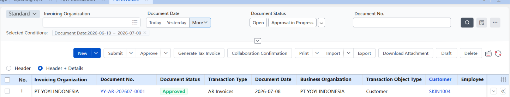

Ini objek paling penting di modul A/R, karena jadi **titik temu antara transaksi bisnis dan pencatatan keuangan. Dipakai buat konfirmasi settlement, ajuin invoice, dan nyatet piutang.**

A/R Invoice bisa nyambung ke berbagai sumber transaksi (misalnya settlement kontrak proyek), atau dibikin manual tanpa sumber (blank/tanpa referensi dokumen lain). Yang menarik, A/R Invoice nggak cuma dipakai buat piutang dari penjualan — piutang non-sales kayak sewa gedung atau denda pun bisa dicatat lewat sini.

## **3. Collection Document**

*Dokumen buat nyatet pembayaran/penagihan yang masuk dari customer.*

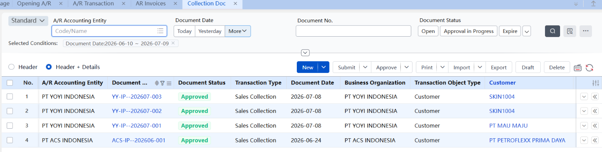

Dipakai buat **mencatat berbagai aktivitas penagihan perusahaan** — bisa dari penjualan, proyek, atau jenis lain. Sistem bisa bedain jenis pembayaran berdasarkan transaksi sama masing-masing customer. Begitu dokumen ini di-approve, sistem otomatis bikin transaksi collection yang jadi dasar buat proses akuntansi dan settlement selanjutnya. Dokumen ini bisa dibuat manual (New), atau otomatis ke-generate dari alur collection transaction yang udah berjalan.

## **4. Opening Collection**

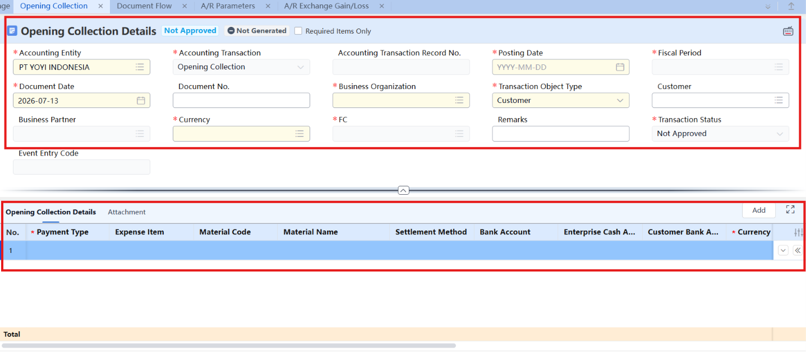

Mencatat **uang yang UDAH DITERIMA dari customer sebelum sistem baru diaktifkan, tapi belum di-settle/dicocokkan ke invoice tertentu**.

**Skenario:** di sistem lama, customer udah transfer Rp 50 juta, tapi belum jelas itu bayar invoice yang mana (mungkin sistem lama nggak rapi trackingnya, atau itu overpayment/uang muka yang belum dialokasikan). Nah, uang "nganggur" yang belum ke-match ke invoice spesifik ini yang dicatat di **Opening Collection** — supaya nanti di sistem baru, uang ini bisa di-apply/dicocokkan ke AR invoice yang sesuai.

## **5. Collection Refund Document**

***Dokumen buat proses pengembalian dana (refund) ke customer.***

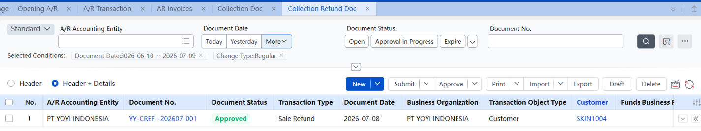

Dipakai kalau perusahaan perlu ngembaliin uang ke customer — misalnya customer kelebihan bayar, atau ada pembatalan transaksi yang uangnya sudah masuk duluan.

## 6. Opening Collection Refund

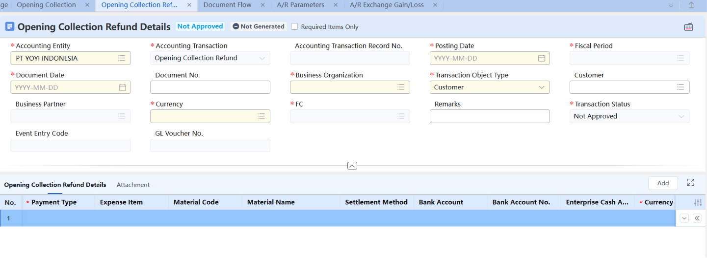

**Fungsi Opening Collection Refund**

Kalau **Opening Collection** = uang yang **DITERIMA** dari customer tapi belum di-settle, maka **Opening Collection Refund** = uang yang **DIKEMBALIKAN** ke customer tapi belum di-settle.

**Skenario Konkret**

Bayangin di sistem lama: customer pernah bayar lebih (overpayment), terus perusahaan refund sebagian ke customer itu — Rp 3 juta misalnya. Tapi refund ini belum jelas "mengurangi" collection yang mana secara spesifik di sistem lama. Nah, transaksi refund yang masih "nganggur" (belum ke-match ke collection tertentu) ini yang dicatat di **Opening Collection Refund**

## **7. A/R Settlement Scheme**

*Aturan settlement yang di-digitize biar bisa jalan otomatis.*

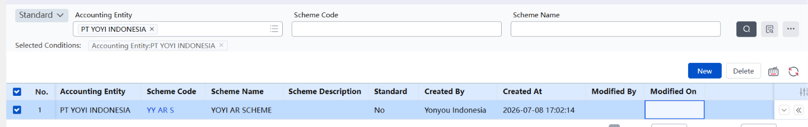

Ini semacam **"template aturan"** buat proses settlement piutang: nentuin data mana yang mau di-settle (filter), urutan settle-nya (sorting), dan cara matching-nya — bisa berdasarkan customer, order, atau kriteria custom lainnya. Prosesnya bisa dijalankan otomatis secara real-time, terjadwal (scheduled), atau dipicu manual. Buat pemula, cara paling gampang buat ngerti konsep ini: anggap aja intinya cuma "per customer mana yang mau di-settle," nanti detailnya makin kebayang seiring jalan.

## **8. A/R Settlement Query**

*Tempat buat cari, export, dan membatalkan transaksi settlement.*

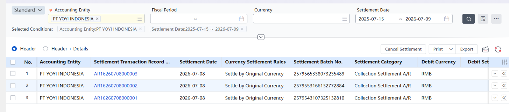

Fungsinya buat query (cari) transaksi settlement yang udah kejadian, export datanya, dan kalau ada yang salah, bisa dibatalkan (cancel) atau di-reverse.

## **9. A/R Exchange Gain/Loss (Selisih Kurs)**

*Menghitung untung/rugi kurs dari piutang & pembayaran dalam mata uang asing.*

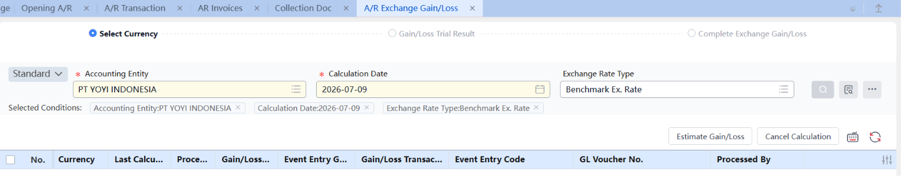

Kalau customer bayar pakai mata uang asing (misal USD), kurs pas invoice dibikin bisa beda sama kurs pas pembayaran diterima — selisih itu yang disebut Exchange Gain/Loss (untung atau rugi kurs). Cara hitungnya diatur lewat satu parameter di level perusahaan, dan ada 3 metode:

- End-of-month: selisih kurs nggak dihitung tiap transaksi, tapi dihitung sekaligus di akhir bulan buat semua piutang yang belum lunas.
- Saat settlement: begitu piutang lunas dibayar penuh, saat itu juga langsung dihitung selisih kursnya.
- Realized/Unrealized: piutang yang udah dibayar dicatat sebagai "Realized" (sudah terealisasi), yang belum dibayar dicatat sementara sebagai "Unrealized" di akhir bulan, lalu di-reverse lagi di awal bulan berikutnya.

Hasil perhitungan selisih kurs ini otomatis diteruskan ke General Ledger (GL) lewat auto accounting instruction — nggak perlu input jurnal manual.

## **10. A/R Account Closing Period & A/R Closing**

*Proses cek dan tutup buku A/R di akhir periode akuntansi.*

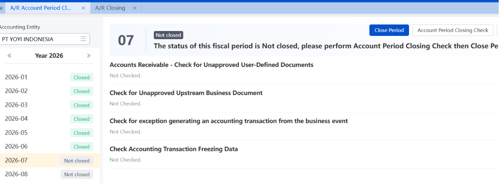

Sebelum buku A/R bisa ditutup, sistem bakal jalanin pengecekan dulu (closing check) buat mastiin nggak ada masalah yang ketinggalan — kalau ada, langsung ketauan dari hasil cek ini. Setelah lolos cek, baru proses closing beneran dijalankan. Kalau ternyata ada yang perlu dikoreksi, closing ini bisa di-reverse (dibuka lagi).

## **11. Opening Account Setup**

*Tempat setup saldo awal — bukan cuma buat A/R. Sebelum kesini biasanya diawali dengan memasukan dari Opening A/R, A/P atau Inventory, baru dilanjut ke bagian menu Opening Account Setup dan itu sudah 1 paket.*

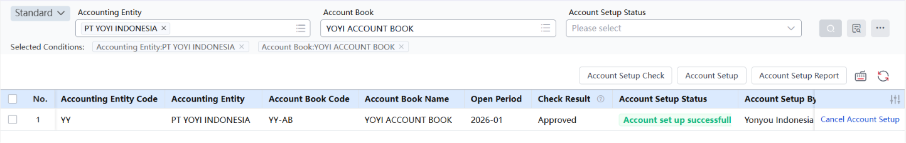

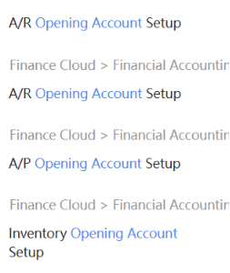

Ini tempat buat masukin transaksi-transaksi saldo awal terkait A/R (piutang awal, collection awal, refund awal). Yang penting diinget: fitur ini nggak eksklusif buat A/R aja — struktur yang sama juga dipakai buat setup saldo awal di modul A/P (hutang) dan Inventory (persediaan).

## **12. A/R Sub Ledger**

*Laporan rincian (detail per transaksi) piutang & pembayaran.*

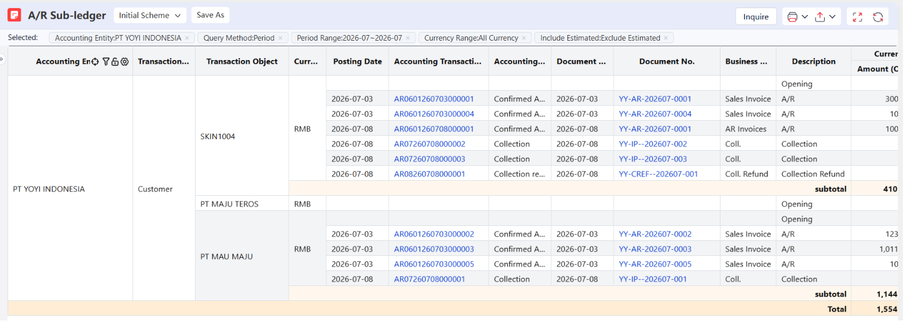

Kalau butuh lihat **detail satu-satu transaksi piutang dan pembayaran yang kejadian dalam periode akuntansi tertentu**, ini laporannya. Levelnya sampai ke transaksi individual, bukan cuma angka total.

## **13. A/R Balance Report （KEY）**

*Laporan ringkasan (summary) saldo piutang & collection.*

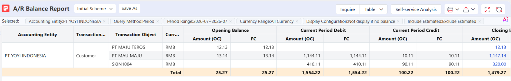

Mirip A/R Sub Ledger, tapi ini versinya ringkas — **nunjukkin summary saldo piutang dan collection dalam periode tertentu, tanpa perlu breakdown per transaksi.** Cocok kalau cuma butuh angka total, bukan detailnya.

## **14. A/R Aging Analysis**

*Laporan umur piutang — dasar buat menilai kualitas piutang & kebijakan kredit.*

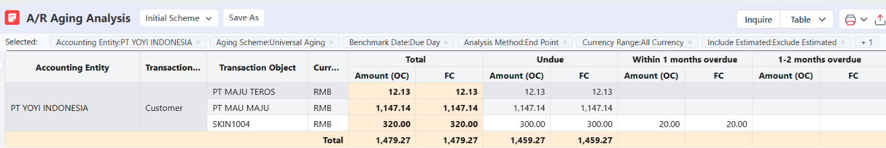

**Laporan ini nunjukkin "umur" piutang tiap customer — piutang mana yang masih baru, dan mana yang udah lama nunggak.** Dengan lihat distribusi umur piutang ini secara menyeluruh, perusahaan bisa menilai kualitas piutang secara keseluruhan dan kondisi kredit masing-masing customer, lalu pakai itu sebagai dasar buat nentuin kebijakan credit sales ke depannya (misalnya, customer yang sering telat bayar mungkin perlu dibatasi limit kreditnya).

## **15. Creditor’s Rights Transfer**

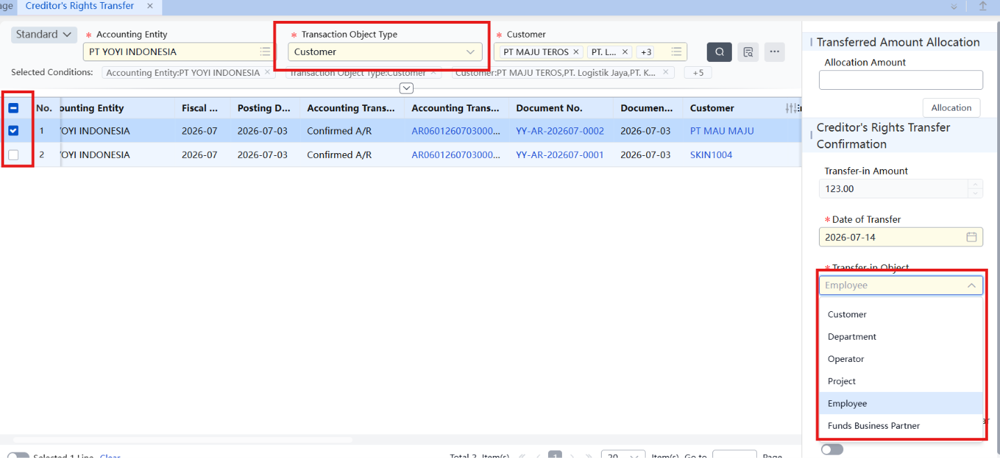

Transfer kepemilikan/tanggung jawab piutang secara internal — bukan jual piutang ke pihak luar. Bisa transfer by customer, project, department, atau salesperson (misal sales resign → piutangnya dialihin ke sales lain).

Nominal piutang nggak berubah, cuma attribution-nya yang pindah. Ada juga transfer khusus buat collection document, terpisah dari AR event-nya.

## 16. Funding Business Partners (资金业务伙伴)

Fungsi: Master data — daftar bank, settlement center, lembaga keuangan non-bank, guarantee company. Dipakai sebagai pilihan counterparty di modul Investment & Financing Management (financing registration, investment registration, derivatives). Beda modul dari AR settlement harian.
