## System Parameter

### 1. 员工启用时是否自动生成/关联用户（是与否）

- **Auto create/relate the user when a user is enabled (Yes/No)**

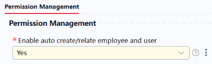

Fungsinya untuk setiap kali ada pendaftaran employee/karyawan baru, maka user akan otomatis dibentuk.

### 2. 商家商品是否需平台方审核 (TIDAK ADA)

- **Merchant products require platform approval**

Sistem Izin supplier/seller ke user Tenant untuk upload product ke sistem

### 3. 浮动换算基准（通常以“数量为准“。）

- **Floating Conv. Basis (Usually "quantity based ")**

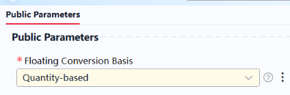

Menghitung suatu jumlah menggunakan format quantity based (pcs).

### 4. 换算率精度

- **CR Precision**

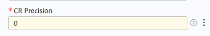

Angka Decimal (setelah koma) yang ingin ditampilkan supaya data angka yang diberikan bisa lebih presisi

### 5. 显示物料图片 （是与否）

- **Display Matl Picture(Yes/No)**

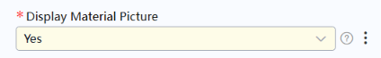

Mengizinkan meng-upload gambar suatu produk/jasa

### 6. 仓库组织关系 （不控制，服务单一组织，服务多组织）

- **Warehouse Org Relationship (No control, single service organization, multi-organization service)**

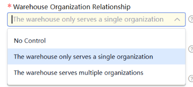

- **No Control :** Organisasi mana saja bebas akses sistem warehouse (1 untuk semua)
- **Single service org:** 1 warehouse Cuma bisa diakses 1 entitas
- **Multi org service :**  1 warehouse bisa multiientitas (lebih dari 1 user atau org yang akses)
### 7. 启用允销控制 （启用与停用）

- **Enable Allowed Sales Control**

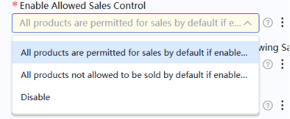

Izin mengkatifkan barang/jasa boleh dijual atau tidak boleh dijual.

### 8. 允许对当前用户授权（是与否）

- **Allow to authorize the current user(Yes/No)**

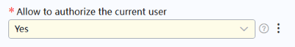

- **Yes :** Punya hak untuk membuka atau menambah akses ke user sendiri.
- **No :** Tidak bisa, hanya admin user yang dipilih saja bisa membuka akses
### 9. 允许组织管理员管理企业账号级角色（是与否）

- **Allow the Org administrator to manage enterprise account-level roles(Yes/No)**

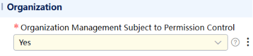

- **Yes :** Organisasi terkait hanya boleh me-manage struktur dibawah mereka (tidak ke Organisasi lain)
- **No :** Tidak ada batasan untuk bisa manage hingga ke organisasi lain
### 10. 部门维护受组织权限控制（是与否）

- **Dept maintenance controlled by Org permission(Yes/No)**

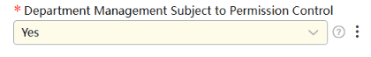

- **Yes :** Department terkait hanya bisa me-manage struktur dibawah mereka (tidak ke Department lain)
- **No :** Tidak ada batasan untuk bisa me-manage hingga ke Department lain
### 11. 允许组织管理员管理企业账号级角色（是与否）

- **Allow the Org administrator to manage enterprise account-level roles(Yes/No)**

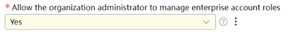

Memberi izin kepada Admin Organisasi yang dipilih untuk me-manage akses system Enterprise Account (High level).

### 12. 角色管理受用户权限控制（是与否）

- **Role management is subject to user permissions(Yes/No)**

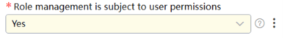

**Yes :** Admin Organisasi hanya bisa mengubah akses roles pada organisasi mereka. Tidak bisa assign ke level atau ke roles yang lebih tinggi.

**No :** Tidak ada Batasan.

### 13. 是否启用权限授权管控（不启用/ 启用组织管理员）

- **Whether to enable authority authorization control**

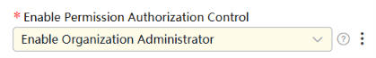

**Enable :** Hanya Admin Organisasi yang dipilih boleh melakukan edit Otoritas

**Disable:** Tidak diizinkan sama sekali

### 14. 使用组织物料的启用/停用状态受管理组织控制

- **The enabling status of Org-level Materials is controlled by Management Organization**

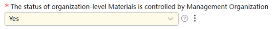

**Yes :** Hanya Organisasi Management saja yg bisa mengontrol status Level Material dari suatu organisasi.

### 15. 是否支持设置组织默认地址

- **Supports setting the default Org address**

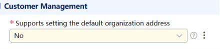

- **Yes :** Alamat akan terinput secara default ketika ada suatu pengajuan atau workflow (alamat sesuai dengan business unit yang didaftarkan)
- **No :** Alamat tidak terinput secara default

### 16. 导入模板中是否展示多个语种

- **Display multiple languages in import template**

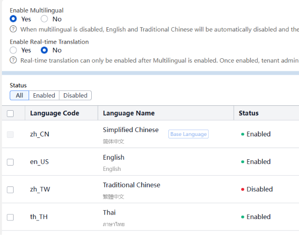

## Multilingual

### 17. 查询需要修改的字段，并进行语言修改 （2-3条）

- **Query the fields that need to be modified, and modify the language (items 2-3)**

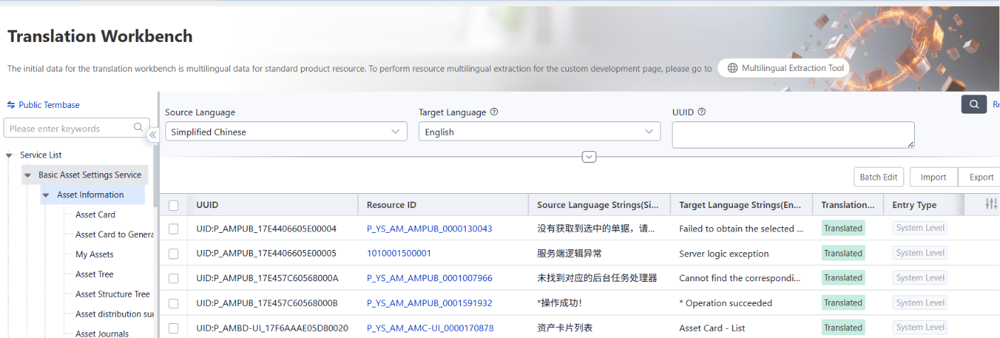

Fungsinya mentranslate data yang sudah pernah diinput didalam list secara massive.

Tau fungsi, tidak tau cara menggunakannya. (issue)

## Locale

### 18. Sales Region

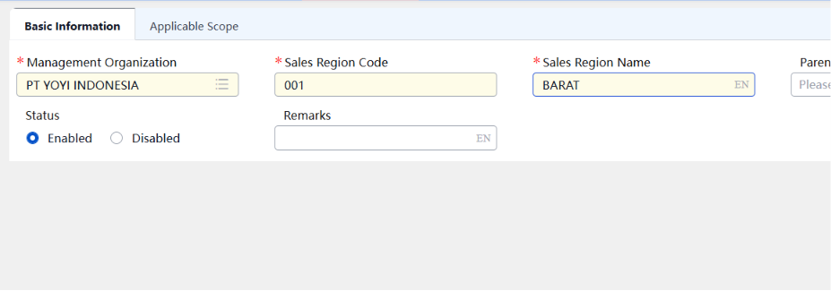

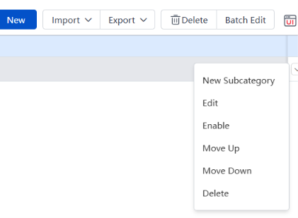

Menginput, edit, enable/disable, delete region tiap sales untuk  kebutuhan pengalokasian.

Tau cara setting, tidak tau fungsinya utk client apa (issue)

### 19. Country/Region

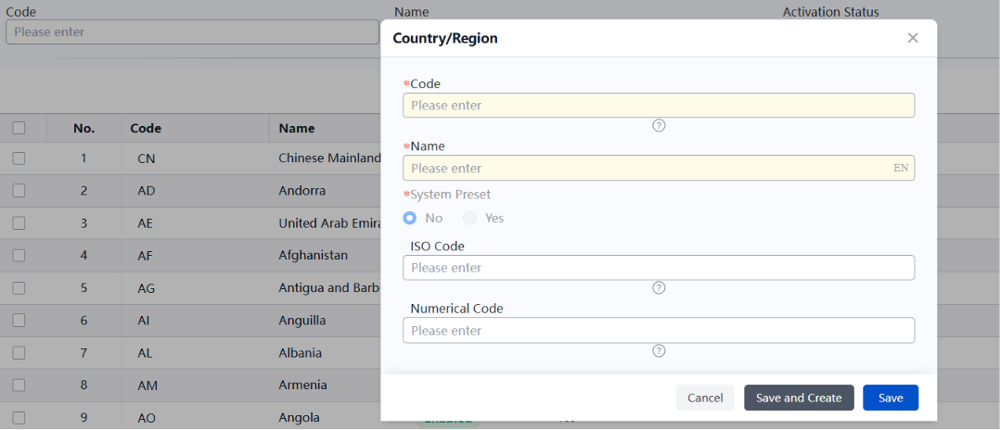

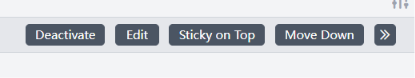

Menginput, edit, enable/disable, delete Country/Region tiap country untuk  kebutuhan pengalokasian.

Tau cara setting, tidak tau fungsinya utk client apa (issue)

## Multi-Currencies

### 20. Currencies

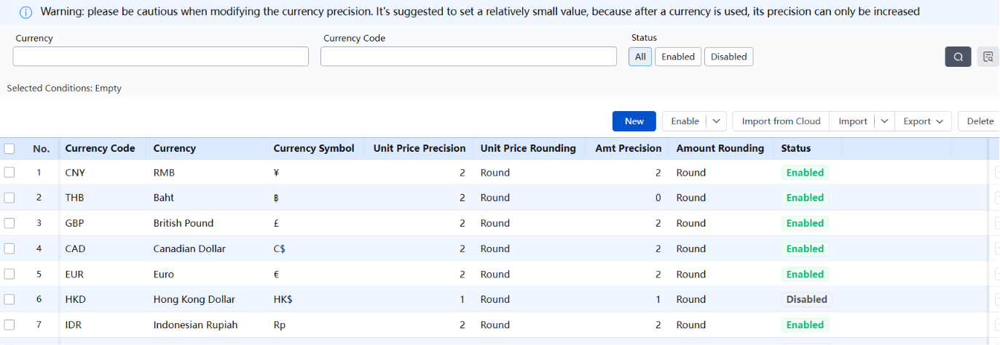

Menambah jenis fiat dari berbagai mata uang negara.

### 21. Exchange Rate Type

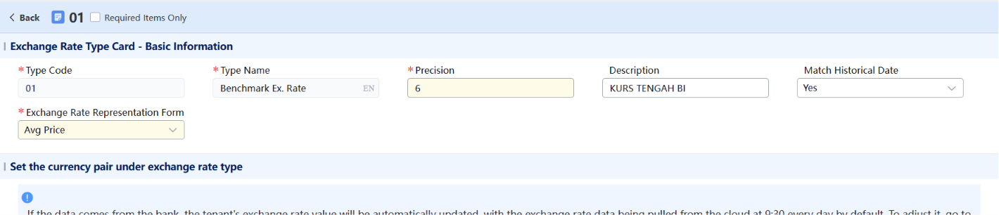

Untuk memasukan **Tipe Rate** mana yang mau menjadi patokan untuk pembayaran.
Opsi "Benchmark exchange rate" hanya bisa konek ke bank China untuk update rate secara otomatis (hanya tersedia versi China).

### 22. Exchange Rate

Input rate fiat ke dalam Exchange Rate Type yang sudah dibuat. Kolom "indirect exchange" diisi dengan rate fiat yang mau ditampilkan. Rate selalu berubah-ubah, sebaiknya rutin di-maintain.

## Organization

### 23. 多组织模型启用

- **Multi-organization model enabled**

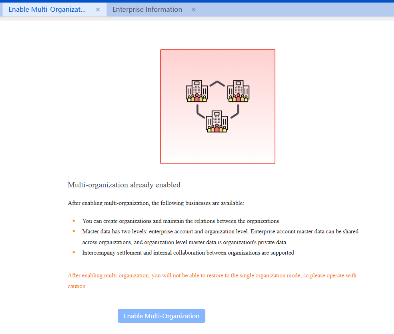

**(HANYA BISA DIAKTIFKAN SEKALI, LANGGANAN BERBEDA)—** untuk perusahaan yang punya cabang/anak Perusahaan. Untuk Perusahaan hanya single entity tidak perlu membuka fitur ini.

### 24. 新增业务单元 （公司，分公司，事业部，办事处，工厂，其它组织）

- **Add new Business Unit (Company,Factory ,Branch ,Office, Business Unit ,Other Org)**

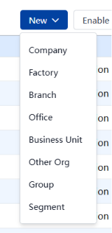

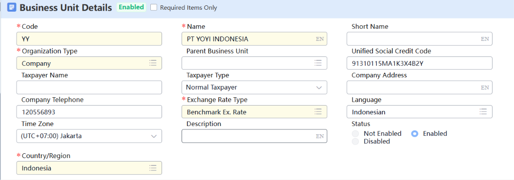

Pembuatan Business Unit baru hingga edit, enable/disable dan settings.

### 25. Department

- **部门**

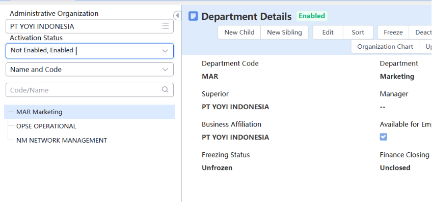

Setelah pembuatan **Businesss Unit** bisa dilanjutkan untuk pembuatan **Department** under Business Unit. **New Sibling** untuk bikin Department baru dan **New Child** untuk organisasi/tim dibawah dari Department.

### 26. Organization Status (Organization Chart)

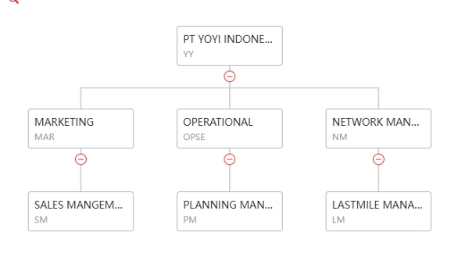

Melihat struktur oraganisasi yang telah dibuat, jika ingin ditampilkan secara visual bisa menekan tombol **“Structure Legend”**

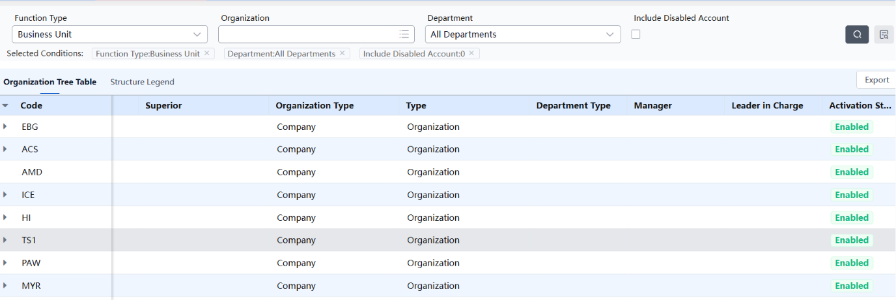

### 27. 职能共享设置 

- **Function Sharing Setting**

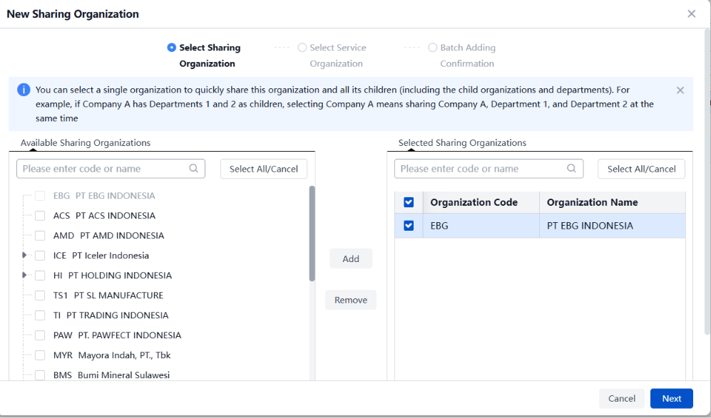

Melakukan **sharing akses** dari Organisasi ke rganisasi lainnya.

Contoh : Organisasi A dan Organisasi B berada dalam 1 Tenant Multi Company
Tapi dari organisasi B **tidak punya akses Finance Cloud**, dari Organisasi A **bisa sharing akses Finance Cloud** ke organisasi B jika dibutuhkan.

## Delegation

### 28. 采购委托关系

- **Purchase Delegation**

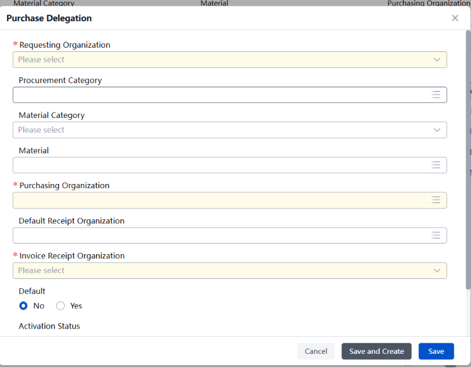

Mendelegasikan pekerjaan purchasing dari organisasi ke organisasi lain, namun secara record tetap tercatat menjadi kepemilikian dari **Requesting Organization**.

### 29. 销售委托关系

- **Sales Delegation**

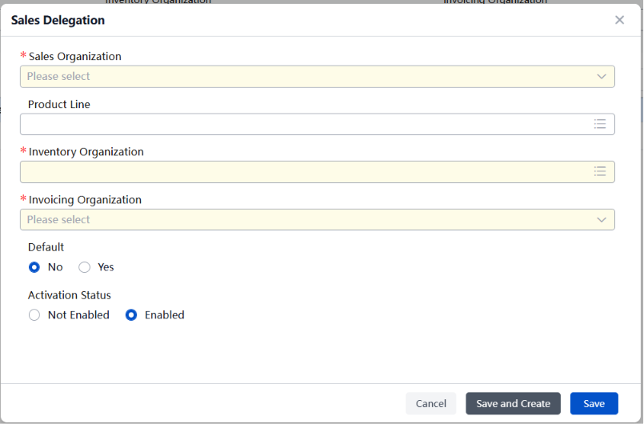

Mendelegasikan penjualan produk ke inventory organisasi yang lain.

Contoh: Ada penjualan dari Organisasi A tapi untuk stocknya di ambil dari organisasi B (CMIIW) (issue)

## Employee

### 30. 员工类型

- **Employee Category**

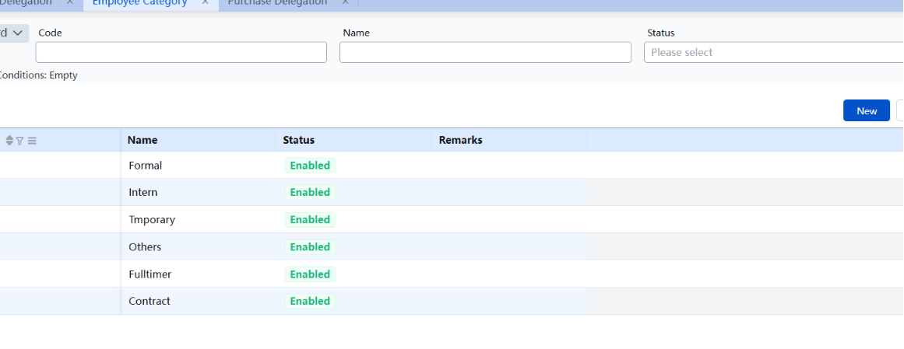

Memasukan jenis kategori karyawan, setelah didaftarkan biasanya akan muncul pada pilihannya ketika melakukan add new employee.

Note: Setiap pembuatan employee, akun user akan otomatis terbuat juga. (Mengikuti fitur pada No.1)

## Authorization (User Management)

### 31. 用户管理

- **User Management**

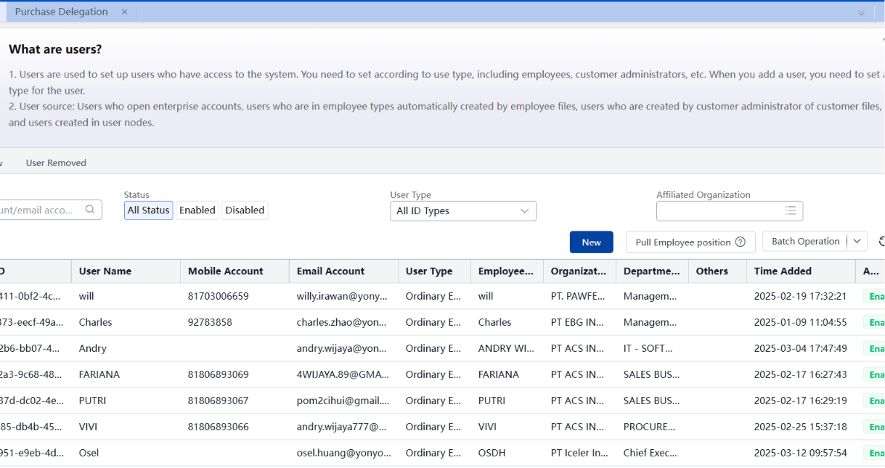

Tempat pembuatan User dan Enable/Disable.

Note untuk bagian employee: Saat pembuatan Employee pastikan switch “Operator” diaktifkan, supaya employee tersebut bisa dikonekan dengan user/role.

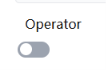

## Authorization (Role Management)

### 32. 角色管理

- **Role Management**

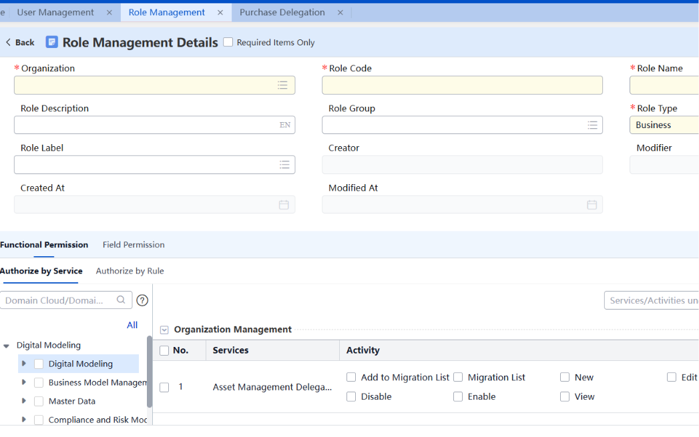

Tempat pembuatan Role baru dan menambahkan akses kedalam role tersebut, hingga enable/disable dan delete. Note: biasanya role dipakai untuk membuat suatu akses untuk admin atau user.

### 33. 角色组

- **Role Group**

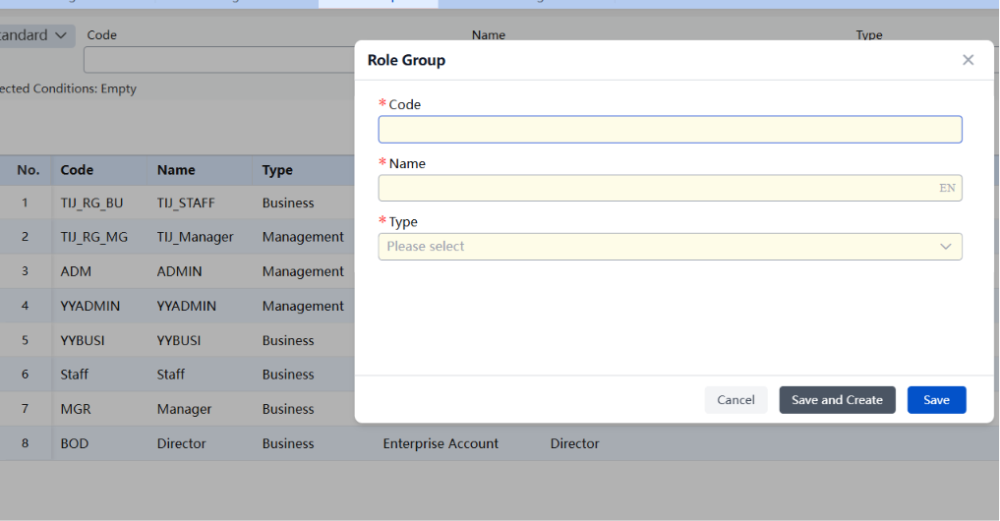

Membuat jenis pengelompokan untuk role yang sudah dibuat. Contoh pengelompokan untuk Role Staff atau Role Admin atau Role Manager.

Tau fungsi, belum ngerti logic nya (issue)

## Authorization (Permission Admin)

### 34. 组织权限管理员

- **Organize Permission Admin**

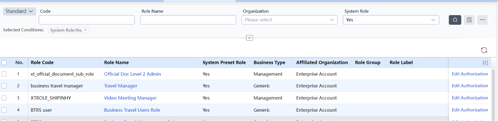

Hanya yang punya akses akun Enterprise saja yang bisa melakukan edit, karena ini termasuk otoritas paling tinggi bukan di Organization Level.

### 35. 授权

- **Authorization**

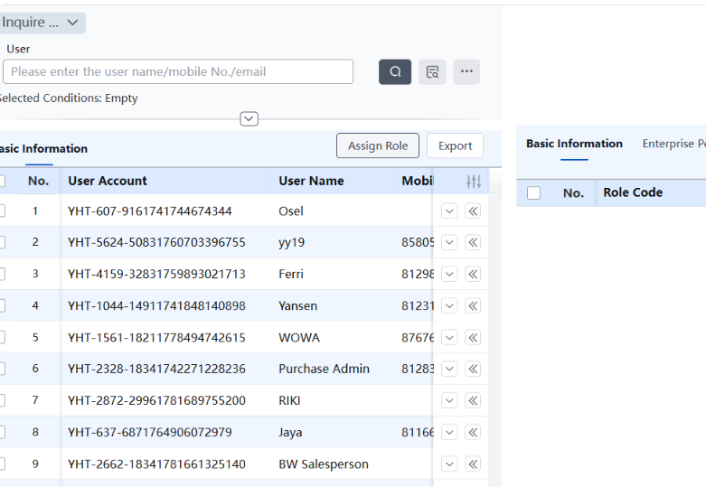

**Key Point:** Tempat untuk menyambungkan atau mengaitkan suatu role kepada user, supaya user bisa melakukan akses ke cloud atau fitur yang telah di-set di dalam role tersebut.

### 36. 全员授权

- **Global App Authorization**

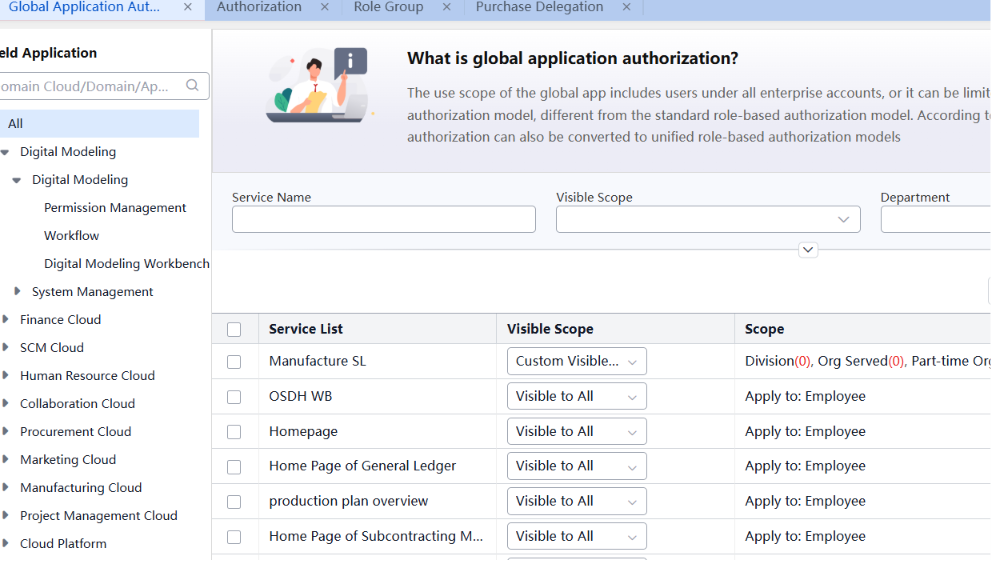

Penggunaan akses Global Application Authorization hanya khusus untuk pengguna Akun Enterprise (high level) atau akses khusus yang berbeda dengan akses standar role. Global App Authorization bisa me-manage secara besar atau secara environment pada tenant tersebut.

Tau fungsi, belum ngerti cara pakai (issue)

### 37. 数据权限

- **Data Permission**

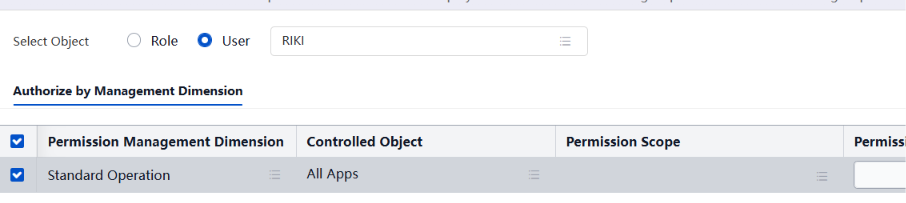

Men-setting untuk suatu user mendapat akses untuk melihat dan mengakses data tertentu pada modul yang telah terikat. Permission dapat dibatasi bedasarkan dimensi (department, Gudang, sales)

contoh: seorang sales boleh diberi akses melihat data Sales Order. (cmiiw) (issue)

## Public File

### 38. 基础数据分级管理

- **Hierarchical Management**

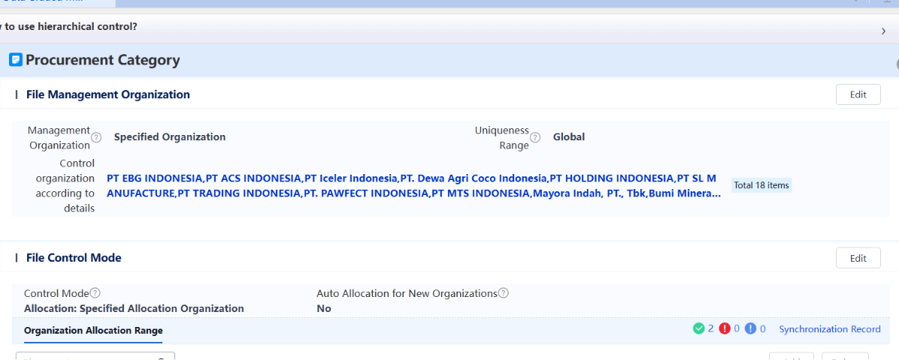

Memberi akses pada suatu organisasi untuk melakukan akses input data ke dalam master data (terdapat berbagai jenis modul).

### 39. 会计期间方案

- **Fiscal Period Scheme**

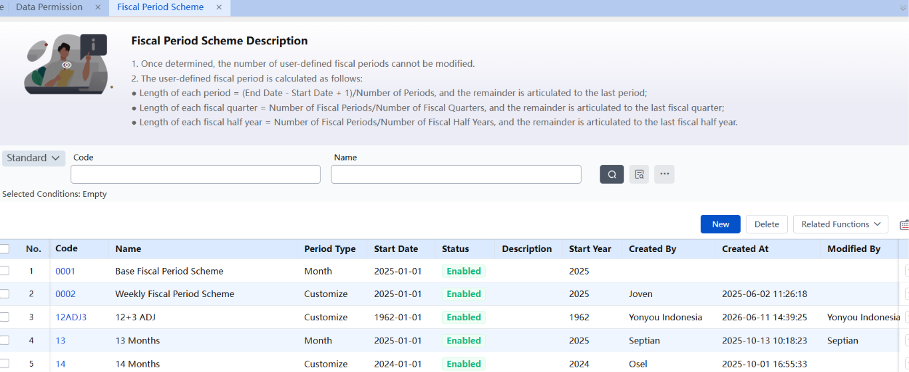

Fiscal Period: Pencatatan transaksi dalam 1 fiskal atau 1 periode (1 periode = 1 tahun)

Template/struktur periode akuntansi. Dibuat sekali di awal setup.

Mendefinisikan: Period Type (Monthly, Weekly, dsb) dan Jumlah Fiscal Periods, Quarters, Half Years per tahun.

### 40. 会计期间

- **Fiscal Period**

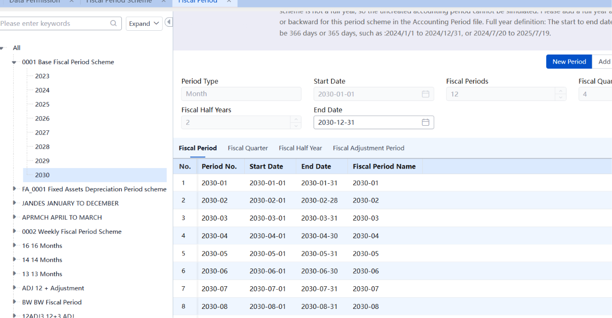

Realisasi aktual per tahun berdasarkan scheme. Sistem otomatis generate periode-periode di dalamnya atau bisa di-generate secara manual.

**Flow :** Fiscal Period Scheme (setup sekali) > Fiscal Period per tahun (dibuat bertahap, minimal tahun berjalan)  > Add new tiap kali pergantian tahun.

### 41. 银行类别

- **Bank Category**

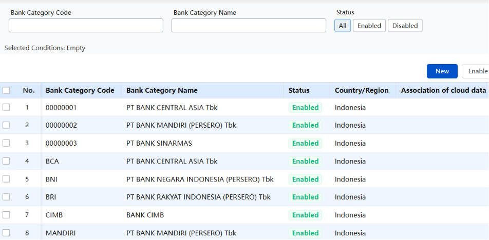

Penambahan Kategori Jenis Bank ke dalam system. (Enable/Disable, Add, Delete)

### 42. 银行网点

- **Bank Branch**

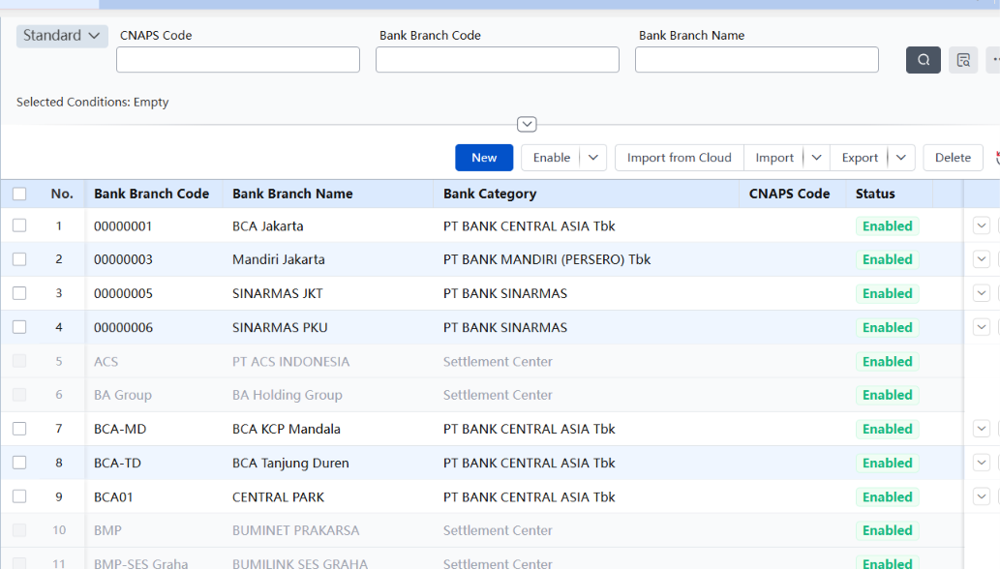

Penambahan cabang dari bank, berhubungan setelah penambahan jenis/kategori bank sebelumnya. (Enable/Disable, Add, Delete)

### 43. 税目税率

- **Tax Item and Tax Rate**
- **Menu “Withholding Tax Calculation”**

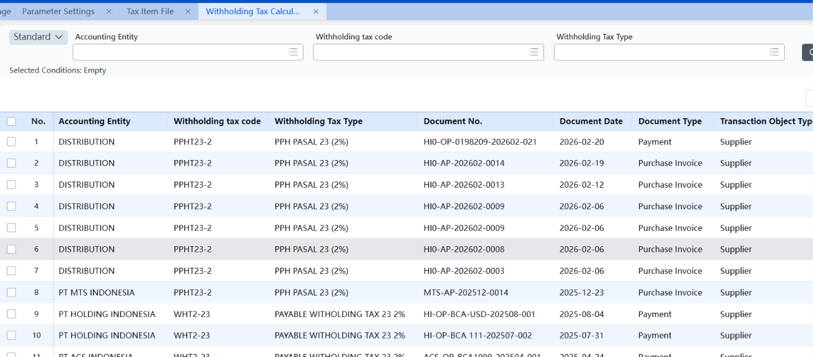

- **(no clue) (issue)**

### 44. 结算方式

- **Payment Method**

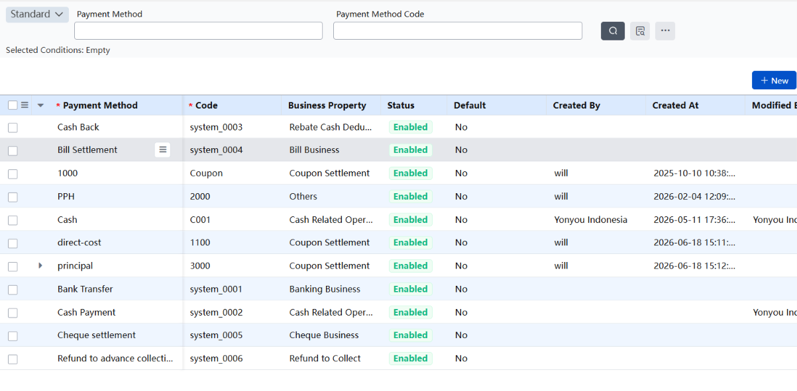

Menambahkan jenis metode pembayaran, biasanya kebutuhan purchasing atau sales. (Enable/Disable, Add, Delete)

### 45. 款项类型

- **Payment Type**

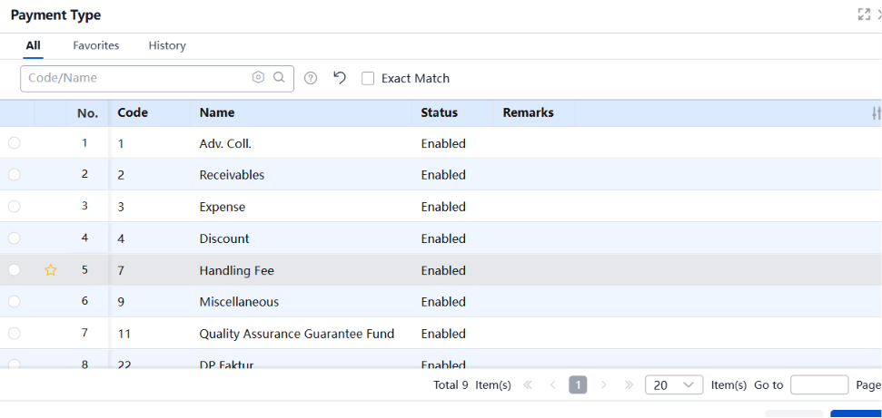

Pembuatan tipe/kategori pembelian atau pembayaran, apakah biaya penanganan, pembayaran pajak atau piutang.

(Enable/Disable, Add, Delete)

### 46. 收款协议

- **Collection Agreement**

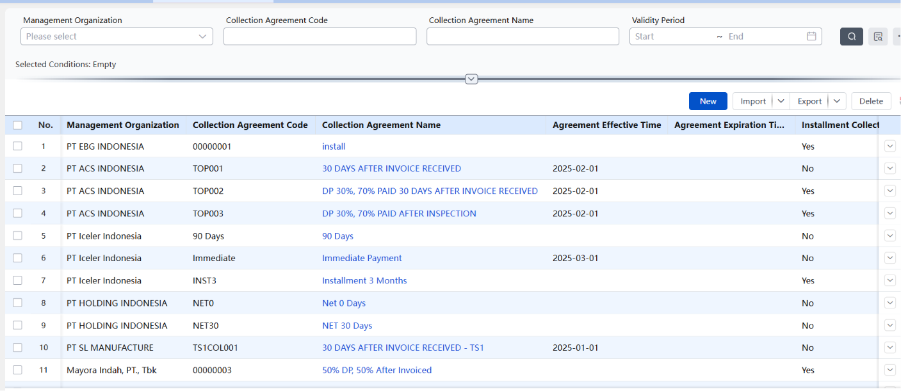

Pembuatan template syarat/skema pembayaran yang disepakati dengan customer atau supplier.

(Enable/Disable, Add, Delete)

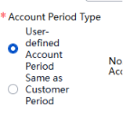

- **User-defined Account Period** → user yang menentukan berapa hari/bulan periode penagihannya (manual, custom sesuai kesepakatan)
- **Same as Customer Period** → ikutin periode yang udah di-set di master data customer-nya langsung

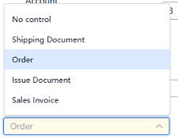

Settingan kapan sistem mulai **"mengontrol"** atau **membatasi** transaksi kalau customer **belum bayar/overlimit:**

- **No Control** → ga ada pembatasan apapun
- **Order** → diblokir sejak Sales Order dibuat
- **Shipping Document** → diblokir saat mau kirim barang
- **Issue Document** → diblokir saat dokumen pengeluaran dibuat
- **Sales Invoice** → diblokir saat mau buat invoice
### 47. 收款起算时点

- **Coll. Start Time**

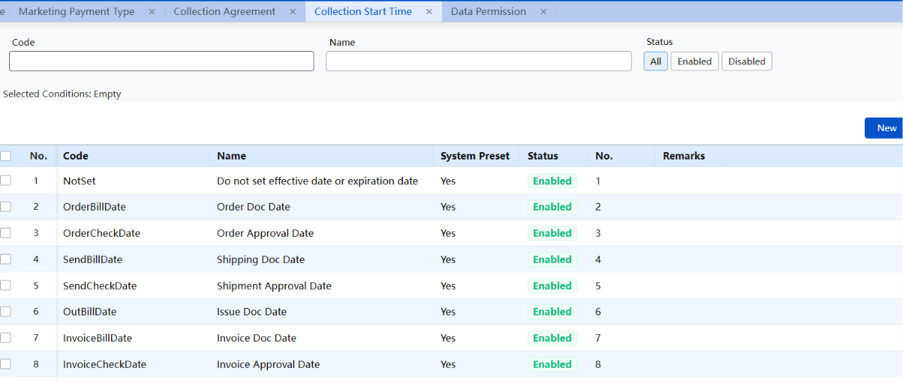

Tempat pembuatan settingan atau opsi kapan suatu agreement akan ditagih.

(Enable/Disable, Add, Delete)

**Logic Collection Agreement dengan Collection Start Time :**

Setup Co	llection Agreement kita bisa memilih Collection Start Time di dalamnya.

Collection Start Time tempat buat masukin jenis kategori collection time

Pilihan yang sering dipakai.

- **Invoice Doc Date** → paling standard; due date dihitung dari tanggal invoice dibuat
- **Invoice Approval Date** → dihitung dari tanggal invoice di-approve (lebih ketat)
- **Order Doc Date** → dihitung dari tanggal SO dibuat (jarang, tapi ada)
- **Shipment Approval Date** → dihitung dari tanggal barang confirmed dikirim
### 48. 付款协议

- **Payment Agreement**

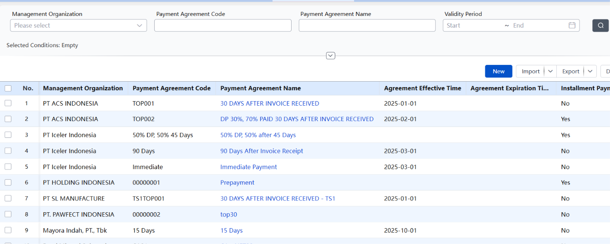

Pembuatan template syarat/skema pembayaran yang disepakati dengan customer/supplier.

(Enable/Disable, Add, Delete)

### 49. 付款起算时点

- **Payment Start Time**

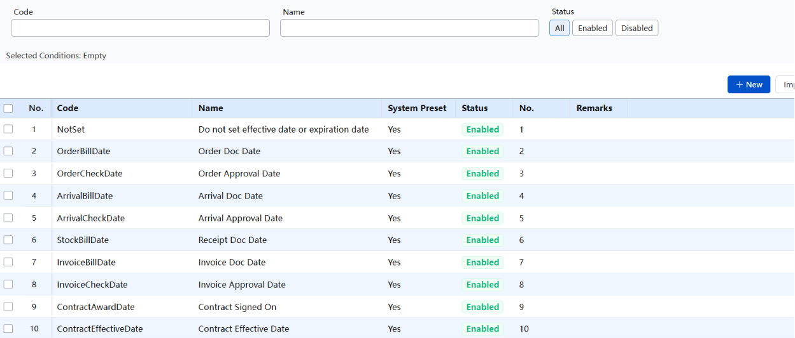

Tempat pembuatan settingan atau opsi kapan suatu agreement akan ditagih.

**Logic Payment Agreement dengan Payment Start Time :**

Setup Payment Agreement kita bisa memilih Payment Start Time di dalamnya.

Payment Start Time tempat buat masukin jenis kategori Payment time

**Yang paling umum dipakai:**

- **Receipt Doc Date** → dihitung dari tanggal barang diterima di gudang *(paling common di procurement)*
- **Invoice Doc Date** → dari tanggal invoice supplier masuk
- **Invoice Approval Date** → dari tanggal invoice supplier di-approve internal
- **Arrival Doc Date** → dari tanggal barang tiba (sebelum di-GR)

## Material Category

### 50. 物料分类

- **Material Category**

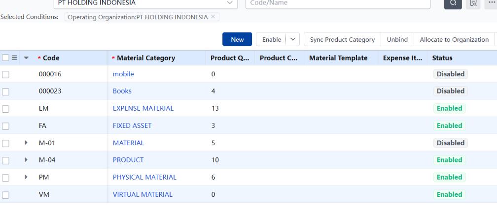

Pembuatan kategori tipe material untuk kebutuhan purchasing.

(Enable/Disable, Add, Delete)

### 51. 计量单位

- **UOM**

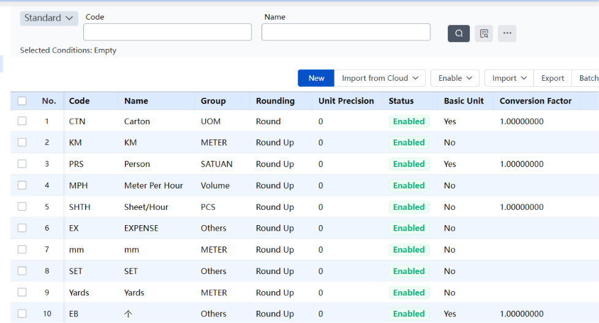

Satuan yang dipakai untuk mengukur/menghitung barang atau material di sistem. Setiap barang yang ada di sistem harus punya satuan — tanpa ini, sistem tidak tau "1 itu maksudnya 1 apa."

**Note Tambahan: Logic Basic Unit =**

PCS    → Basic Unit = Yes  → 1 PCS = 1 PCS      (patokan)

Box10  → Basic Unit = No   → 1 Box10 = 10 PCS   (1 box isi 10 pcs)

### 52. 物料创建

- **Material Creation**

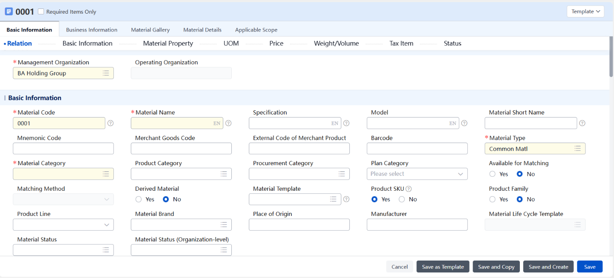

Tempat mendaftarkan semua barang, jasa, atau material yang akan dipakai ke dalam transaksi di system, biasanya untuk kebutuhan katalog resmi dari Perusahaan/client.

Pada bagian Material creation ada kotak “Self Produced” ini yang berkorelasi dengan Product Receipt (Produk yang kita terima melalui produksi kita sendiri), jika tidak mencentang “Self produced”, maka Ketika menginput material pada menu product receipt, tidak ada akan material yang muncul pada menu.

### 53. 物料模版

- **Material Template**

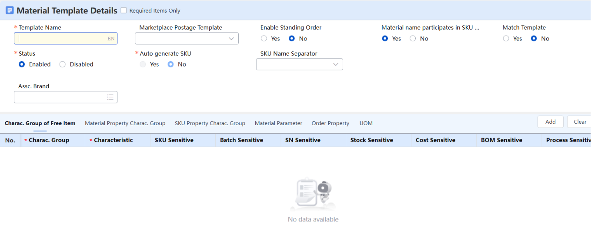

Blueprint/cetakan standar yang bisa diterapkan ke material baru saat proses pembuatan. Tujuannya: supaya material sejenis punya struktur yang konsisten tanpa harus diisi ulang dari nol setiap kali.

## Material Property

### 54. 物料规格

- **Material Specification** (Tidak ada di settings) (issue)

### 55. 物料属性

- **Material Property** (Tidak ada di settings) (issue)

### 56. SKU属性

- **SKU Property**

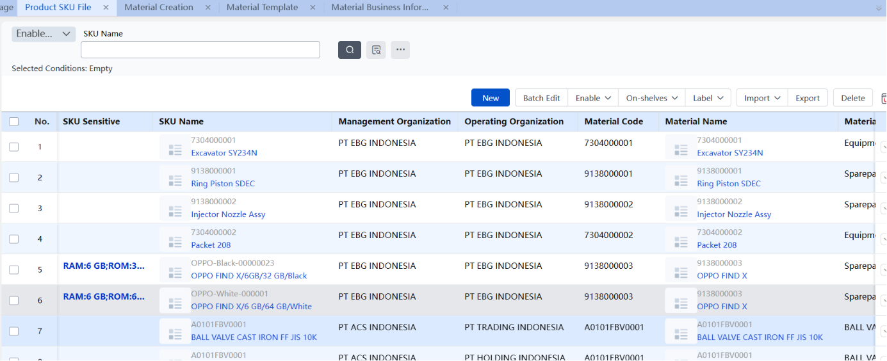

SKU Adalah detail varian yang bisa diperjual belikan, alias turunan dari Material Creation.

Contoh: Ukuran Baju, SKU nya S M L XL XXL.

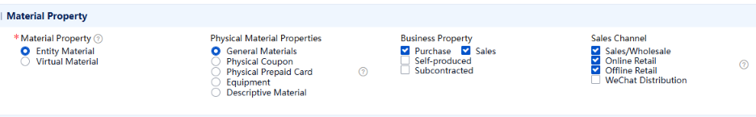

**Material Property**

Bagian ini nge-konfigurasi wujud fisik, fungsi bisnis, dan jalur distribusi dari material.

**A. Material Property (Wujud Dasar)**

- **Entity Material:** Barang fisik yang berwujud nyata, punya stok, dan butuh disimpan di gudang fisik (misal: *sparepart*, smartphone, baju).
- **Virtual Material:** Barang non-fisik atau kompilasi. Di YonSuite, ini biasanya dipakai buat **Kits/Bundle** (paketan beberapa barang jadi satu SKU) atau produk jasa.

**B. Physical Material Properties (Detail Atribut Fisik)**

- **General Materials:** Barang umum standar operasional (bahan baku, barang jadi, komoditas komersial biasa).
- **Physical Coupon & Physical Prepaid Card:** Voucher belanja atau kartu prabayar fisik yang punya nilai nominal uang. Sistem akan melacak nomor seri kartu ini sebagai aset berharga.
- **Equipment:** Alat kerja atau mesin perusahaan yang didaftarkan sebagai item, tapi bukan untuk dijual melainkan untuk operasional internal.
- **Descriptive Material:** Item pembantu yang sifatnya hanya teks/deskripsi penjelas di dalam dokumen transaksi, tidak memiliki pergerakan stok nyata.

**C. Business Property (Fungsi Modul Bisnis — Bisa Multi-Check)**

- **Purchase:** Centang ini kalau barangnya bisa dibeli dari supplier (otomatis item ini bisa ditarik ke dokumen PR, PO, dan GR).
- **Sales:** Centang ini kalau barangnya bisa dijual ke *customer* (otomatis item ini bisa ditarik ke SO dan Sales Invoice).
- **Self-produced:** Centang ini kalau barangnya diproduksi sendiri oleh pabrik internal perusahaan.
- **Subcontracted:** Centang ini kalau proses produksinya dilempar/maklon ke pihak luar (*outsource*).

**D. Sales Channel (Jalur Penjualan — Bisa Multi-Check)**

Menentukan item ini boleh ditransaksikan di jalur penjualan mana saja. Kalau tidak dicentang, item tidak akan muncul saat tim sales menginput di kanal terkait.

- **Sales/Wholesale:** Penjualan partai besar / B2B (Business-to-Business) via tim sales langsung.
- **Online Retail:** Penjualan e-commerce (misal integrasi ke marketplace lokal).
- **Offline Retail:** Penjualan langsung di toko fisik / POS (Point of Sales).
- **WeChat Distribution:** Fitur bawaan ekosistem Yonyou di China untuk skema jualan *social commerce* via WeChat.

**2. Bedah Value Management Mode**

Ini menu paling sensitif karena menentukan **ke mana larinya jurnal akuntansi** saat barang ini diproses secara finansial.

- **Inventory Accounting (Akuntansi Persediaan):**
  - *Arti:* Pilihan standar untuk barang dagangan atau bahan baku operasional utama.
  - *Efek Finansial:* Pas barang masuk lewat GR (*Goods Receipt*), nilainya masuk ke akun Aset Lancar (Persediaan/Inventory) di Neraca. Nilainya baru berubah jadi beban (HPP/COGS) pas barangnya kejual atau dipakai produksi.
- **Expense (Langsung Beban / NTT):**
  - *Arti:* Dipakai buat barang-barang habis pakai yang ga perlu dinilai secara aset laba-rugi jangka panjang. Ini nyambung sama konsep **NTT (Non-Track Transaction)** yang pernah lo pelajarin.
  - *Efek Finansial:* Pas PO/Invoice barang ini kelar, sistem ga bakal masukin nilainya sebagai aset gudang, tapi langsung ditembak mati sebagai biaya atau beban di bulan berjalan (misal: Biaya Alat Tulis Kantor/Stationery, Biaya Air Minum Karyawan).
- **Fixed Assets (Aset Tetap):**
  - *Arti:* Dipakai kalau lo beli barang operasional bernilai tinggi dan berumur panjang (misal: perusahaan beli laptop Ryzen 7 buat lo kerja, atau beli meja standing desk).
  - *Efek Finansial:* Begitu dibeli, nilainya diakui sebagai *Capital Expenditure* (CapEx) dan barangnya akan otomatis dijembatani untuk masuk ke modul **Fixed Asset** buat dihitung penyusutannya (depresiasi) tiap bulan.

## Customer

### 57. 客户分类

- **Customer Category**

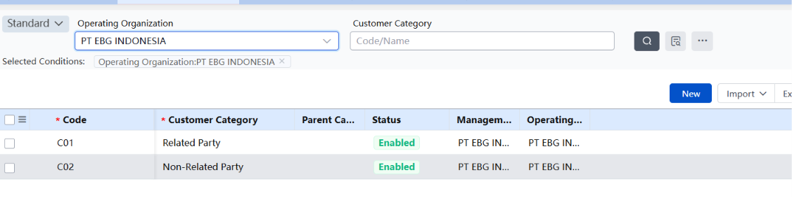

Pembuatan Jenis/Kategori Customer, tujuan untuk pembagian customer.

(Enable/Disable, Add, Delete)

### 58. 客户级别

- **Customer Grade**

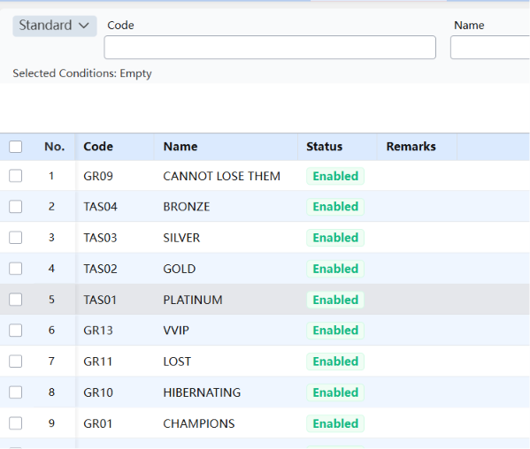

Pembuatan Grade atau prioritas dari suatu Customer, tujuan untuk pembagian customer sesuai prioritas.

(Enable/Disable, Add, Delete)

### 59. 客户行业

- **Customer's Industry**

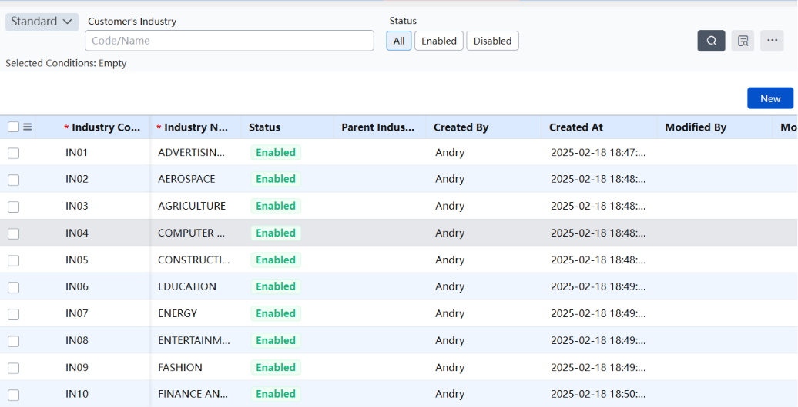

Pembuatan Jenis/Kategori Industri Customers

(Enable/Disable, Add, Delete)

### 60. 客户档案

- **Customer File**

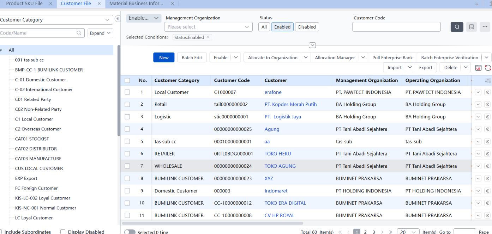

**Database resmi semua customer** perusahaan di sistem. Sebelum bisa bikin Sales Order, Invoice, atau transaksi apapun ke customer, customer wajib terdaftar dulu ke customer file system perusahaan, supaya bisa diinput kedalam invoice atau order.

### 61. 客户属性

- **Customer Property** (Tidak ada di settings) (issue)

### 62. 供应商分类

- **Supplier Category**

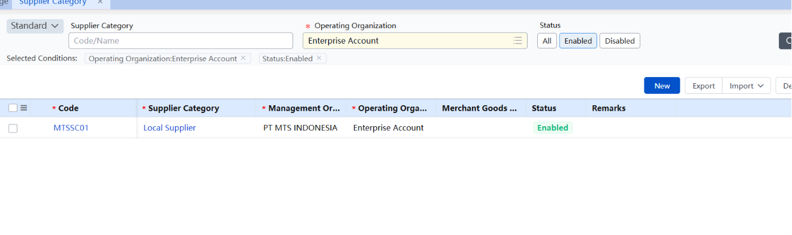

Mirip seperti Customer Category atau Material Category, hanya saja dengan base Supplier. Juga dipakai untuk menkategorikan supplier.

(Enable/Disable, Add, Delete)

## Supplier

### 63. 供应商档案

- **Supplier File**

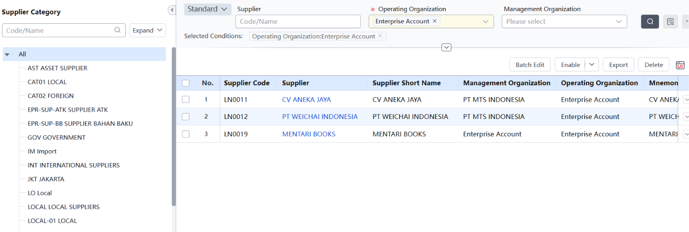

Database atau informasi setiap supplier yang terdaftar di dalam sistem, sama seperti Customer File, tapi ini basisnya Supplier.

(Enable/Disable, Add, Delete)

### 64. 供应商属性

- **Supplier Property** (Tidak ada di settings) (issue)

## Project

### 65. 项目类别

- **Project Category**

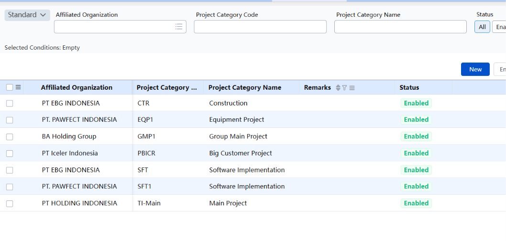

Pengkategorian project, berguna untuk pembagian, kategori atau level suatu project yang akan dijalankan

### 66. 项目

- **Project**

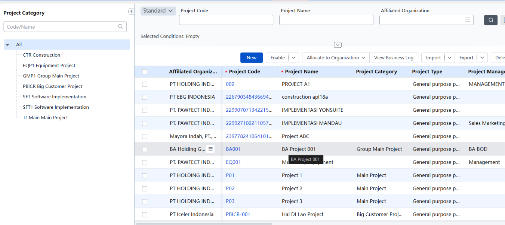

Input project yang sedang berjalan delete project yang sudah tidak berjalan.

Biasanya dipakai untuk meng-assign ke suatu project yang ingin dijalankan, berguna untuk mentrack cost termasuk workflow di dalamnya.

(Add, Delete)

## Business File

### 67. 仓库

- **Warehouse**

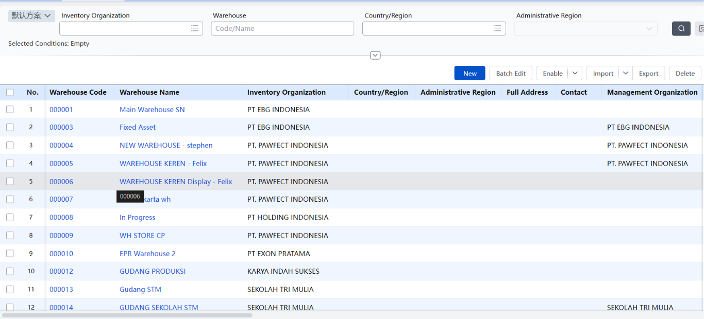

Pendaftaran nama gudang kepunyaan organisasi ke dalam sistem (Enable/Disable, Add, Delete)

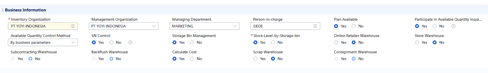

**SN Control** → aktifkan tracking per serial number untuk barang mahal/bernilai tinggi. Kalau Yes, setiap unit punya SN unik yang dilacak sistem dari masuk sampai keluar gudang.

**Storage Bin Management** → aktifkan manajemen lokasi bin di dalam gudang. Kalau Yes, sistem tracking barang sampai level rak/lokasi spesifik. Wajib Yes kalau gudang lo punya rak fisik.

**Calculate Cost** → sistem hitung nilai/cost barang di gudang setiap akhir bulan (stock valuation). Kalau Yes, ada perhitungan monetary value inventory di laporan keuangan.

**Stock-Level-by-Storage-Bin** → sistem tracking jumlah stok per bin secara individual. Kalau Yes, lo bisa lihat berapa qty barang di tiap bin secara real-time, bukan cuma total gudang.

### 68. 货位

- **Storage Bin**

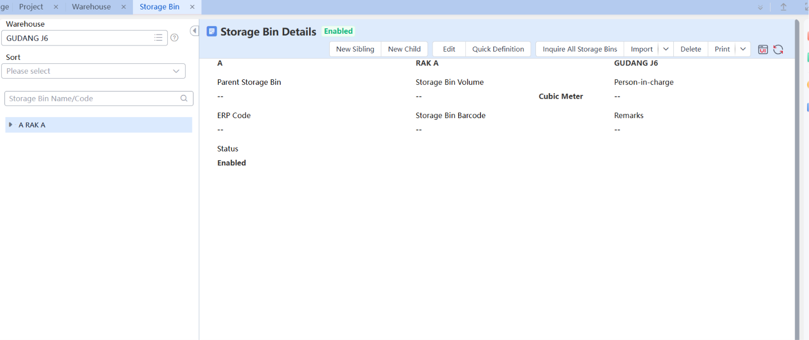

**Turunan dari Warehouse.** Fungsinya **Mengalokasikan** barang ke titik paling spesifik, tempat barang disimpan secara fisik. Bisa berupa laci, slot rak, lantai tertentu, atau area kecil yang punya kode unik.

Contoh: Gudang A – Rak 001 (baju)

### 69. 货位物料对照

- **Storage Bin Material Cross**

**Mendedikasikan suatu storage bin** tertentu untuk material spesifik tertentu secara **permanen**.

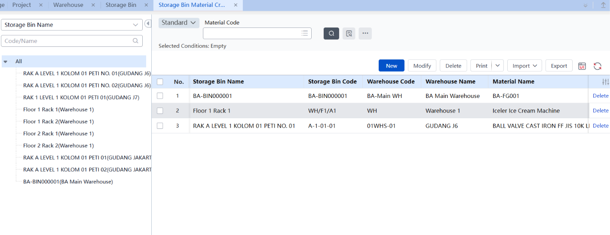

Contoh Gudang A -- Rak 1A (Raw Material).

### 70. 发运方式

- **Shipping Method**

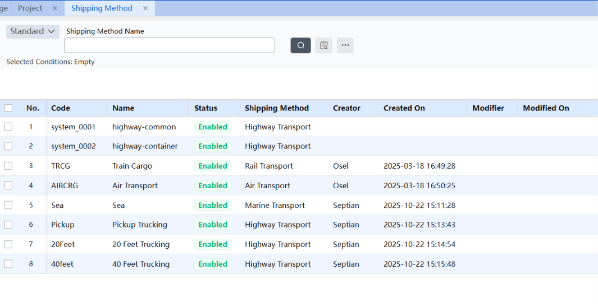

Penambahan jenis pengiriman ke dalam system.

(Enable/Disable, Add, Delete)

## Enterprise Fund Account

### 71. 企业银行账户

- **Bank Account** (Tidak ada di settings) (issue)

### 72. Corporate Fund Account

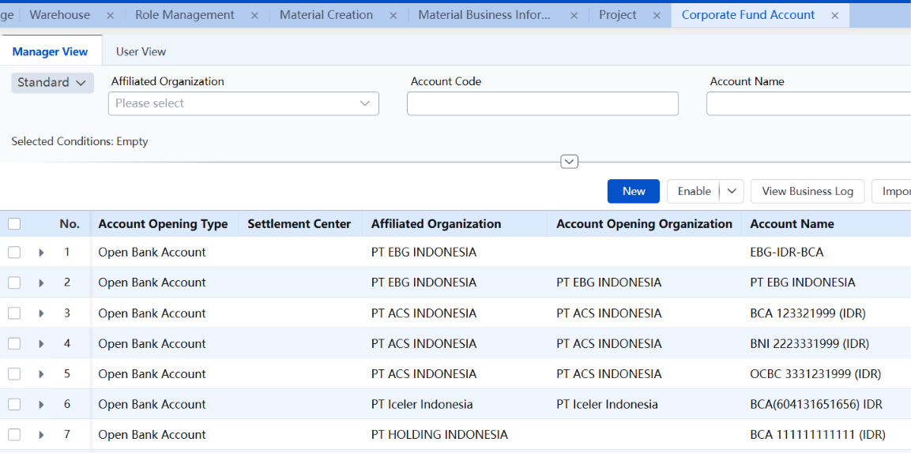

Kantong dana utama perusahaan. Ini "rekening induk" yang nampung total duit internal yang dimiliki perusahaan. Dari sini lo bisa lihat berapa total dana yang tersedia.

### 73. Enterprise Cash Account

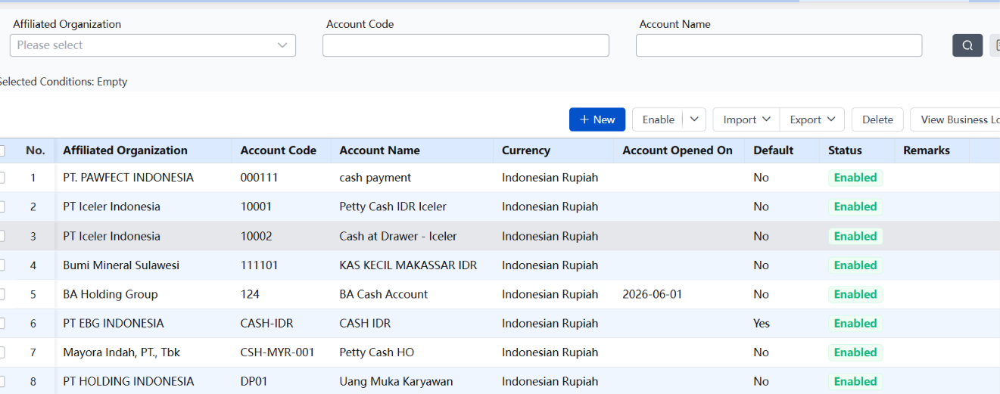

Rekening kas operasional yang lebih kecil & spesifik. Contoh: petty cash, kas per department. Bisa di-assign ke divisi atau proyek tertentu. Ini "kantong-kantong kecil" yang diambil dari kantong induk.

### 74. Account Purpose

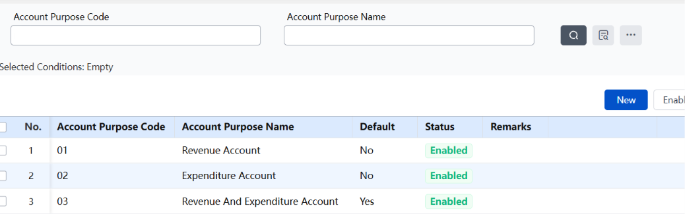

Penanda tujuan tiap akun dipakai buat apa. Fungsinya biar duit ga kepake sembarangan — tiap akun jelas peruntukannya.

### 75. 企业现金账户

- **Cash Account**

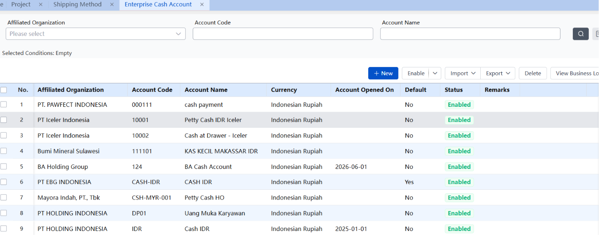

Pengkategorian kantong cash pada suatu organisasi, mirip seperti Chart of Account dalam Finance.

## Expense Item

### 76. 费用项目类型

- **Expense Item Category**

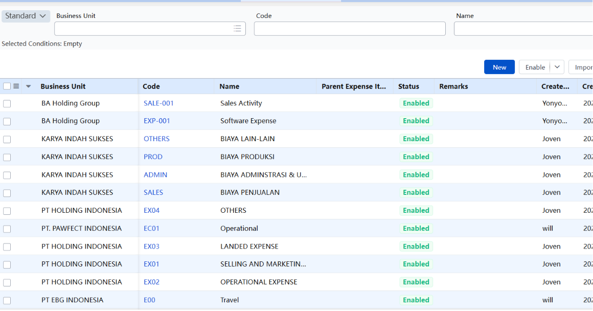

Penambahan jenis atau kategori beban/biaya yang dikeluarkan oleh perusahaan.

(Enable/Disable, Add, Delete)

### 77. 费用项目

- **Expense Item**

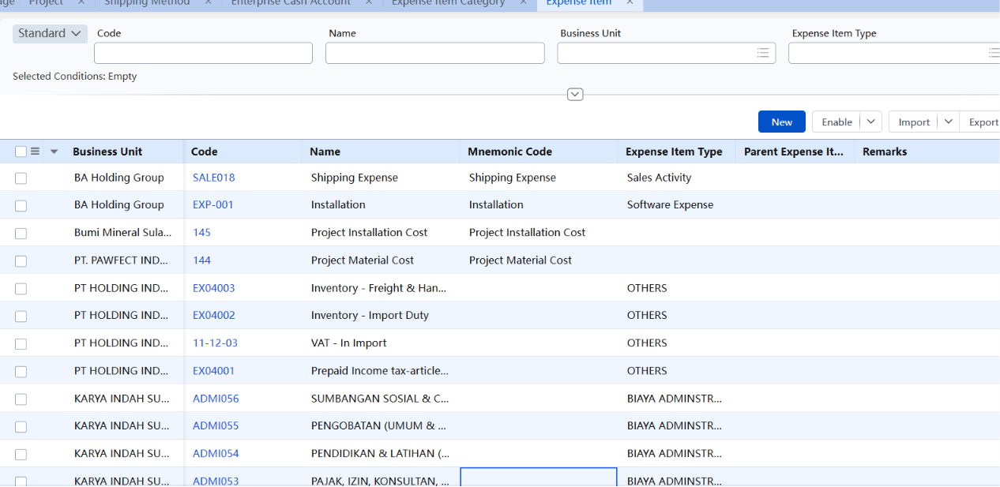

**Turunan dari Expense Category.** Jenis item pada expense beban/biaya dalam kategori expense.

Contoh: Kategori “Pajak” – PPH 21, PPHb dll

## User Defined Field

### 78. 固定自定义项

- **Fixed User-defined Field**

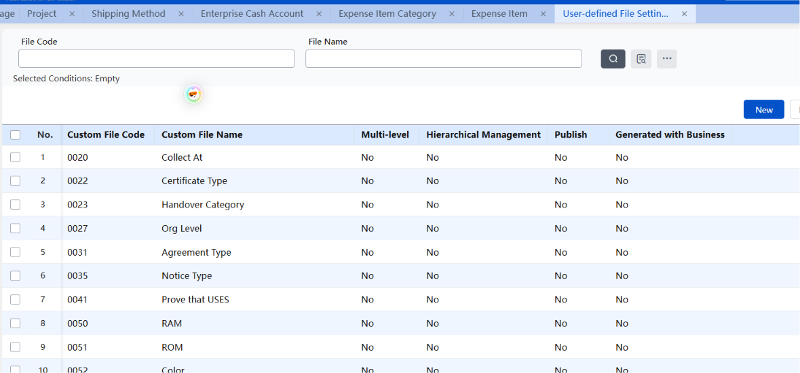

Fixed User Defined Field yang menjadi permanen dan wajib ada contoh pada bagian No, code, nama. (penambahan suatu menu atau list pada User Defined)

### 79. 自定义项设置

- **User-defined File Setting**

Penambahan suatu menu atau suatu list dalam sistem, biasanya kebutuhan bisa berbagai macam, contohnya dalam purchasing atau sales.

## Process Data

### 80. 交易类型

- **Transaction Type**

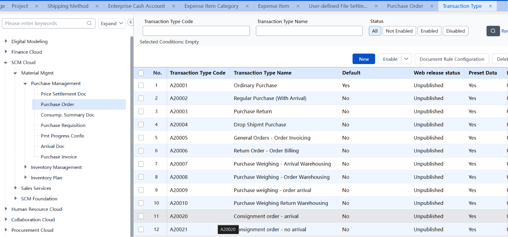

Menambahkan **tipe transaksi** (jenis transaksi apa) ke berbagai macam cloud, tidak hanya terbatas 1 saja, tapi biasanya akan lebih sering dipakai di modul SCM

Tau fungsi, tidak mengerti logic (issue)

## Workflow

### 81. 模型管理

- **Model Management**

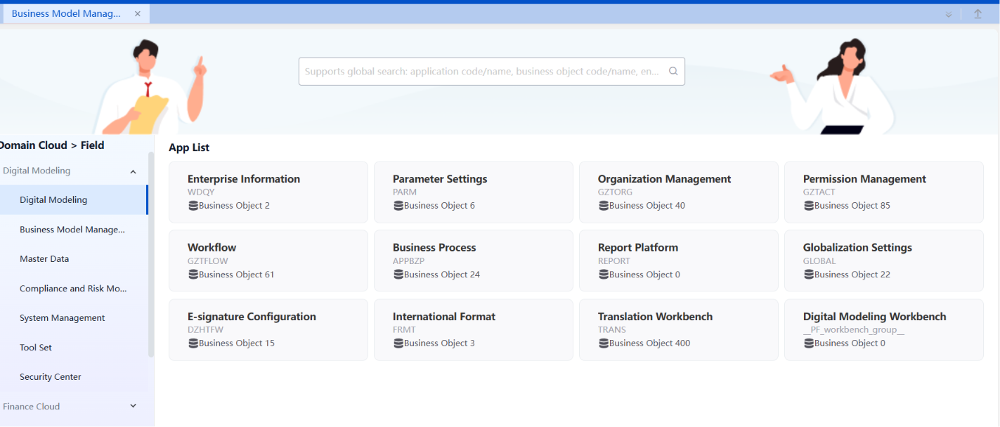

Tampilan arsitektur sistem — user bisa lihat struktur data di balik setiap modul (?)

Tau fungsi, tapi tidak tau logic (issue)

### 82. 流程调度

- **Workflow Process Scheduling**

**Note: Sudah digantikan menjadi Workflow Monitoring.**
Fungsinya utk monitoring Workflow request yang sudah pernah diajukan.

## Business Process

### 83. 单据转换规则

- **Doc Conv. Rules**

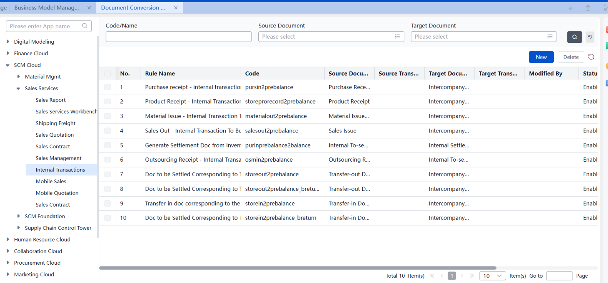

Aturan yang menentukan bagaimana satu dokumen bisa otomatis menghasilkan dokumen berikutnya dalam alur transaksi. Document Conversion Rules = aturan yang mendefinisikan push down itu. **Arrival > Receipt**

### 84. 业务流设置

- **Business Process Design**

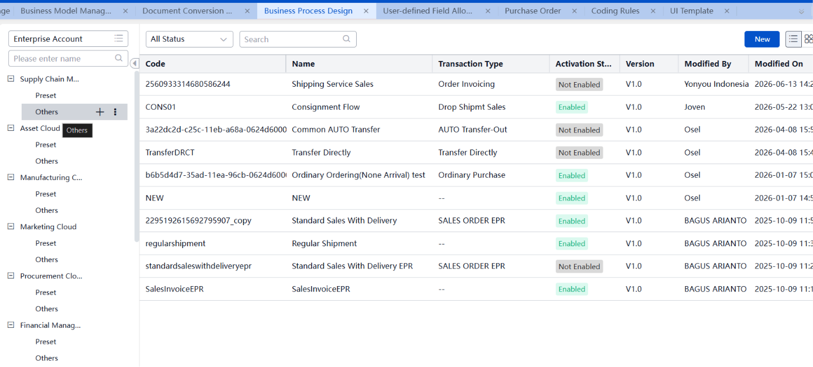

Jika Workflow Design adalah urutan untuk suatu approval, maka Business Process Adalah urutan aktivitas/dokumen dari awal sampai akhir.

## Aux Process Function

### 85. 代理人设置

- **Proxy Settings** (Tidak ada di settings) (issue)

### 86. 审批常用语

- **Common Approve** (Tidak ada di settings) (issue)

## Template

### 87. UI模版

- **UI Template**

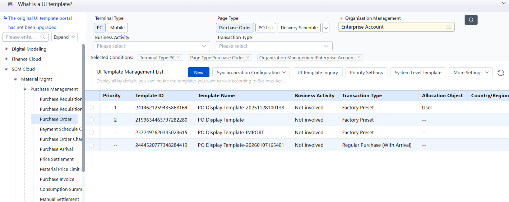

**UI Template** — menyesuaikan tampilan UI berdasarkan jenis atau kebutuhan transaksi Contoh: field ukuran baju (dari user defined) bisa dimasukkan ke UI Purchase Order

**Note**: kalau user sudah pernah modifikasi UI mereka sendiri, update template besar/global dari kita **tidak akan menimpa** punya mereka. Ada opsi **"Clear user level setting"** untuk menyamakan semua

Tau fungsi, masih butuh latihan untuk menggunakan ini (issue)

### 88. 打印模版

- **Print Template**

setting template untuk print, formatnya drag and drop saja

Tau fungsi, masih butuh latihan untuk menggunakan ini (issue)

## Coding Rules

### 89. 编码规则

- **Coding Rules**

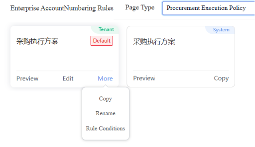

Aturan penomoran otomatis untuk setiap transaksi (PO, Material, dll) Exp: PO-20261106-0001

Constant untuk jenis unique code, Time untuk penomoran tanggal, SN untuk kode urutan

## Alert Task

### 90. 预警任务

- **Alert Task**

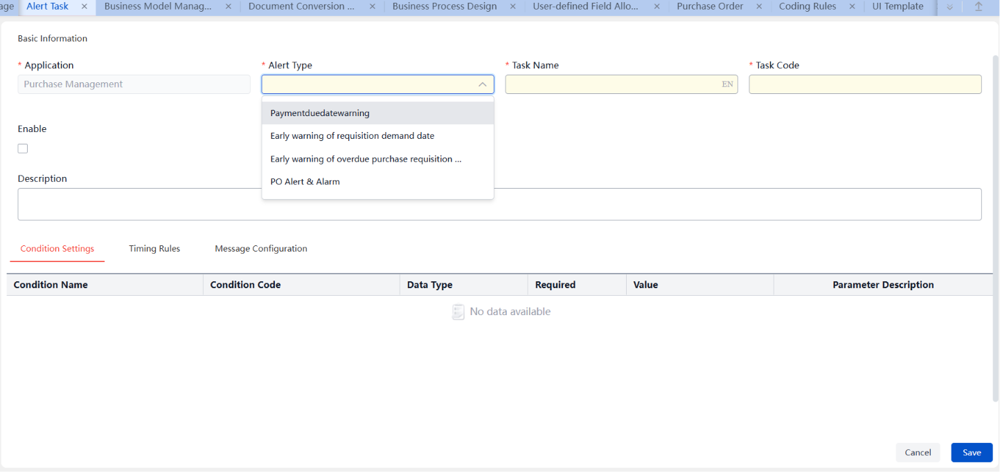

Bikin Alert atau Reminder terhadap suatu pekerjaan yang dikerjakan, bisa berlaku untuk semua jenis cloud.

## Workbench Management

### 91. 工作台管理

- **Workbench Management**

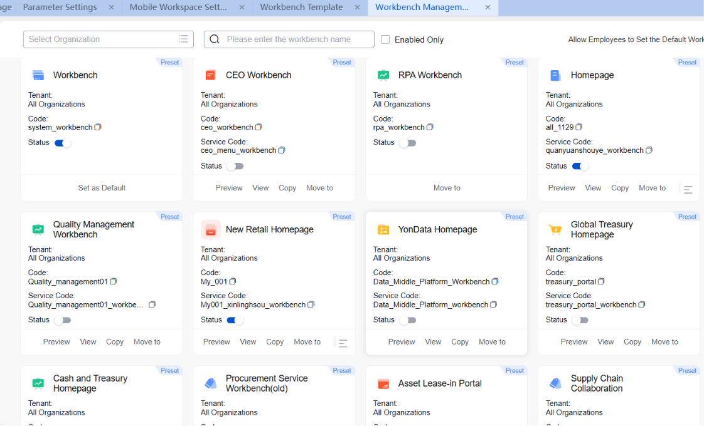

Mensetting template tataan dari Workbench sesuai dengan kebutuhan user.

**Tau fungsinya belum ngerti cara pakai (issue)**

## Mobile Workbench Configuration

### 92. 移动工作台设置 (Mobile Workspace Settings)

- **Mobile Workbench Settings**

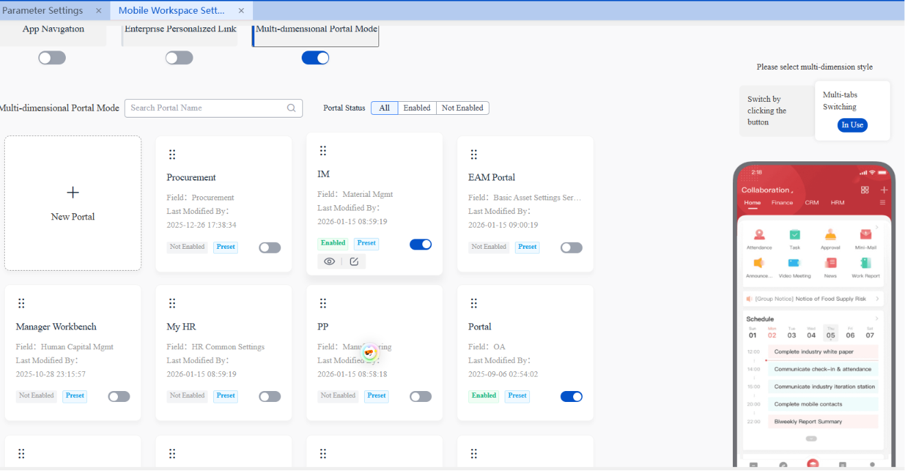

Digunakan untuk men-customize menu dan men-enable/disable menu yang ada pada system yonyou pada mobile phone.

**Tau fungsinya belum ngerti cara pakai (issue)**

### 93. 移动门户设计

- **Mobile Portable Design/ Mobile Portal Design**

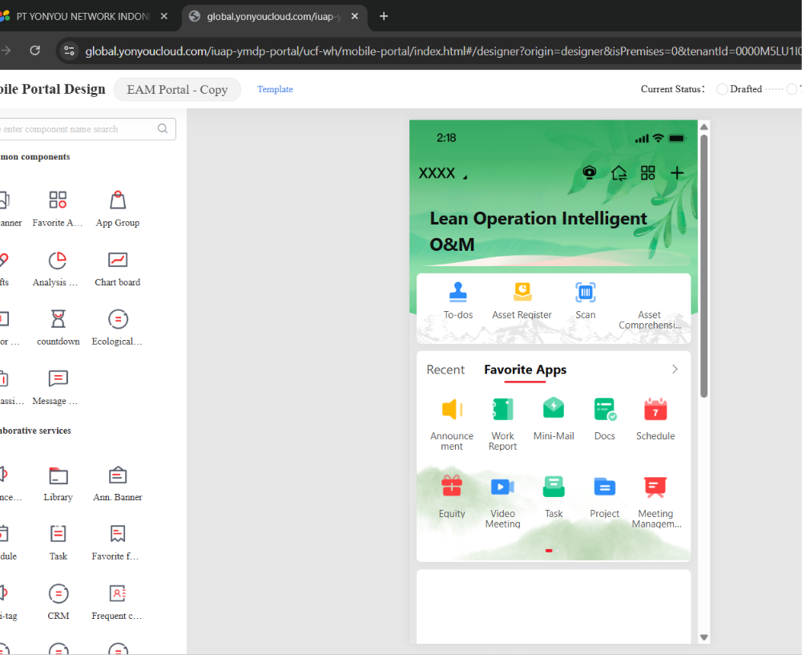

Digunakan untuk Mendesign UI dari aplikasi mobile Yonyou

**Tau fungsinya belum ngerti cara pakai (issue)**

### 94. 移动应用排序

- **Homepage Sorting** (Tidak ada di settings) (issue)

## Catatan Tambahan Digital Parameter Training Video by Osel

### 95. Enterprise Information

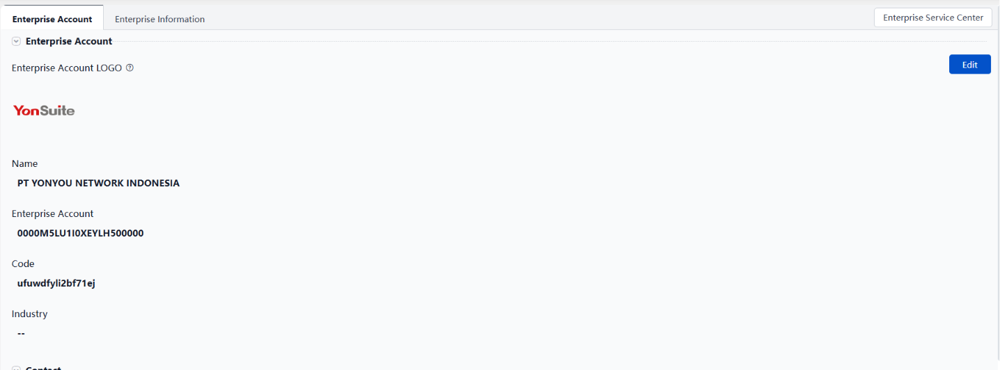

Tempat menyimpan informasi client/customer. Logo perusahaan juga bisa diedit di sini.

### 96. Alur Setup Dasar (Flow Penting)

- Bikin Business Unit → Bikin Department → Bikin User → Bikin Employee
- → Bikin Role → Hubungkan Role dengan Employee dengan Authorization

### 97. Parameter Setting — Level Pengaturan

| Level | Cakupan |
| --- | --- |
| Tenant Level Setting | Berlaku untuk semua tenant — pengaruhnya besar dan luas |
| Org Parameter Setting | Berlaku khusus untuk satu organisasi saja |

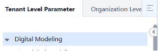

### 98. Permission Management & Digital Parameters (yang sering diotak-atik)

- **a. User & Employee**
- Auto create employee/user saat ada user baru yang dibuat

- **User Management** — untuk bikin user baru

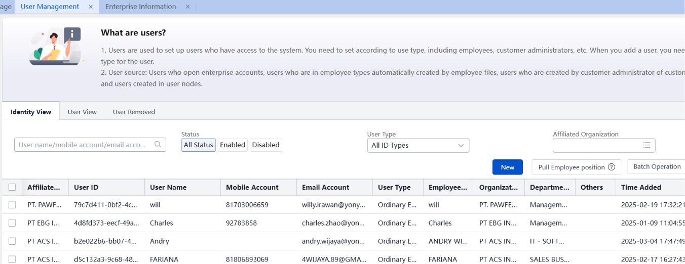

- **New Identity** — perpindahan akses user untuk employee **(User Management > User View)**

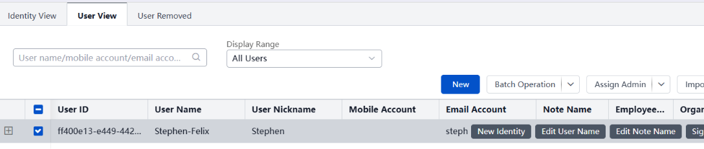

- **User View** — bisa delete user, sebagai administrator

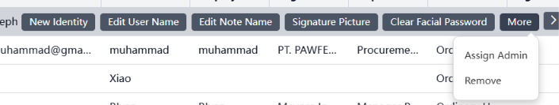

- **b. Organization & Business Unit**
- **Multi Organization** **(HANYA BISA DIAKTIFKAN SEKALI, LANGGANAN BERBEDA)—** untuk perusahaan yang punya cabang/anak Perusahaan

- Business Unit jenis yang paling sering dipakai: **"Company"**

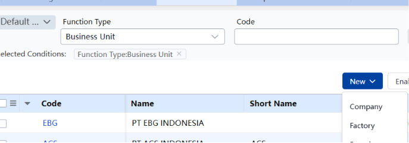

- **Original Currency** — currency yang diset saat bikin business unit
- **Functional Currency** — currency yang diset sesuai kebutuhan

- **Organization Chart** (di bagian Department)

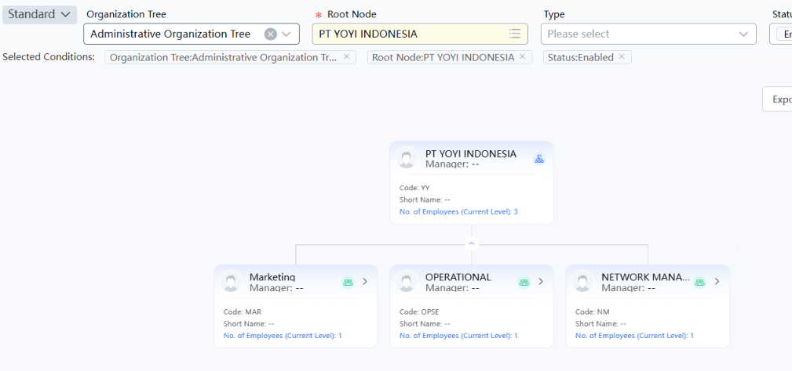

- **c. Parameter & Karakteristik lain**
- Business Management → Characteristic → **Character Grade Control** (default: No). Kalau di-set Yes, custom field yang kita set di sistem akan aktif — ❓ **Tidak tau fungsi dan logic (issue)**

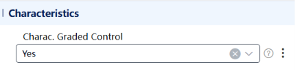

- Parameter Setting → **Withholding Payable** dan **Tax Calculation Time Point**
- Tulisan **"EN"** di suatu kolom = kolom itu mendukung multiple language

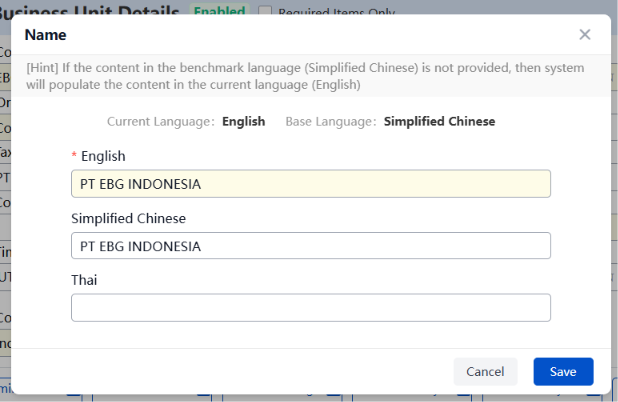

- **d. Data Permission**
- **Data Permission** (izin untuk mengakses data) > Pilih user > Controlled Object ke All (semua cloud) – Biasnaya dipakai untuk pembatasan region dan fungsi. Contoh Case : Sales Region Barat hanya bisa meng-akses Customer yang diinput pada Region Barat.
- **e. Workflow**
- **Workflow Design** → Settingan "select person by initiator" → opsi "Department head/leader of initiator" = approval dilakukan oleh head/leader department dari yang mengajukan

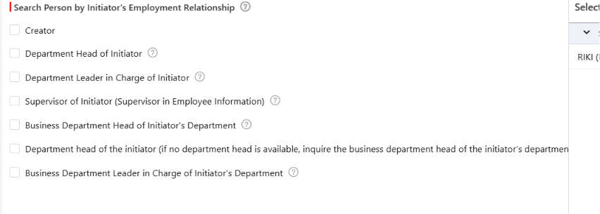

- **Setting approver (1 Phase bisa >1 orang)** — bisa diatur: 1 orang cukup approve / harus semua / jumlah tertentu supaya ter-approve

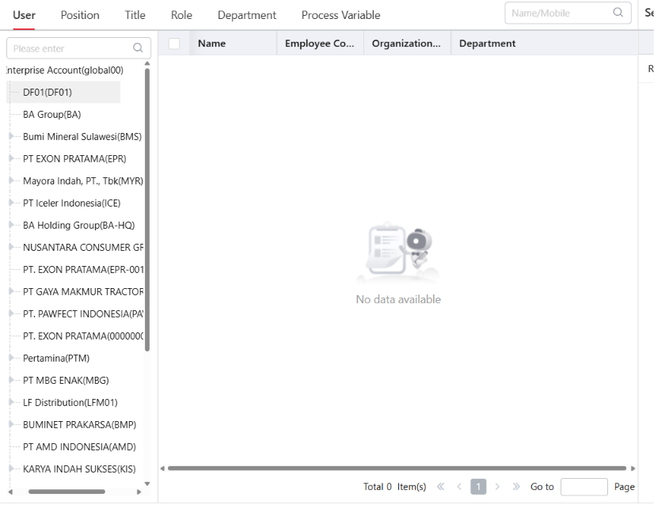

- **Approval berjenjang** — 1 Phase bisa lebih dari 1 nama, bisa dibuat berurutan (by nama), approval-nya otomatis akan mengikuti urutan (untuk kasus approval jumlah person > 1 orang dalam 1 phase)

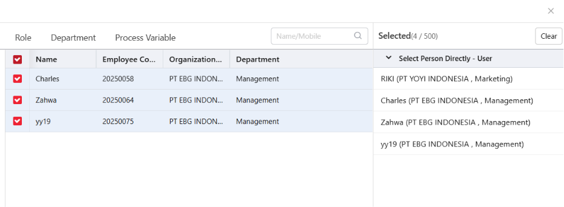

- **Workflow Monitoring** — untuk cek workflow yang sedang berjalan; pastikan nomornya benar, kalau tidak transaksi lain bisa terganggu

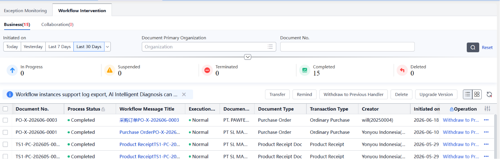

- **5. Master Data**
99. **Management Grade** — assign company tertentu agar bisa input data ke master data

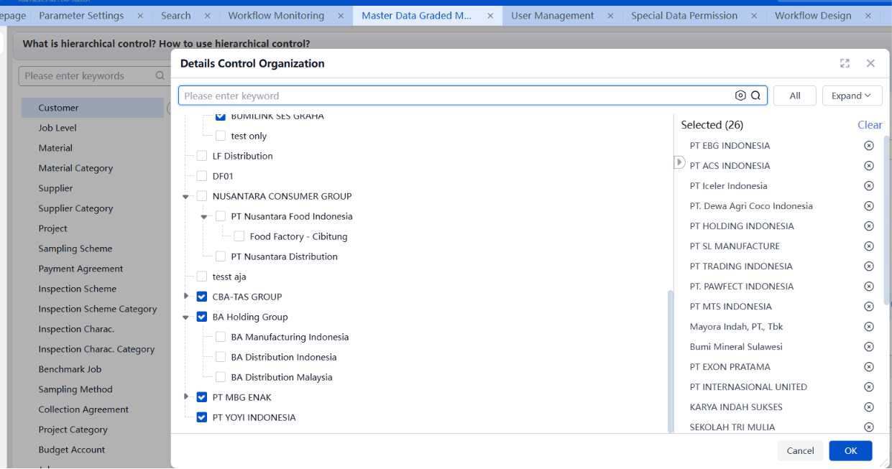

100. **Uniqueness Rules** — pengecekan data duplikat. Semakin banyak layer kategori, makin detail. Contoh: cek by nama + negara + code = 3 layer. Kalau cuma 1 layer (nama saja), berisiko false-duplicate (nama sama tapi negara/code beda dianggap sama). Paling sering kena: nama customer, supplier, material.

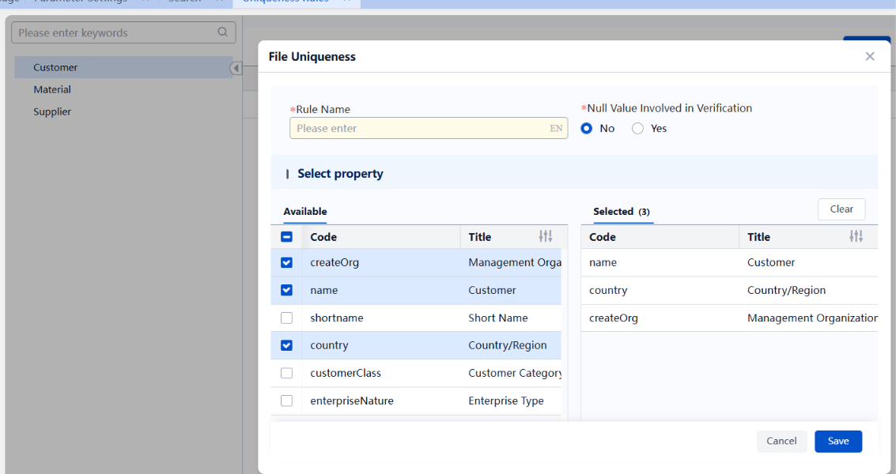

Catatan: Kalau sistem Yonyou ada update, workflow yang sudah dibuat **tidak akan hilang**

101. **Currencies** — bisa atur precision (biasanya 0–2 digit, tergantung nilai mata uang). Catatan: kalau precision sudah dinaikkan, **tidak bisa diturunkan lagi**

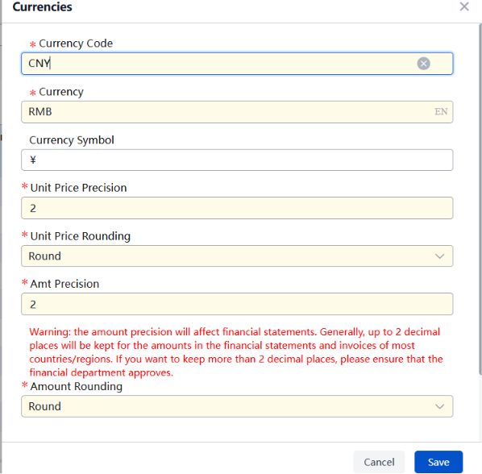

102. **Exchange Rate Type** — untuk memasukan Tipe Rate mana yang mau menjadi patokan.
Opsi "Benchmark exchange rate" bisa konek ke bank China untuk update rate otomatis (hanya tersedia versi China)

103. **Exchange Rate** — input rate fiat ke dalam Exchange Rate Type yang sudah dibuat. Kolom "indirect exchange" diisi rate fiat yang mau ditampilkan. Rate ini berubah-ubah, sebaiknya rutin di-maintain

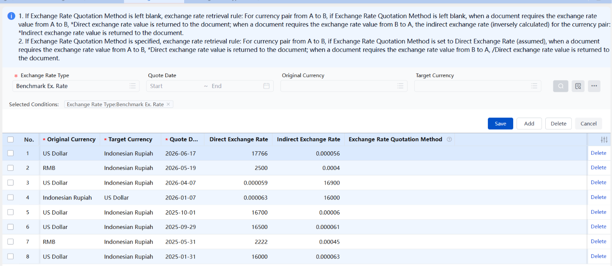

104. **User Defined File Setting** — maintain custom field, bentuknya seperti kategori/koleksi Contoh: RAM dengan berbagai kapasitas→ bisa add size baru **Flow:**
  - Add new di **User Defined File Setting**

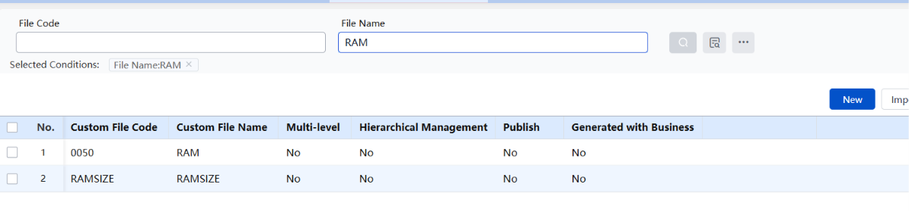

  - Maintain ke **User Defined File Maintain** untuk isi kategorinya (mis. 8GB, 16GB, 32GB, 64GB)

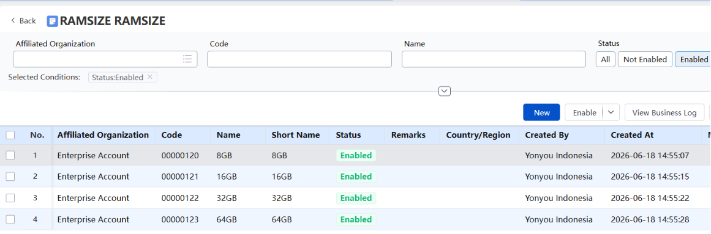

  - Ke bagian **Characteristic** untuk: (1) assign ke Business Unit mana, (2) pilih data type sesuai yang sudah dibuat **(User Defined File Maintain)**
  - Save → aktifkan → alokasikan kategori agar bisa dipakai

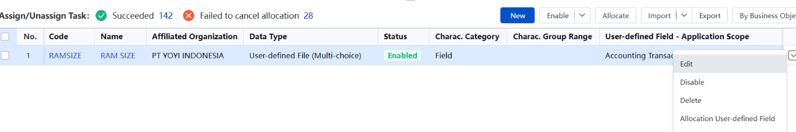

  - Untuk kategori barang, biasanya dialokasikan ke **Purchase Order**, masuk ke bagian *body* (bukan header)

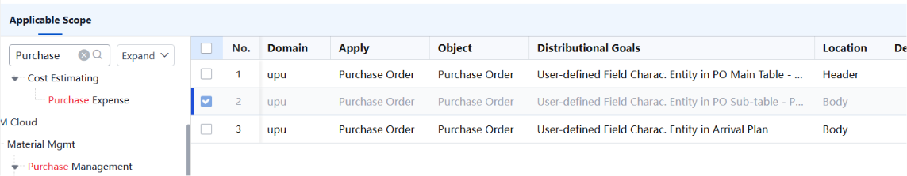

  - Untuk verifikasi semua sudah terpasang, pastikan kita alokasikan ke mana dulu (Apakah Purchase Order, Purchase Request?), baru kita cek ke bagian yang sudah alokasikan itu misalkan Purchase Order (DISINI ADA ERROR, YANG DIBIKIN TIDAK MUNCUL) (issue)

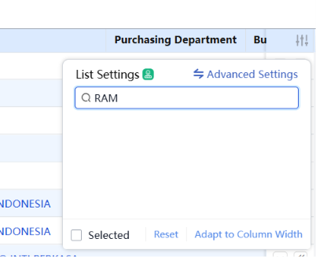

106. **Transaction Type** — membedakan UI/data antar jenis transaksi. Contoh: saat import, ada beberapa jenis data — UI dan proses import bisa dibedakan (mana yang lokal, mana yang bukan). Bikin tipe transaksi untuk bikin pembeda tiap jenis transaksi. Semuanya ud by default, tpi tergantung case kemungkinan bisa ditambahin atau custom. - (Tau fungsi, belum mengerti logic) (issue)

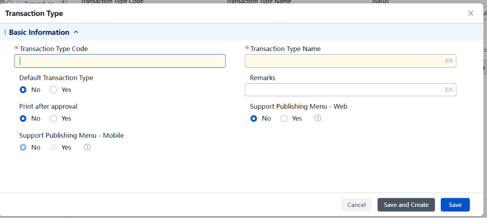

107. **Coding Rules** — aturan penomoran otomatis transaksi (PO, Material, dll) Exp: PO-20261106-0001
  - Tambah jenis penomoran baru: pilih field → Edit → Copy → edit hasil copy-nya

  - Kalau pakai Transaction Type, bisa tentukan formula penomoran sendiri (lalu wajib di-**verify**)
  - Setting "basic flow" menentukan nomor reset per bulan/per tahun

  - **Manual modification** sebaiknya dinonaktifkan (kalau aktif, user bisa otak-atik nomor secara manual)

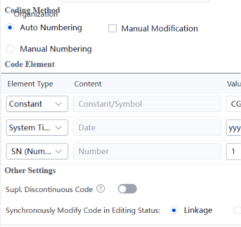

  - **Supplement incontinuous code** — merapikan nomor agar tetap berurutan kalau ada data atau nomor terhapus, maka system otomatis akan memnyesuaikan angka Ketika diinput order baru.

  - **View SN** — melihat sudah berapa kali suatu kode terpakai (SN = nomor urut ke berapa, mis. PO ke berapa)
  - **Coding Log** — detail riwayat nomor kode yang sudah terpakai.

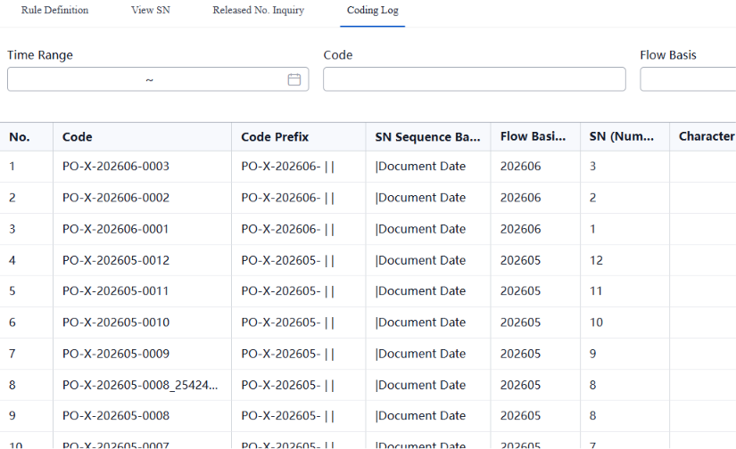

108. **UI Template** — menyesuaikan tampilan UI berdasarkan jenis transaksi Contoh: field ukuran baju (dari user defined) bisa dimasukkan ke UI Purchase Order
- **Catatan**: kalau user sudah pernah modifikasi UI mereka sendiri, update template besar/global dari kita **tidak akan menimpa** punya mereka. Ada opsi **"Clear user level setting"** untuk menyamakan semua —  **belum sepenuhnya paham cara kerja opsi ini.**

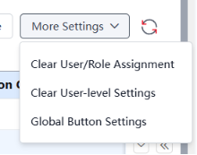

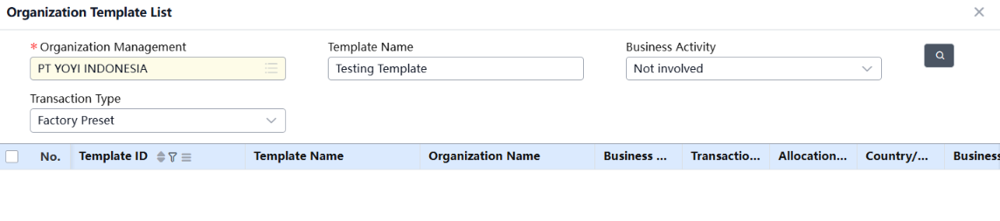

109. **Print Template** — setting template untuk print, formatnya drag and drop

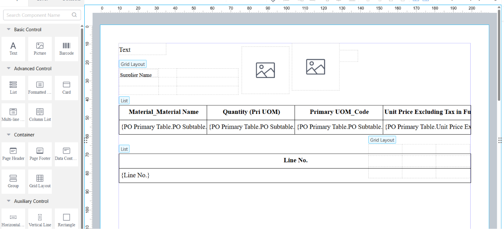

- **Menu Management** — mengubah lokasi/posisi menu

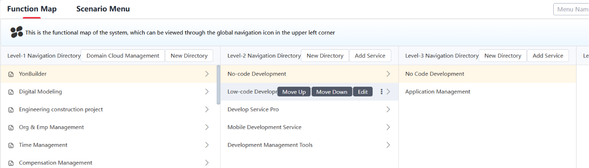

- **Enterprise Style Setting / System Frame Setting** — mengubah preference theme/template tampilan

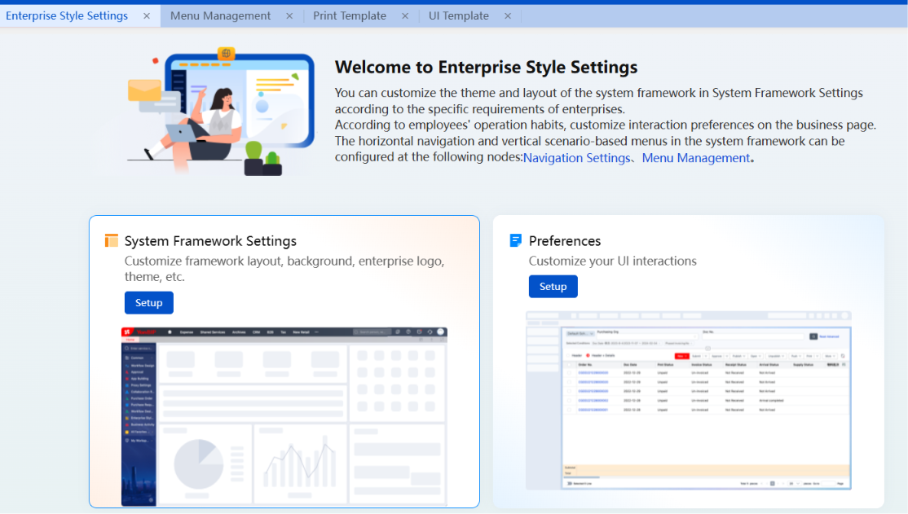

**Catatan Tambahan:**

### 99. Leader in Charge dan Manager (cmiiw)

designated head of the department; used for approval routing — when a workflow requires department head approval, the system auto-routes to whoever is set as Leader here.

### 100. Licensing & Resource Management

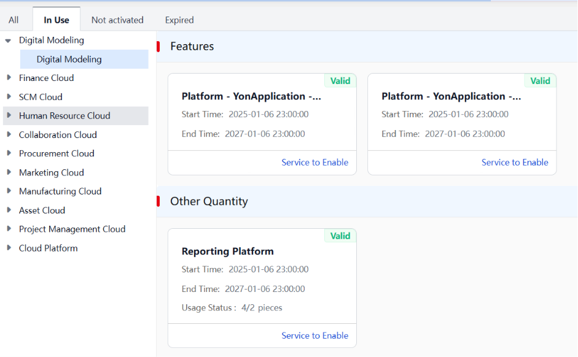

**Tracking masa berlaku lisensi** — kapan expired, modul apa yang aktif

**Kontrol akses modul** — kalau lisensi expired/not activated, user nggak bisa akses modul itu

**Manajemen user slot** — berapa banyak user yang bisa pakai sistem (quantity-based licensing)

**Service activation** — tombol "Service to Enable" untuk aktivasi fitur tambahan

## Tax Collection

### 101. Tax System File (register

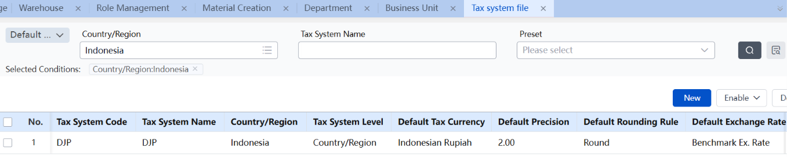

Biasanya untuk mendaftarkan suatu Lembaga perpajakan suatu negara, karena kita berada di Indonesia, di system kita daftarkan menggunakan DJP.

### 102. Tax Category Archive

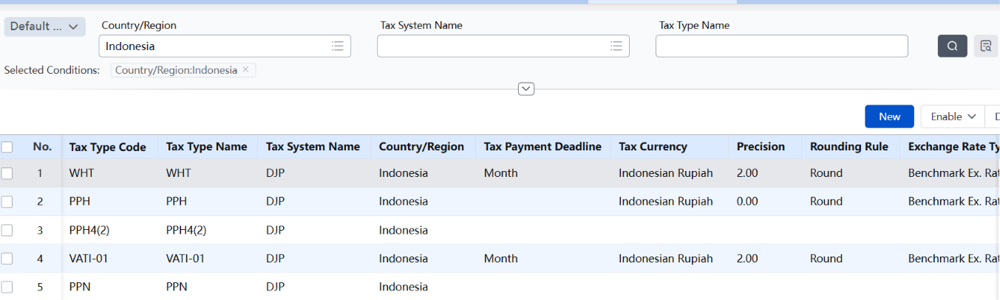

Biasanya dipakai untuk mendaftarkan tipe tipe jenis pajak pada suatu negara, jika di Indonesia ada seperti PPH, PPH, PPN, dll.

### 103. Tax Rate Archive

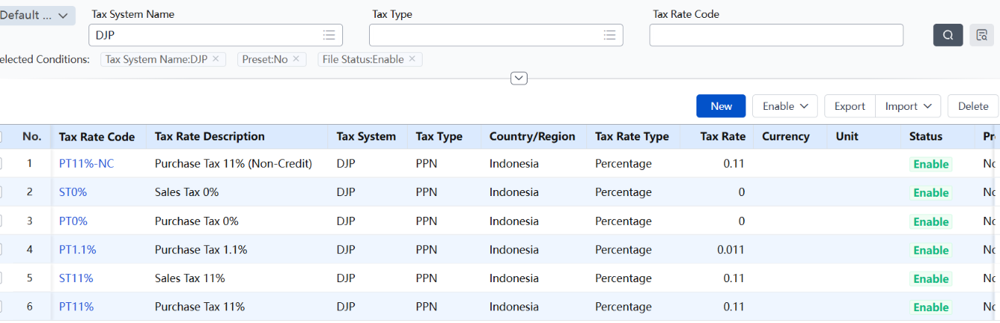

Disini biasanya dipakai untuk memasukan tipe tipe rate dari jenis jenis pajak suatu negara tergantung dengan jenis pembelian atau penjualan.

### 104. Witholding Tax Type

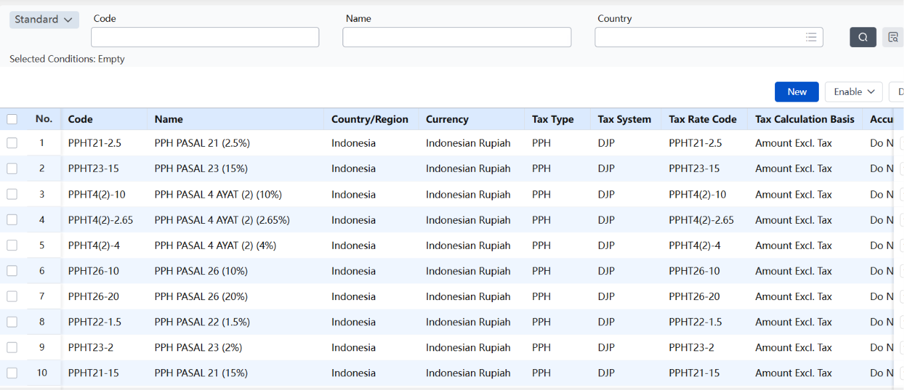

Tempat kita memasukan jenis jenis potongan namun hanya **khusus potongan PPH** saja, dikarenakan potongan PPH ada berbagai jenis.

Ke-3 Settingan dari Tax ini semuanya berhubungan untuk kebutuhan purchasing, Sales dan Finance kedepannya.
