## **1. FA Opening**

*Input aset yang udah ada sebelum modul Fixed Asset resmi diaktifkan.*

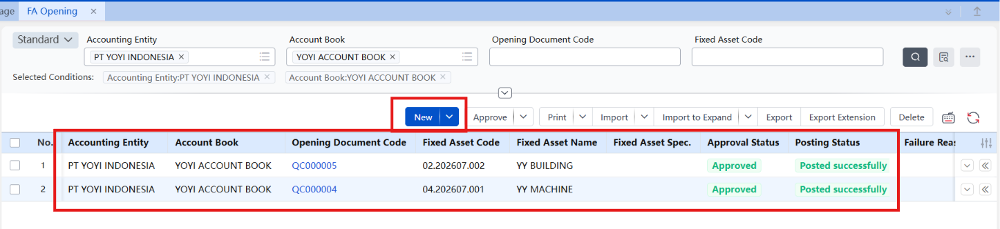

**Fungsi:** sama kayak logic Opening di AR/AP — perusahaan biasanya udah punya aset dari sebelum sistem ini dipakai (gedung, kendaraan, komputer, dll). FA Opening ini pintu masuk buat "mendaftarkan" aset-aset lama itu, biar starting point sistem sesuai kondisi riil di lapangan, bukan mulai dari nol.

Kalau nggak bisa input/save aset, cek dulu "Fiscal Period" — kemungkinan tahun/periode yang mau diinput belum ke-register di situ.

## **2. FA Opening Account Setup**

*Finalisasi data opening balance FA per account book.*

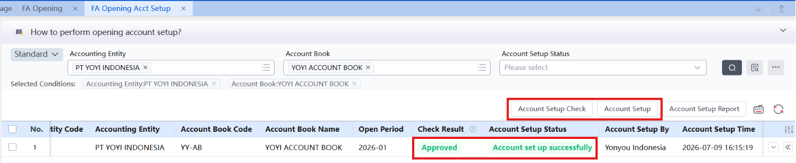

**Fungsi:** mengunci data opening yang udah diinput supaya dianggap resmi/final — sebelum ini, data opening masih bisa dianggap "draft". Bisa cek hasil dulu baru setup, atau langsung setup kalau udah yakin datanya benar.

## **3. New FA**

*Pendaftaran aset baru sehari-hari (bukan aset lama/opening).*

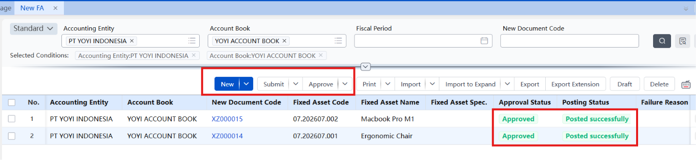

**Fungsi:** ini titik masuk utama buat nyatet pembelian aset baru selama operasional berjalan — beda sama FA Opening yang cuma dipakai sekali di awal. Kartu aset di sini bisa di-assign ke Department/Project tertentu, dan support skenario lanjutan seperti aset yang dibangun dari akumulasi biaya project (Specialized Accounting/Project Cost) atau aset yang butuh perhitungan pajak percepatan (Tax Cloud - Accelerated Depreciation).

## **4. FA Transfer**

*Mencatat perpindahan aset antar Department/lokasi.*

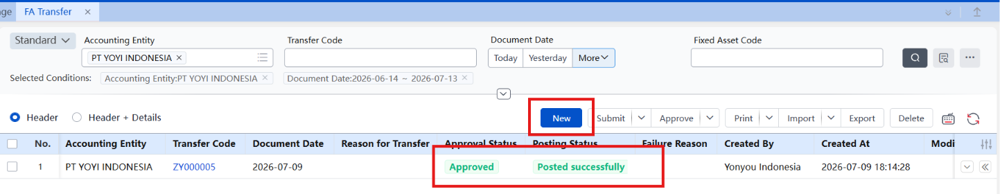

**Fungsi:** aset fisik itu sering pindah tangan — laptop dipindah dari divisi A ke divisi B, kendaraan dialihkan ke cabang lain. Tanpa fitur ini, histori kepemilikan/penempatan aset jadi nggak jelas. Begitu form transfer di-review, sistem otomatis update kartu aset dan generate voucher GL — jadi perpindahan aset ini juga punya jejak akuntansi, bukan cuma catatan fisik doang.

## **5. FA Adjustment**

*Koreksi data di kartu aset yang salah input.*

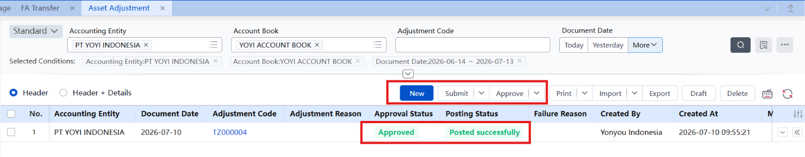

**Fungsi:** kalau ada kesalahan di data dasar aset (Basic Info, Accounting Info, Account Distribution), ini tempat buat membenerinnya — dan yang penting, sistem tetap nyimpen data SEBELUM dan SESUDAH perubahan. Ini penting buat audit trail: kalau ada yang tanya "kok angkanya beda dari sebelumnya," ada jejaknya.

## **6. FA Reclassification**

*Pindah kategori aset kalau ada perubahan kebijakan/kesalahan klasifikasi.*

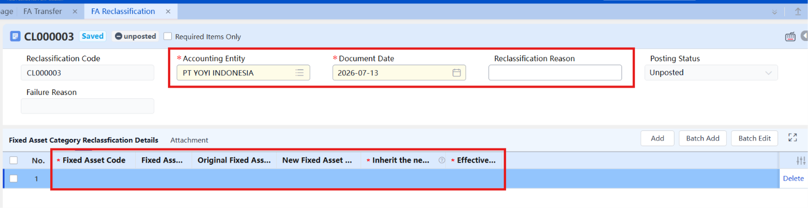

**Fungsi:** kadang kategori aset perlu diubah — karena kebijakan akuntansi berubah, cara perusahaan mengelola kategori aset berubah, atau ada salah klasifikasi dari awal. Yang penting di sini: lo bisa pilih apakah aset itu "ikut" aturan depresiasi kategori barunya (metode, umur ekonomis, nilai residu) atau tetap pakai aturan lama.

## **7. FA Disposal**

*Proses resmi pas aset dilepas — dijual, rusak, atau hilang.*

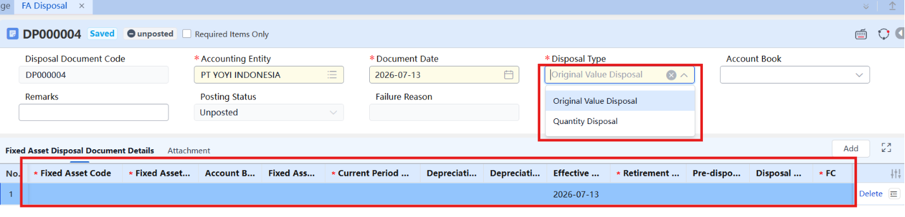

**Fungsi:** aset nggak bisa "dihapus" gitu aja dari pembukuan pas udah nggak dipakai — harus lewat proses resmi yang menghapus nilai original dan akumulasi depresiasinya secara akuntansi, sekaligus mencatat untung/rugi dari pelepasan itu (kalau dijual di atas/bawah nilai buku).

dijalankan saat aset dijual, rusak, dihibahkan, atau hilang. Proses ini trigger akun clearing (清理), generate entry buat clearing + income + gain/loss, dan otomatis update status kartu serta info depresiasi asetnya.

## **8. Depreciation Accrual**

*Proses inti — menghitung & mencatat penyusutan tiap periode.*

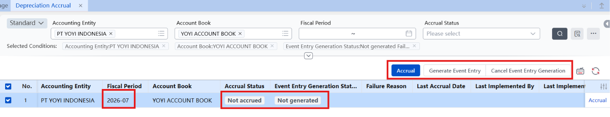

**Fungsi:** ini jantungnya modul FA. Tiap periode, penyusutan tiap aset dihitung otomatis, hasilnya update ke kartu aset (akumulasi depresiasi nambah), dan akhirnya di-posting jadi voucher ke GL. Tanpa proses ini jalan tiap bulan secara berurutan, nilai buku aset di sistem jadi nggak update dan bisa nge-block proses-proses lain (based on pengalaman kita, ini yang paling sering jadi sumber error sequential).

## **9. FA Stock Taking**

*Stock opname fisik — cocokkan aset di lapangan vs di sistem.*

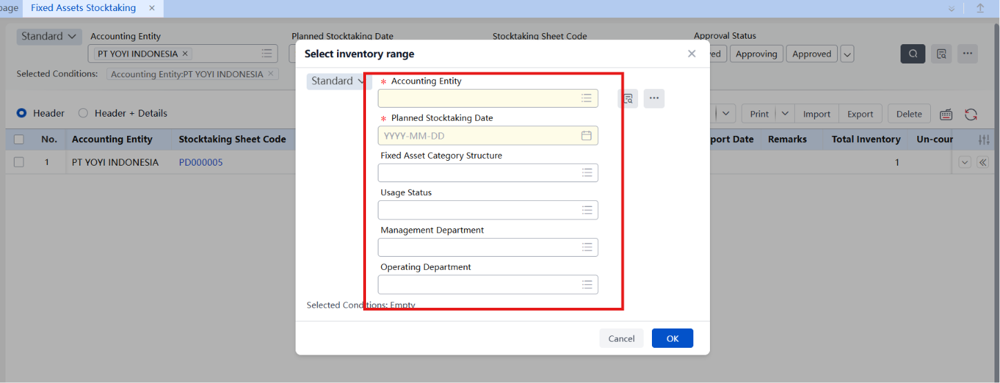

**Fungsi:** beda sama inventory barang dagang yang keluar-masuk tiap hari, aset tetap bisa "menghilang" diam-diam (dicuri, rusak, dipindah tanpa dicatat) tanpa ada transaksi harian yang otomatis ngingetin. Fitur ini nyediain proses buat cek fisik berkala, ketemu selisih (surplus/shortage/damaged), investigasi penyebabnya, dan catat konsekuensi akuntansinya.

## **10. FA Account Period Closing**

*Kunci periode akuntansi khusus modul FA.*

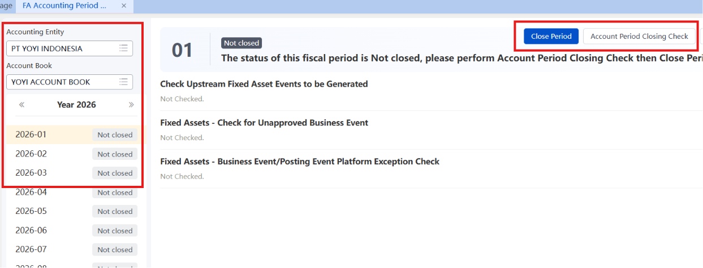

**Fungsi:** mencegah ada input data atau akses dari sistem upstream ke periode yang harusnya udah selesai diproses. Ada checklist yang harus lolos dulu sebelum closing diizinkan — mirip prinsip validasi yang kita liat di GL Closing.

## **11. FA Closing**

*Proses penutupan modul FA secara keseluruhan.*

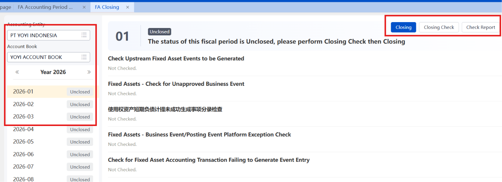

**Fungsi:** urutannya: selesaikan Depreciation Accrual dulu, baru Period Closing, baru FA Closing. Sama prinsipnya kayak modul lain — nggak bisa lompat tahap.

## **12. FA GL Report**

*Laporan ringkasan (summary) posisi aset tetap.*

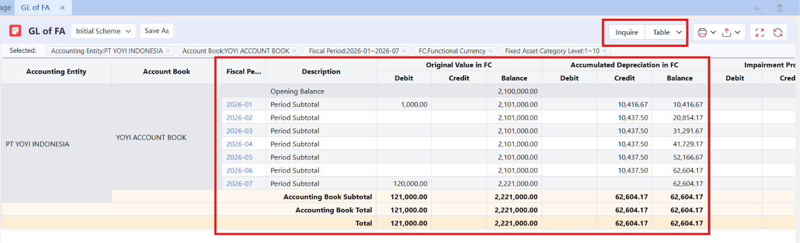

**Fungsi:** buat lihat gambaran besar — nilai original, akumulasi depresiasi, impairment, nilai buku bersih, per periode. Cocok buat kebutuhan manajemen/analisis skala besar, bukan buat ngecek transaksi satu-satu.

## **13. Sub-Ledger FA**

*Laporan rincian (detail) tiap transaksi aset.*

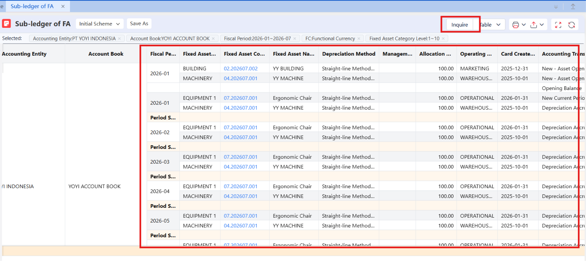

**Fungsi:** kalau FA GL Report itu summary, ini versi detailnya — nyatet tiap transaksi ekonomi terkait aset (nilai original, akumulasi depresiasi, impairment, nilai buku) dalam format debit-credit-card amount-balance. Dipakai kalau butuh trace transaksi spesifik, bukan cuma angka total.

## **14. Depreciation Calc of FA**

*Laporan khusus buat ngecek perhitungan penyusutan.*

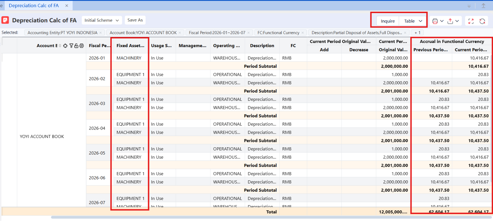

**Fungsi:** nunjukin detail perhitungan depresiasi per berbagai dimensi — dipakai buat verifikasi apakah angka penyusutan yang dihasilkan sistem udah sesuai ekspektasi, sebelum atau sesudah Depreciation Accrual dijalankan.

## **15. FA Accounting Book Parameter**

*Konfigurasi aturan kontrol untuk satu buku aset tetap, di-set per periode akuntansi.*

**Fungsi:** ngatur gimana depresiasi dirangkum (per department/kategori aset), apakah perpindahan aset mempengaruhi atribusi depresiasi periode berjalan, dan gimana voucher depresiasi di-generate. Parameter ini harus di-approve dulu sebelum bisa mulai bikin kartu aset atau proses depresiasi di periode itu — dan kalau mau diubah, periode tersebut harus belum closed/posted.

## **16. Increase Method (增加方式)**

*Klasifikasi cara aset diperoleh — beli, disetor investor, sewa pembiayaan (finance lease), dll.*

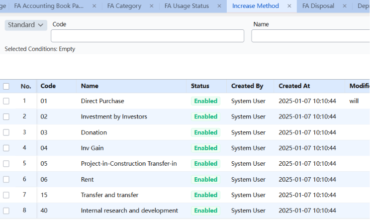

**Fungsi:** ini master data yang harus dikonfigurasi dulu sebelum bikin kartu aset — kalau cara perolehan asetnya nggak ada di daftar Increase Method, kartu asetnya nggak bisa disave.

## **17. Depreciation Method**

*Aturan perhitungan alokasi nilai aset per periode.*

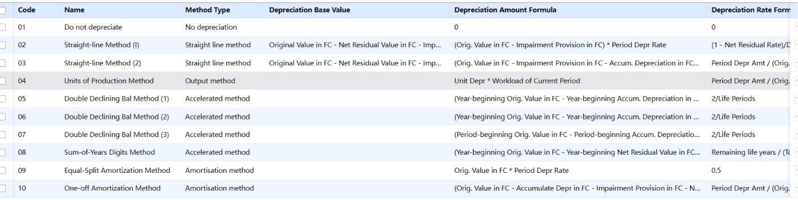

**Fungsi:** nentuin cara sistem menghitung penyusutan tiap periode — ada 10 metode standar (garis lurus, saldo menurun ganda, metode jam kerja, dll) yang dipilih pas bikin/edit kartu aset. Metode-metode preset ini nggak bisa diedit atau dihapus, cuma bisa dipilih.

## **18. Original/Opening Card Entry**

*Input data aset yang udah eksis sebelum sistem live (opening data).*

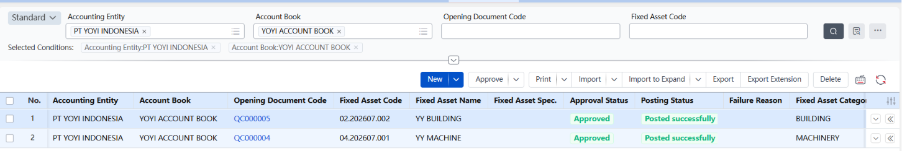

**Fungsi:** konsepnya sama kayak Opening Data di modul lain. Begitu di-approve, sistem generate entry internal (事项分录), tapi ini belum langsung masuk ke GL — perlu proses terpisah dulu supaya nyampe ke buku besar.

## **19. FA Inventory Shortage Form (盘亏单)**

*Dipakai saat stock opname fisik ketemu jumlah aset lebih sedikit dari catatan buku.*

**Fungsi:** flow-nya bikin shortage form → write-off kartu → confirm loss, dengan jurnal Debit Asset Loss, Kredit Fixed Asset — mengurangi nilai buku awal dan akumulasi depresiasi sekaligus.

**Fixed Assets Inventory Surplus & Inventory Loss — Breakdown**

**Inventory Surplus (盘盈)**
Ditemukan aset fisik yang **belum tercatat di sistem** pas proses stocktaking. Kebalikan dari shortage — bukan aset ilang, tapi aset "nongol" yang belum punya kartu. Proses selanjutnya adalah surplus handling (bikin kartu aset baru berdasarkan temuan fisik itu).

**Inventory Loss (盘亏)**
Ditemukan **kekurangan** — jumlah fisik lebih sedikit dari catatan buku. Flow-nya:

1. Stocktaking selesai, jumlah yang kurang di-input.
2. Data itu di-push otomatis ke **inventory loss document**.
3. Begitu inventory loss document di-approve → sistem generate **complete disposal transaction** secara otomatis.

Untuk dokumen FA Inventory Shorttage Form itu degenerate dari （盘点单/Stocktaking Sheet）ga bisa dari node inv surplus atau loss.

## **20. Depreciation Allocation Table (折旧分配表)**

***Laporan rangkuman biaya depresiasi per dimensi (department/akun biaya/kategori aset) untuk satu periode.***

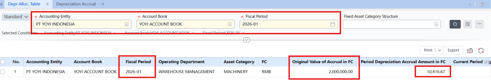

**Fungsi:** dijalankan setelah accrual selesai, jadi basis data buat generate voucher ke GL — syaratnya, template voucher GL harus udah diset statusnya ke "temporary" atau "formal" dulu.

## **21. Depreciation Accrual (折旧计提)**

*Proses hitung otomatis biaya depresiasi tiap bulan, dijalankan sebelum closing.*

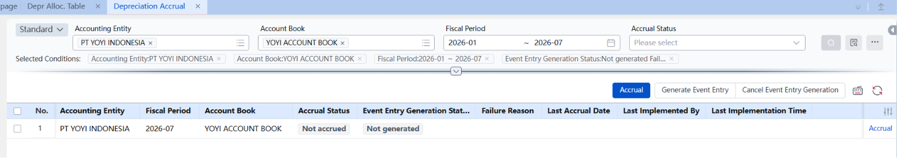

**Fungsi:** support simulasi/prediksi dan reverse accrual (反计提) — cancel entries lalu re-run ulang kalau ada perubahan data kartu aset.

## **22. FA Stats & Analysis 固定资产统计分析**

Laporan analitis/dashboard dari Aset yang dimiliki

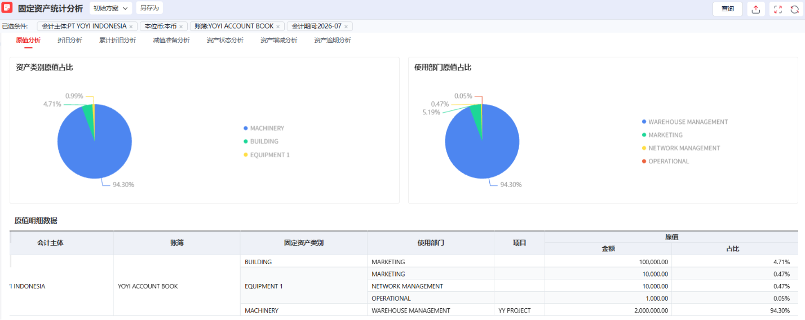

Tujuannya kasih gambaran kondisi keseluruhan fixed asset dalam suatu periode query — beda dari Depreciation Allocation Table (yang fokus ke biaya depresiasi buat generate voucher GL), report ini lebih ke **analisis manajerial**: gimana kondisi portfolio aset perusahaan secara umum.

## **23. Studi Kasus — Error yang Pernah Ditemuin**

*2 error nyata yang kejadian pas coba daftar/proses Fixed Asset.*

**Kasus 1 — Error saat daftar Fixed Asset baru: "Disposal convention is not defined for this year"**

Error lengkap: "The disposal convention is not defined for this year. Failed to obtain the depreciation start date. Please check the enabling date and depreciation convention."

Akar masalah: ada 2 setting terpisah yang harus di-extend per tahun, dan namanya emang nggak terasa nyambung ke modul Fixed Asset secara langsung —

- Accounting Period (di node Fiscal Period) — daftar tahun yang "dikenali" sistem buat perhitungan depresiasi
- Allocation/Depreciation Convention (di node Allocation Practice) — aturan kapan penyusutan mulai/berhenti

Kalau tahun berjalan (misal 2026) belum di-extend di salah satu atau keduanya, aset baru nggak bisa didaftarin.

Solusi: masuk ke Accounting Period → "Add Period" sampai tahun yang dimaksud, lalu ke Allocation Convention → edit convention yang ada → "Add Next Year" buat nambahin Allocation Date tahun tersebut.

**Kasus 2 — Nggak bisa input transaksi aset: "期间级检查未通过：折旧计提状态检查"**

Error: transaksi aset di bulan berjalan (misal Juli) ke-block, karena bulan sebelumnya (Juni) belum menjalankan Depreciation Accrual.

Akar masalah: pendaftaran depresiasi harus dijalankan secara berurutan bulan per bulan — perhitungan penyusutan bulan berjalan butuh angka akumulasi dari bulan sebelumnya sebagai basis. Nggak bisa lompat.

Solusi: ke menu Depreciation Accrual, jalankan dulu untuk periode yang ketinggalan (Juni) — Calculate, Review, lalu Post — baru bulan berikutnya bisa lanjut.

*⚠ Pola yang sama muncul di 2 kasus ini: keduanya soal "urutan" — nggak bisa maju ke langkah berikutnya kalau prasyarat sebelumnya belum selesai. Ini prinsip yang berulang di banyak modul YonSuite (GL, Inventory, FA), jadi kalau ketemu error baru yang mirip, curigai dulu apakah ini soal sequencing sebelum cari penyebab lain.*
