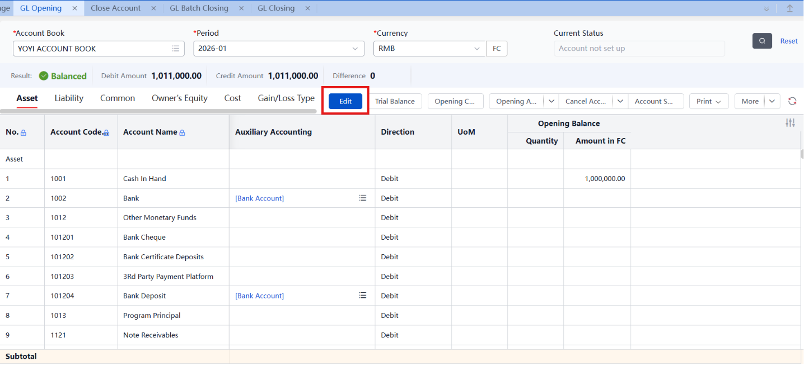
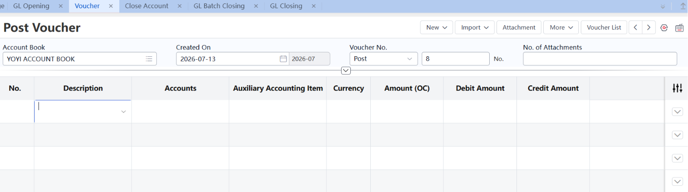
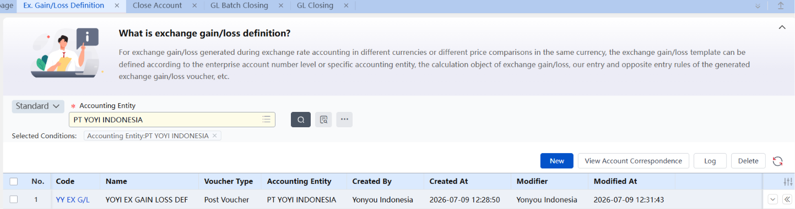
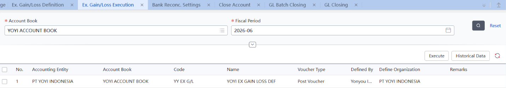
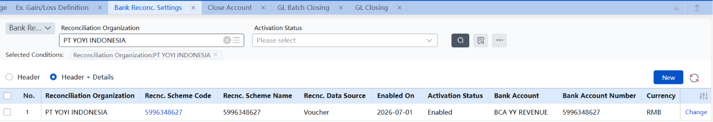
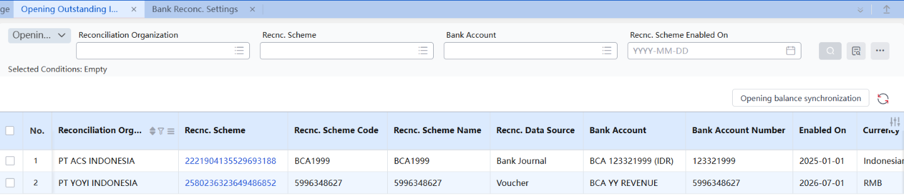
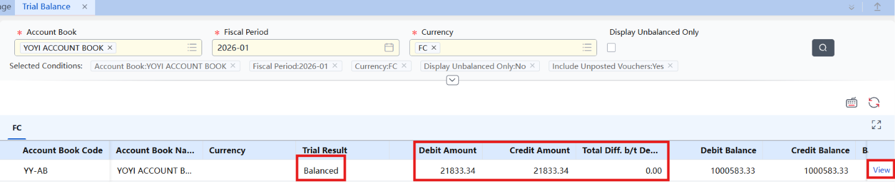
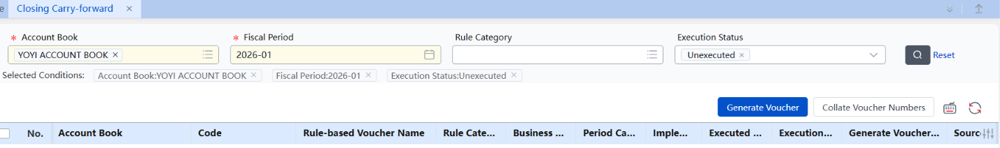
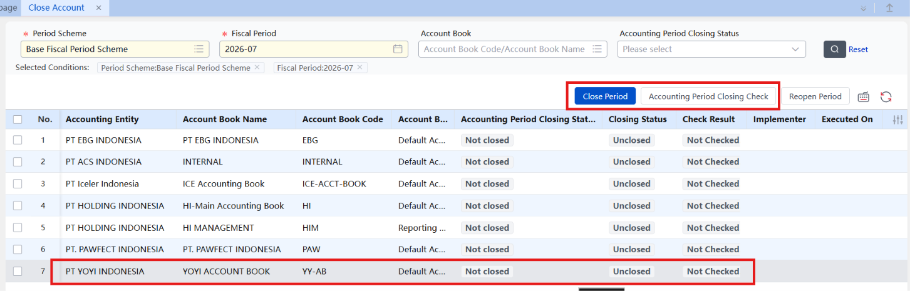
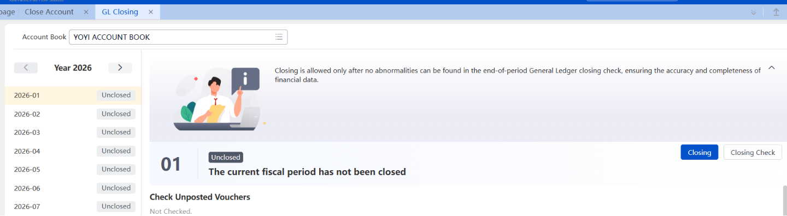

## **1. GL Opening**

*Entry saldo awal akun-akun GL saat modul General Ledger baru diaktifkan.*

Sebelum sistem dipakai buat transaksi harian, semua saldo yang udah ada dari sebelum sistem ini jalan (saldo lama, akumulasi sebelum periode aktivasi) harus dimasukin dulu ke GL sebagai persiapan. Yang bisa diisi: saldo per akun (opening balance), termasuk versi per Auxiliary Item (kalau akun pakai auxiliary accounting) dan per mata uang asing (kalau akun pakai foreign currency accounting).

Kalau GL baru diaktifkan di tengah tahun berjalan, Cash Flow Opening juga perlu diisi — biar laporan Cash Flow tahun berjalan tetap lengkap dan akurat. Kalau ada business system yang diimport duluan, data yang udah ada di situ otomatis ditarik jadi opening data akun terkait, lewat Event Accounting.

Biasanya diisinya di bagian "Opening Balance".

## **2. Voucher / Voucher Entry (Conditional)**

*Bukti tertulis pencatatan transaksi ekonomi — dasar dari semua pencatatan buku.*

Voucher adalah bukti tertulis yang mencatat terjadinya atau selesainya sebuah transaksi ekonomi, dan jadi dasar buat registrasi buku (book registration). Setiap perusahaan wajib bikin dan review voucher lewat prosedur tertentu, dan pencatatan buku harus berdasarkan voucher yang sudah direview dan diverifikasi — biar transaksi ekonomi perusahaan tercermin secara akurat.

Sumber voucher di sistem ada 2: voucher yang diinput manual sama user berdasarkan dokumen asli, dan voucher yang otomatis di-generate dari berbagai dokumen bisnis lewat Event Accounting Platform.

*⚠ Pastikan Account, Voucher Type, dan Cash Flow Item sudah ke-set duluan sebelum input voucher.*

## **3. Exchange Gain/Loss — Definition & Execution**

*Setup aturan dan eksekusi perhitungan selisih kurs mata uang asing.*

3.1 Ex. Gain/Loss Definition

3.2 Ex. Gain/Loss Execution

**Definition** dipakai buat menentukan akun dan auxiliary accounting apa aja yang perlu dihitung exchange gain/loss-nya, serta mata uang mana yang perlu dihitung. Di sini juga diatur aturan debit-credit akun dan mata uang buat voucher yang bakal ke-generate setelah perhitungan selesai.

**Execution** dipakai buat menjalankan template Exchange Gain/Loss yang udah didefinisikan per accounting entity dari ledger tersebut, dan menghasilkan voucher dengan sumber "Exchange Gain/Loss."

*⚠ Pastikan akun Exchange Gain/Loss sudah ada di Chart of Account sebelum setup Definition.*

## **4. Bank Reconciliation (Rekonsiliasi Bank)**

*Proses mencocokkan catatan kas perusahaan dengan rekening koran bank.*

Alurnya dimulai dari bikin scheme, lalu isi data opening, baru terakhir jalanin rekonsiliasinya. Berikut urutannya:

### 1. Bank Reconc. Settings — bikin scheme dari sini

- Setup sumber data bank statement Perusahaan (bisa setup di **Corporate Fund Account**
- ), kecocokan antara akun rekonsiliasi dan akun bank, serta kombinasi akun bank buat rekonsiliasi batch.
- Sistem support 2 tipe sumber data rekonsiliasi: bank journal vs bank statement, dan accounting voucher vs bank statement.

### 2. Opening Outstanding Item

Setelah scheme dibikin, di sinilah kita cari dan sesuaikan apa yang dibutuhkan — termasuk transaction outstanding item, opening balance, dan opening balance adjustment. Begitu scheme bank-enterprise reconciliation diaktifkan, di sini bisa diisi opening balance akun rekonsiliasi, voucher awal yang belum tercatat, jurnal awal yang belum tercatat, dan data transaksi awal yang belum tercatat. Bisa juga query opening balance adjustment table buat cek apakah saldonya udah cocok.

**3) Bank Statement Reconciliation — langkah terakhir**

- Rekonsiliasi antara bank journal perusahaan dengan bank statement.
- Rekonsiliasi antara voucher GL dengan bank statement.
- Auto-matching berdasarkan aturan: nomor rekening bank sama, mata uang sama, jumlah sama.
- Support auto-matching, manual matching, dan unilateral matching.
- Bisa otomatis generate collection document dan payment document buat data yang "bank udah terima tapi perusahaan belum catat" atau sebaliknya, dan otomatis registrasi ke bank journal.
- Support generate balance reconciliation statement — ini dipakai buat generate Opening Balance Adjustment Report.

## **5. GL Closing**

*Proses tutup buku bulanan GL — mirip AR/AP Closing, tapi ada 4 tahap.*

**Tahap 1 — Trial Balance: cek apakah account book balance**

Cek apakah total debit dan total credit semua akun di periode berjalan sama besar, sebelum closing tiap periode akuntansi — buat mastiin posting-nya udah benar. Bisa dijalankan berkali-kali di tengah maupun akhir bulan. Closing cuma bisa dilakukan kalau hasil trial balance-nya sudah balance (nggak ada selisih).

**Tahap 2 — Closing Carry-Forward: generate voucher period-end**

Voucher carry-forward dijalankan rutin sesuai kebutuhan akuntansi — misalnya carry-forward sales cost, amortisasi deferred expense, accrued tax, carry-forward manufacturing expense ke production cost, dan carry-forward akun gain/loss ke akun gain/loss. Template voucher carry-forward ini didefinisikan lewat Rule Voucher, dan bisa dijalankan sekaligus (batch) atau satu-satu.

Kalau di-cek dan Rule Voucher-nya masih kosong, berarti rule-nya belum di-setup. Kalau udah pernah di-setup, tinggal pilih rule-nya dan generate voucher — begitu selesai, entry periode itu otomatis ke-posting.

Ada juga fitur one-click collation buat merapikan nomor voucher (menghilangkan nomor yang bolong/salah urutan) dalam periode yang dipilih.

*⚠ Collation nomor voucher harus dipakai hati-hati — nomor voucher bakal disusun ulang total, jadi harus selesai sebelum voucher resmi diprint.*

**Tahap 3 — Close Account: mengunci periode akuntansi**

Kalau perusahaan punya banyak business system yang jalan dengan kecepatan beda-beda, closing ini perlu dilakukan biar nggak ada business system yang masih generate voucher buat periode yang lagi ditutup. Closing di GL ini mastiin data detail dari klasifikasi bisnis (inventory, cost, receivable, payable, fixed asset) konsisten dan lengkap sama data GL di periode fiskal yang sama.

**Setelah closing, business system nggak akan generate voucher baru lagi buat periode itu** — dokumen dari upstream business system otomatis digenerate ke periode berikutnya. GL juga akan proses akun expense lebih lanjut, generate voucher profit & loss transfer. Closing inspection report bisa diterbitkan pas proses GL closing ini.

**Tahap 4 — GL Closing: pengecekan final**

Menjalankan pengecekan closing final dan konfirmasi semua kondisi udah terpenuhi sebelum periode dianggap benar-benar closed.

*⚠ Progress pribadi: sempat stuck di tahap Closing karena GL nggak bisa ditutup sebelum semua ledger lain (termasuk Fixed Asset period dan Cost Center) juga closed. Makanya sementara pindah dulu belajar modul Fixed Asset dan Cost Center, baru nanti lanjut GL lagi mulai dari tahap Closing ini.*

## **6. Studi Kasus — GL Closing Troubleshooting**

*Log masalah nyata yang ditemuin pas coba closing GL, plus akar masalah & solusinya.*

**Kasus 1 — P&L account masih ada saldo, nggak mau 0**

Error: "损益类科目金额和数量的余额是否为0检查" — salah satu akun P&L

(contoh: 660107 Selling Expense\_Asset Depreciation) masih nyisa saldo di akhir periode.

**Akar masalah:** akun Revenue/Expense harus balik ke 0 tiap akhir periode (saldonya dipindah ke akun Current Year Profit) — proses ini disebut P&L Carry-Forward, dan belum dijalankan.

Solusi: setup 1x di awal (**GL Parameter** (GL0013) → tentuin frekuensi Monthly/Annual; **Rule Voucher Definition** → bikin rule dengan Business Type "Gain/Loss Carry-forward", Definition Method "Quick Selection", Profit Account "Current Year Profits", Carry-forward Method "Centralized"), lalu tiap periode tinggal jalanin di menu **Closing-Carry Forward** → pilih rule → generate voucher.

**Kasus 2 — Error daftar Fixed Asset baru: Depreciation Convention belum ada**

Error: "The disposal convention is not defined for this year. Failed to obtain the depreciation start date."

Akar masalah: ada 2 setting yang harus di-extend per tahun di Fixed Asset Book Parameters — Accounting Period (daftar tahun yang "dikenali" sistem) dan Allocation/Depreciation Convention (aturan kapan penyusutan mulai/berhenti). Kalau tahun berjalan (misal 2026) belum di-extend di salah satu atau keduanya, aset baru nggak bisa didaftarin.

Solusi: masuk ke Accounting Period → "Add Period" sampai tahun yang dimaksud, lalu ke Allocation Convention → edit convention yang ada → "Add Next Year" buat nambahin Allocation Date tahun tersebut.

**Kasus 3 — Nggak bisa input transaksi asset karena periode sebelumnya belum di-depreciate**

Error: "期间级检查未通过：折旧计提状态检查" — transaksi di bulan berjalan (misal Juli) ke-block karena bulan sebelumnya (Juni) belum menjalankan Depreciation Accrual.

Akar masalah: Depreciation Accrual harus dijalankan berurutan bulan per bulan, karena perhitungan penyusutan bulan berjalan butuh angka akumulasi dari bulan sebelumnya sebagai basis.

Solusi: ke menu Depreciation Accrual, pilih periode yang ketinggalan (Juni), jalankan Calculate → Review → Post, baru bulan berikutnya bisa lanjut.

*⚠ Catatan: ada thread terpisah soal Inventory Account (cancel account setup, cancel review, cost calculation reversal chain) - itu bukan bagian dari chain GL Closing ini, itu kasus lain yang kejadian di modul Inventory pas eksplor cara undo data.*
