Inget dulu bedanya sama Inventory Management: yang di-track di sini bukan QUANTITY barang, tapi VALUE/NILAI barangnya — modul ini yang jadi "penerjemah" pergerakan fisik barang jadi angka Rupiah yang masuk ke GL.

## **IC PARAMETER**

### 1. Receipt Doc Price Scheme

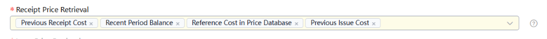

Dipakai buat purchase inbound, self-made inbound, dan inbound lainnya — kalau harga inbound nggak dispesifikasi manual, sistem ambil harga otomatis pakai scheme ini. Jadi untuk cost calculation sistem akan mengambil harga dari sini sesuai urutan.

### 2. Issue Doc Price Retrieval Scheme

Harus enable "auto pricing" dulu di Inventory Parameters baru fitur ini jalan. Dipakai buat purchase outbound, self-made outbound, dan outbound lainnya — kalau harga outbound nggak dispesifikasi manual, sistem ambil harga otomatis pakai scheme ini. Jadi untuk cost calculation sistem akan mengambil harga dari sini sesuai urutan.

1. Negative Issue Doc Price Scheme

*Catatan: bukan parameter terpisah — digabung/dikelola bareng Issue Doc Price Retrieval Scheme (item #2 di atas). Red-letter (return/reversal) outbound pakai scheme yang sama dengan outbound normal, nggak ada config sendiri.*

### 3. Processing of Abnormal Bal (the Qty is positive and the Amt is 0)

Ada stok fisik, tapi nilai buku = 0. Penyebab: biaya masuk (inbound cost) nggak ke-aggregate dengan benar, atau ada anomali di perhitungan cost.

### 4. Processing of Abnormal Bal (the Qty is positive and the Amt is negative)

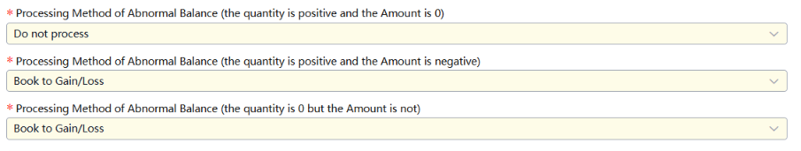

Ada stok fisik, tapi nilai buku minus.
Bukan soal urutan transaksi kebalik, tapi **biaya outbound (keluar) lebih tinggi dari biaya inbound (masuk)**. Jadi pas barang keluar, sistem ngitung cost yang harus dikurangin dari saldo lebih besar dari apa yang sebenernya ada di saldo — hasilnya saldo jebol ke minus.

### 5. Abnormal Bal (Qty is zero and Amt is not zero) Processing

Fisik udah habis (qty 0), tapi masih ada sisa nilai nyangkut (misal akhir bulan qty 0 tapi amount masih Rp 50).
bukan cuma soal rounding, tapi lebih umum: **outbound nggak sepenuhnya nge-offset/ngurangin cost dari inbound**. Jadi ada sisa nilai yang "ketinggalan" karena proses pengurangan biaya nggak tuntas pas barang keluar.

### 6. Est. Processing Method

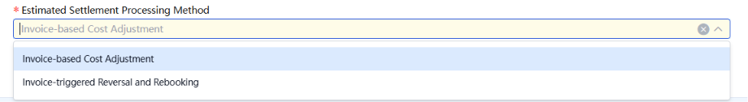

Ngatur cara sistem handle **selisih harga** antara barang yang udah masuk gudang (pakai harga estimasi) vs harga asli di invoice yang baru datang belakangan.

**2 opsi:**

1. **Invoice based cost adjustment (补差)** — cuma bikin 1 entry buat nutup selisihnya aja. *Contoh: estimasi Rp 1.000.000, invoice Rp 1.050.000 → sistem bikin entry +Rp 50.000.*
2. **Invoice triggered reversal and rebooking (回冲)** — hapus/reverse entry lama, terus bikin entry baru dari nol pakai harga invoice. *Contoh sama: entry lama -Rp 1.000.000 (reverse), entry baru +Rp 1.050.000 (rebook).*

Hasil akhir sama, tapi jejaknya di sistem beda — Adjust lebih ringkas, Reverse & Rebook lebih jelas histori-nya.

### 7. Cost Area Creation Type

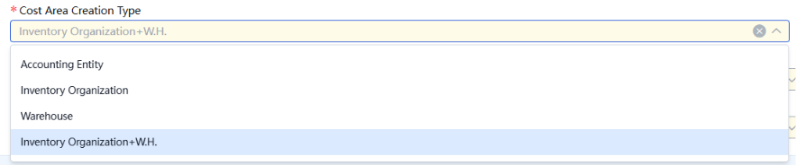

4 pilihan buat definisiin scope perhitungan cost:

1. Per accounting entity (satu perusahaan, satu cost pool)
2. Per inventory organization (misal multi-pabrik)
3. Per warehouse (misal per lini produk)
4. Per inventory org + warehouse (paling detail — misal gudang bahan baku & gudang barang jadi beda pabrik)

### 8. Price Scheme of Adj Doc Generated Upon Abnormal Bal

### 9. Apportion Basis of Abnormal Balance Booked to Gain/Loss

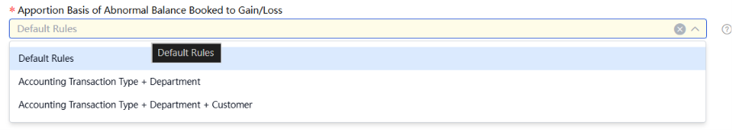

- **Default Rules** Pakai aturan bawaan sistem — kemungkinan ini yang narik dari node "Outbound Adjustment Doc Allocation Rule" (rule custom per item/kategori kalau udah di-setup).
- **Accounting Transaction Type + Department** Alokasi selisihnya dipecah berdasarkan kombinasi 2 dimensi: jenis transaksi akuntansi + department. Jadi kalau abnormal balance-nya nyangkut beberapa department, sistem bagi proporsional berdasarkan kombinasi itu.
- **Accounting Transaction Type + Department + Customer** Sama kayak di atas, tapi lebih detail — nambah dimensi customer juga. Jadi alokasinya makin granular, bisa ketauan abnormal balance-nya "milik" customer mana.

### 10. Re-calculate Cost at Month-end

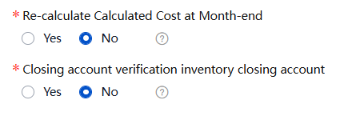

**Yes:** pas closing bulan, sistem recalculate SEMUA cost (moving average/FIFO) pakai parameter & urutan terbaru — termasuk yang udah pernah dihitung.

**No:** cuma hitung cost buat data periode berjalan yang belum dihitung.

### 11. Data Processing Method after Closing Account Period

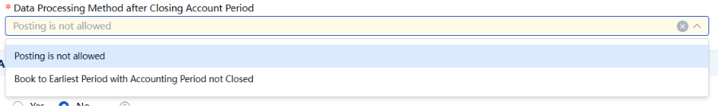

Ngatur apa yang terjadi kalau ada **transaksi baru** yang nyoba nyantol ke periode yang udah di-closed (Inventory Period Close yang kita bahas sebelumnya).

**2 opsi:**

**1. Posting is not allowed**
Sistem tolak total. Kalau ada transaksi baru (misal outbound/inbound) yang tanggalnya jatuh di periode yang udah closed → langsung error, nggak bisa diproses sama sekali. User harus manual pindahin tanggal transaksi ke periode yang masih terbuka.

*Contoh: Periode Juni udah closed. Ada outbound baru yang keinput tanggal 15 Juni → sistem reject, user harus ubah jadi tanggal Juli.*

**2. Book to Earliest Period with Accounting Period not Closed**
Sistem otomatis **"lempar"** transaksi itu ke periode terbuka paling awal — nggak reject, tapi juga nggak maksa masuk ke periode closed yang dituju.

## **Opening**

### **12. Opening Inventory Accounting**

*Titik masuk data opening —* ***ambil data dari SCM Cloud.***

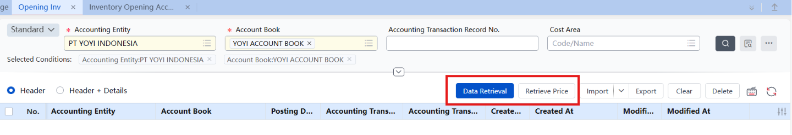

**Fungsi:** ini semacam "pintu gerbang" yang narik data inventory dari modul SCM (Supply Chain Management) Cloud — jadi data yang udah ada di sisi operasional/logistik, ditarik ke sisi akuntansi biar bisa dihitung nilainya.

### **13. Estimated Opening**

*Ambil data dari Purchased Good Receipt Opening.*

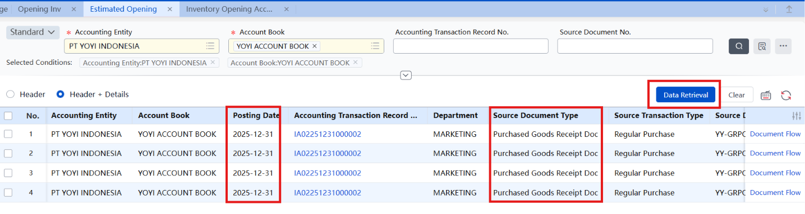

**Fungsi:** khusus narik data barang yang MASUK dari pembelian (purchase receipt) yang statusnya "opening" — ini bagian dari proses membangun saldo awal inventory berdasarkan barang yang udah dibeli sebelum sistem baru dipakai.

### **14. Product in Transit Opening**

*Ambil data dari Sales Issue & Receiving Opening transaction type.*

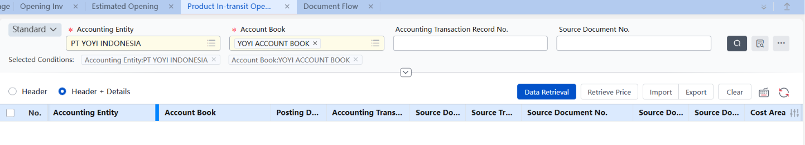

**Fungsi:** nangkep barang yang "**sedang dalam perjalanan**" pas opening — misalnya barang yang udah keluar dari gudang asal (sales issue) tapi belum sampai/diterima di tujuan. Ini penting supaya nilai barang yang "nggantung di jalan" nggak hilang dari pencatatan. Dikarenakan barang barang sudah sampai dan sudah dibayarkan oleh customer, maka dari itu dari system tidak bisa mengambil data dari Sales Issue, karna datanya sudah kosong.

### **15. Inventory Opening Account Setup**

*Setup approval step buat opening data.*

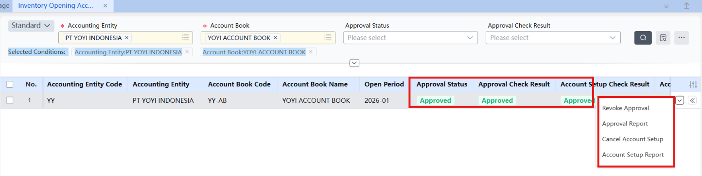

**Fungsi:** finalisasi data opening yang udah ditarik dari 3 node sebelumnya — ini yang **"mengunci"** data opening supaya dianggap resmi. Setelah lewat approval di sini, data ini jadi basis buat proses-proses berikutnya (Cost Calculation, dst).

## **Incoming/Outbound Adjustment**

*Koreksi manual nilai inventory kalau ada gain/loss yang nggak otomatis ke-capture sistem.*

**Fungsi:** dipakai kalau nilai inventory perlu disesuaikan manual — misalnya ada selisih nilai pas terima atau keluar barang yang nggak sesuai standar perhitungan otomatis sistem.

**a) Incoming Adjustment — Gain/Loss for Receipt**

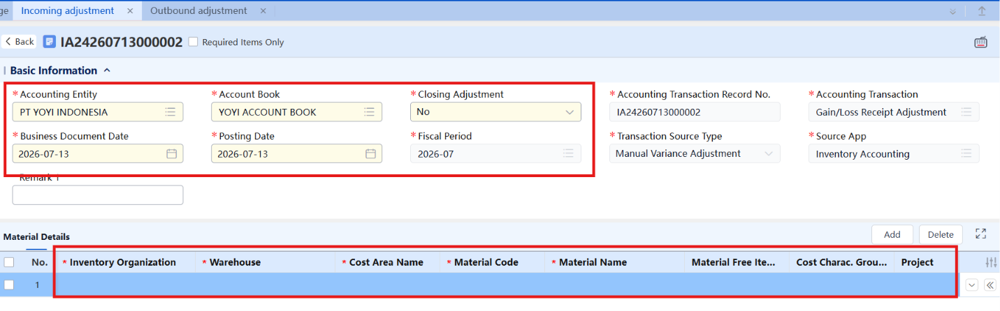

Dipakai buat query hasil generate otomatis dari sistem soal adjustment inventory terkait transaksi akuntansi, atau buat manual NAMBAH nilai inventory sesuai kebutuhan akuntansi.

**b) Outbound Adjustment — Gain/Loss for Issue**

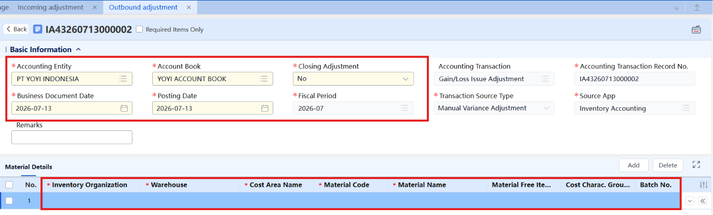

Dipakai buat menambahkan dan query transaksi akuntansi adjustment yang terkait dengan pengeluaran (issue) barang.

## **Cost Calculation & Area**

*Metode hitung nilai barang — pilih yang paling sesuai karakter bisnis.*

**Fungsi:** nentuin CARA sistem menghitung nilai/cost barang yang keluar-masuk. Pemilihan metode ini ngaruh langsung ke akurasi COGS (Cost of Goods Sold) dan nilai inventory di laporan keuangan.

### **16. Cost Area**

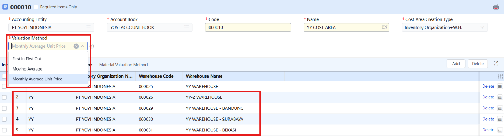

**Fungsi:** Kelompok gudang yang harga barangnya dihitung bareng jadi satu (bukan dipisah per gudang). Kalau beberapa gudang digabung dalam 1 cost area, sistem anggap stoknya satu kesatuan pas ngitung harga rata-rata.

***Contoh:*** *Barang A ada di Gudang Bandung (beli Rp 1.000) & Gudang Surabaya (beli Rp 1.200). Kalau satu cost area → harga rata-ratanya digabung, jadi sama buat kedua gudang. Kalau beda cost area → masing-masing gudang punya harga sendiri.*

Setup PT YOYI INDONESIA: 5 warehouse (YY, YY-2, Bandung, Surabaya, Bekasi) digabung jadi 1 cost area (YY COST AREA), pakai basis Inventory Organization+W.H.

**Valuation Method**
Fungsi: Cara hitung harga per unit barang. 3 opsi:

1. **FIFO** — barang masuk duluan, keluar duluan.
2. **Moving Average** — harga rata-rata update tiap ada transaksi baru.
3. **Monthly Average Unit Price** (dipakai PT YOYI INDONESIA) — harga rata-rata dihitung sekali di akhir bulan, dipakai buat semua transaksi keluar bulan itu.

*Catatan: karena pakai Monthly Average, cost final baru ketauan di akhir bulan — makanya ada opsi "Re-calculate Cost at Month-end" buat handle transaksi susulan/koreksi.*

| Metode | Karakteristik | Cocok Buat |
| --- | --- | --- |
| Monthly/Full Month Average | Simpel dan stabil — dihitung 1x di akhir bulan, rata-rata semua pembelian bulan itu | Bisnis yang harga belinya relatif stabil, nggak butuh update real-time |
| Moving Average | Lebih dinamis — cost ter-update tiap kali ada pembelian baru, real-time | Bisnis yang harga beli sering berubah dan butuh cost yang selalu up-to-date |
| FIFO (First In First Out) | Pakai sistem layer — mengikuti alur fisik barang (yang masuk duluan, keluar duluan) | Bisnis yang mau cost mengikuti aliran fisik barang secara akurat (misal barang expired/FEFO-sensitive) |

Pemilihan metode tergantung 3 hal: bagaimana cara perusahaan beroperasi, seberapa stabil harga barangnya, dan seberapa akurat perusahaan mau angka Cost of Goods Sold-nya.

## **Inventory Accounting Closing**

*Urutan wajib: Account Period Closing → Cost Calculation → Inventory Closing.*

### **17. Inv Account Period Closing**

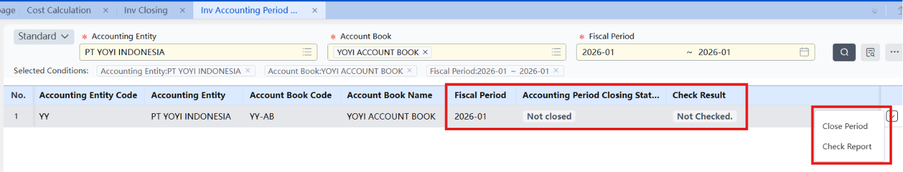

Fungsi: mengunci rentang data akuntansi di periode berjalan, menciptakan lingkungan data yang stabil buat proses Cost Calculation dan Inventory Closing berikutnya. Ini kayak **"freeze" data** dulu, biar nggak ada perubahan di tengah proses hitung.

### **18. Cost Calculation**

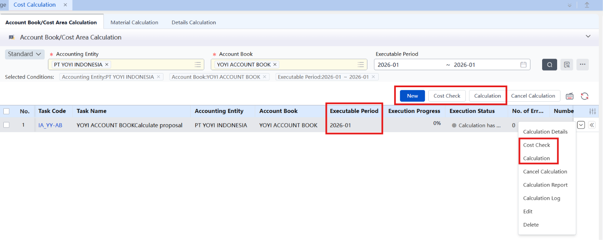

Fungsi: metode sistematis buat menghitung SEMUA cost area dan SEMUA material sekaligus, dalam satu lingkup accounting entity - ledger. Ini eksekusi nyata dari metode yang dipilih di poin 6 (Monthly Average/Moving Average/FIFO).

### 19. Inv Closing

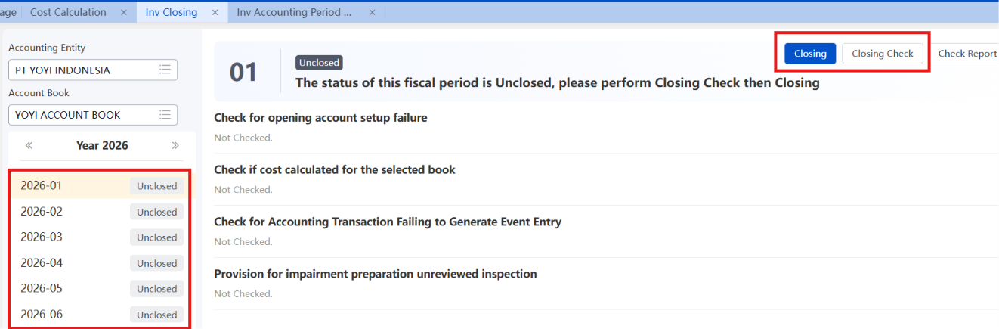

Fungsi: menjalankan month-end closing buat account book di bawah accounting entity tersebut, sesuai fiscal period-nya. Ini langkah penutup — setelah ini, periode dianggap selesai diproses.

## Alur Closing Inventory Accounting

Inv acc
period > cost calculate > inv batch close

## Inventory Accounting Report

*3 jenis laporan, beda level detail.*

### **20. GL of Inv (General Ledger of Inventory) (PENTING)**

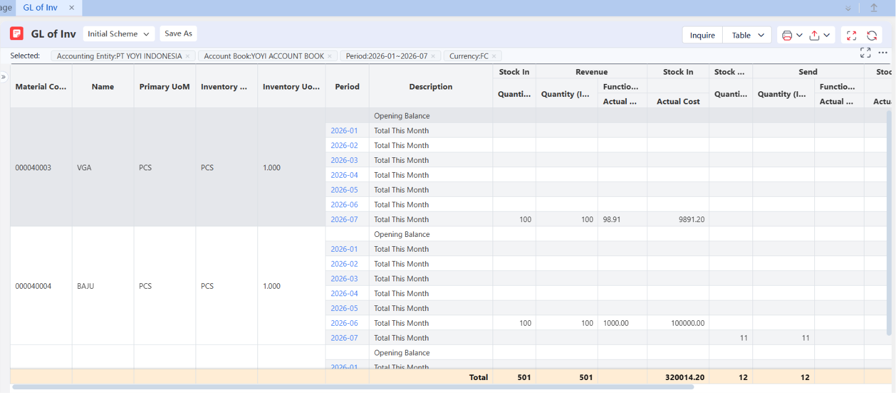

Fungsi: query berdasarkan accounting entity, account book, dan fiscal period — **nampilin inventory receipt, issue, dan balance. Ini level RINGKASAN.**

### **21. Sub-Ledger of Inv (PENTING)**

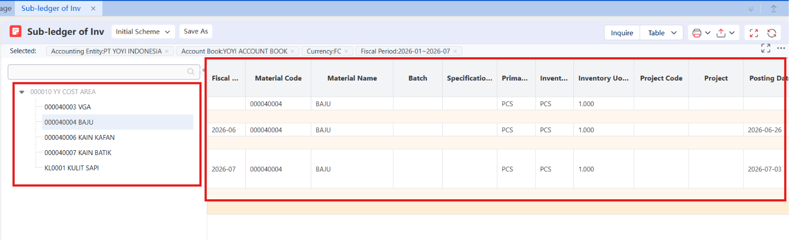

Fungsi: sama query dimension-nya, tapi nampilin detail **SATU PER SATU tiap transaksi** (receipt, issue, balance), diurutkan berdasarkan tanggal dokumen bisnis. Ini level DETAIL/rincian.

### **22. Good Receipt/Issue/Inv Summary (PENTING)**

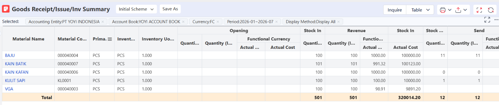

Fungsi: query berdasarkan dimensi yang sama tapi dengan rentang fiscal period — **nampilin opening, receipt, issue, dan balance dalam periode yang dipilih.** Cocok buat **lihat pergerakan inventory secara menyeluruh dalam suatu range waktu.**

### **23. Receipt Summary**

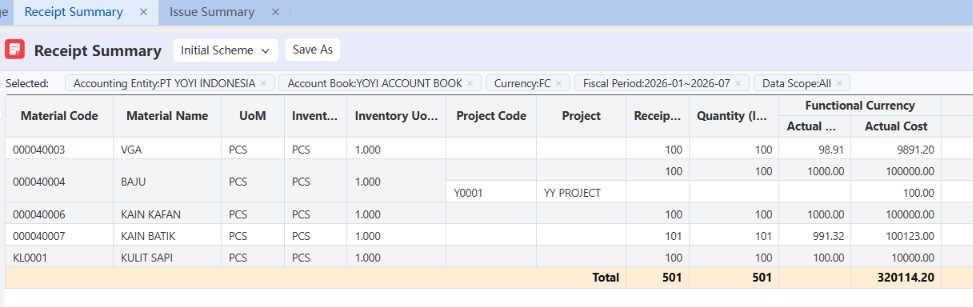

Fungsi: Ngerangkum total barang **masuk** (inbound) di suatu ledger & periode, bisa dikelompokin berdasarkan kriteria tertentu (misal per material, per warehouse, per supplier).

### **24. Issue Summary**

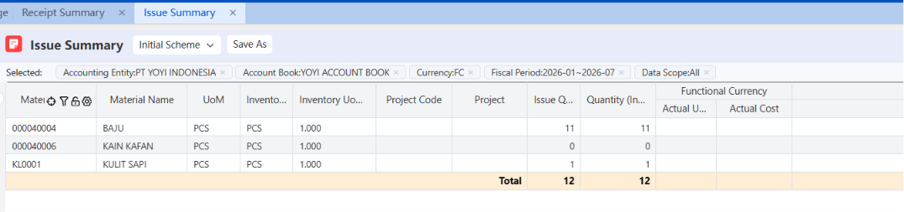

Fungsi: Ngerangkum total barang **keluar** (outbound) di suatu ledger & periode, sama juga bisa dikelompokin berdasarkan kriteria tertentu.

### **25. Outsourcing Cost Query**

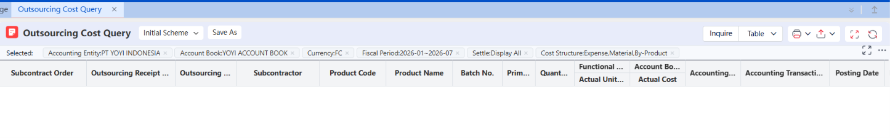

**Fungsi:** Laporan buat liat **berapa biaya outsourcing** (kerja titip produksi ke pihak luar/subkontraktor) dalam periode tertentu, plus breakdown-nya per komponen biaya (cost sub-item).

### **26. Turnover Rate Ratio/Analysis**

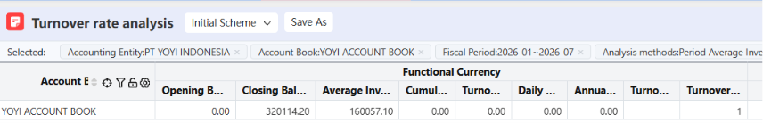

**Fungsi:** Report buat ngukur seberapa cepat stok "berputar" (keluar-masuk) dalam suatu periode & account book tertentu.

## **Inventory Price Database**

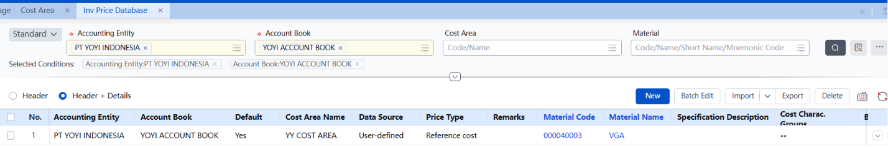

**Inventory Price Database — Simpel**

**Fungsi:** Tempat nyimpen harga acuan (reference cost) per barang, per cost area, per ledger — manual diinput, bukan otomatis dari transaksi. Ini semacam "price list cadangan" yang dipakai sistem kalau butuh harga tapi nggak ketemu dari sumber lain (harga terakhir masuk/keluar, dll).

**Cara kerja Effective Date (penting):** harga baru berlaku kalau tanggal transaksinya ≥ tanggal efektif. Jadi kalau lo set harga baru mulai efektif 1 Juli, transaksi tanggal 5 Juli pakai harga baru itu, tapi transaksi tanggal 25 Juni masih pakai harga lama.

*Contoh: Material X harganya Rp 10.000 efektif dari 1 Juni. Terus lo update jadi Rp 12.000 efektif 1 Juli. Transaksi tanggal 20 Juni pakai Rp 10.000, transaksi tanggal 5 Juli pakai Rp 12.000.*

## **Studi Kasus — Error yang Pernah Ditemuin**

*Beberapa kasus nyata soal cancel/undo data di modul ini — semuanya soal urutan (sequencing), sama kayak pola di GL dan FA.*

**Kasus 1 — Gagal cancel Opening: "该账簿已期初审核，请取消审核后重新操作"**

Artinya: gagal narik ulang data Inventory Opening karena Account Book itu sudah melewati proses Review (审核) — data yang udah di-review dianggap final, sistem block kalau mau ditarik ulang.

Solusi: cari tombol "取消审核" (Cancel Review) di layar yang sama, baru bisa retrieve data lagi.

**Kasus 2 — Reversal Chain: cancel Period-Lock ternyata butuh beberapa layer**

Kalau mau cancel 关账 (Period-Lock) tapi periode itu udah lanjut ke tahap-tahap berikutnya, muncul rangkaian block:

- "该期间已成本计算，不能取消关账" — nggak bisa cancel period-lock karena Cost Calculation udah jalan
- "该期间已经过账到事项分录，不能取消成本计算" — nggak bisa cancel Cost Calculation karena hasilnya udah ke-posting ke GL (事项分录)

Artinya: undo harus dari langkah PALING AKHIR dulu. Urutan cancel yang benar (kebalikan dari forward flow di poin 7): reverse posting GL dulu → baru cancel Cost Calculation → baru cancel Period-Lock.

*⚠ Ini area sensitif karena udah nyentuh voucher GL yang mungkin udah kepake laporan lain — jangan cancel sendiri tanpa konfirmasi ke Willy dulu.*

**Kasus 3 — Gagal pull Opening Data: "无期初数据" (tidak ada data opening)**

Artinya: sistem nggak nemu dokumen Inventory Opening yang memenuhi kriteria. ADA 6 syarat sekaligus yang harus semuanya lolos:

- Tanggal dokumen harus lebih awal dari tanggal aktivasi Inventory
- Transaction Type dokumen harus "Opening Stock-In"
- Cost Domain sudah dibuat buat Warehouse Organization terkait, dan lebih awal dari tanggal dokumen
- Warehouse Profile dicentang "Participate in Cost Calculation"
- Item Master → Value Management Mode di-set ke "Inventory Accounting" (bukan cuma quantity tracking)
- Transaction Type di-set ke "Update Inventory Cost"

Kalau salah satu syarat aja nggak terpenuhi, hasil retrieve data kosong. Yang paling sering kelewat: poin Item Master (Value Management Mode) dan Cost Domain — karena keduanya setup di level master data, jadi kalau kelewat, SEMUA dokumen yang pakai item/warehouse itu ikut gagal.
