## Inventory Business Parameter

### Control Rules (Aturan Pengecekan)

### 1. Check the warehouse for inbound and outbound based on the warehouse-material relationship.

- **仓库物料关系检查规则**

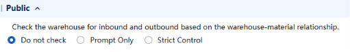

Cek apakah material tertentu boleh masuk/keluar dari gudang yang berkaitan (berdasarkan mapping warehouse-material yang udah diset).

- **Do not check** → ga dicek, bebas
- **Prompt only** → munculin peringatan, tapi tetap bisa lanjut
- **Strict control** → diblokir total jika tidak sesuai relationship

### 2. Nearly-Expired Goods Rejection Rules

- **效期临期拒收规则**

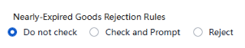

Aturan tolak barang yang mendekati kadaluarsa saat barang masuk.

- Do not check → terima aja
- Prompt only → kasih warning, masih bisa terima
- Strict control → tolak otomatis barang yang udah mepet expired

### Issue / Outbound Rules (Aturan Pengeluaran)

### 3. Auto Clear Product without Stock

- **自动清除0存量商品**

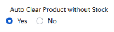

Otomatis hapus item yang stoknya 0 dari daftar. 
*(yes = bersihin otomatis biar list rapi || no = tidak otomatis)*

### 4. Allow Issue Quantity Exceeding Issue Application Quantity

- **允许超出库申请出库 (keluar masuk Gudang)**

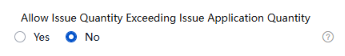

Boleh ga keluarin barang lebih banyak dari yang diminta di aplikasi pengeluaran. 
*(yes = boleh lebih, no = tidak)*

***Yes*** *→ boleh keluarin barang* ***melebihi*** *jumlah yang diminta, tapi ada batasnya:*

*Issue quantity ≤ Applied quantity × (1 + ceiling of over-issuing %)*

*Artinya ada persentase maksimal yang lo set — misalnya over-issuing 10%, maka kalau aplikasi minta 100 pcs, maksimal yang bisa keluar 110 pcs.*

***No*** *→ ga boleh sama sekali melebihi jumlah aplikasi. Minta 100, keluar maksimal 100.*

*setting ini bisa diubah kapanpun, tapi hanya berlaku buat dokumen* ***setelah*** *perubahan.* ***Dokumen yang udah ada sebelumnya tidak terpengaruh.***

### 5. Allow Exceeding Planned Order Quantity

- **计划订单允许超计划下达 (permintaan pengeluaran sesuai rencana)**

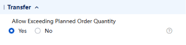

Boleh ga rilis order melebihi jumlah yang direncanakan.

***Yes*** *→ boleh keluarin barang* ***melebihi*** *jumlah yang direncanakan, tapi ada batasnya:*

*Issue quantity ≤ Applied quantity × (1 + ceiling of over-issuing %)*

*Artinya ada persentase maksimal yang lo set — misalnya over-issuing 10%, maka kalau aplikasi minta 100 pcs, maksimal yang bisa keluar 110 pcs.*

***No*** *→ ga boleh sama sekali melebihi perencanaan. Minta 100, keluar maksimal 100.*

*setting ini bisa diubah kapanpun, tapi hanya berlaku buat dokumen* ***setelah*** *perubahan.* ***Dokumen yang udah ada sebelumnya tidak terpengaruh.***

### 6. Allow Issue Quantity Exceeding Transfer Order Quantity

- **允许超调拨订单出库 (mutasi/pindah barang antar gudang)**

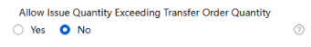

Boleh ga keluarin barang lebih dari jumlah di transfer order (mutasi antar gudang).

***Yes*** *→ boleh keluarin barang melebihi jumlah di transfer order, tapi ada batas:*

*Issue quantity ≤ Transfer quantity × (1 + issue overage upper limit %) tetap ada persentase maksimal yang dikontrol.*

***No*** *→ ga boleh sama sekali melebihi jumlah di transfer order.*

*setting ini bisa diubah kapanpun, tapi hanya berlaku buat dokumen* ***setelah*** *perubahan.* ***Dokumen yang udah ada sebelumnya tidak terpengaruh.***

### 7. Auto Picking upon Issue

- **支持自动拣货**

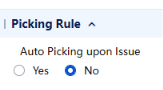

Sistem otomatis nentuin bin mana yang diambil saat issue. 
*(yes = auto picking)*

### Stocktaking / 盘点 Rules (Aturan Stock Opname)

### 8. Count Material with 0 Stock on Book

- **盘零账存物料**

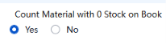

Ikutkan hitung material yang di buku stoknya 0. 
*(yes = tetap dihitung)*

Kalau Auto Clear = Yes, terus Count Material 0 Stock = Yes:

Ini kontradiktif secara logika.

Auto Clear sudah hapus material yang stoknya 0 dari daftar → pas opname jalan, material itu udah ga ada di list → setting Count Material 0 Stock jadi ga relevan karena ga ada yang perlu dihitung lagi (karna material 0 sudah ga ada di list, dikarenakan settingan Auto Clear)

### 9. Count Stock on Book

- **盘点显示账存数量**

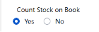

Ngatur apakah angka stok buku **ditampilkan** di form hitung fisik atau tidak.

- Yes → petugas **bisa lihat** angka sistem saat hitung fisik
- No → blind counting, petugas tidak tau angka sistem

### 10. The physical inventory order defaults to include products from the stocktaking plan.

- **实盘单默认带入盘点计划商品**

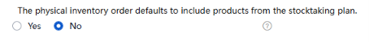

Form hitung fisik otomatis isi barang-barang/material dari rencana stock opname. *(yes = auto isi).* jadi petugas pengecek udah dapat form berisi nama material, tidak harus nulis manual sendiri nama nama barangnya apa yang mau dicek.

impel — ini ngatur apakah form stock opname fisik otomatis sudah tertulis daftar barang-barang dari **rencana stock opname (stocktaking plan)** yang udah dibuat sebelumnya pada sistem.

**Yes** → saat bikin dokumen form stock opname fisik, sistem otomatis tarik daftar barang dari stocktaking plan yang akan di cek oleh petugas. Jadi ga perlu input manual satu-satu.

**No** → form kosong, isi sendiri manual.

**Catatan penting dari hint:**

Parameter ini **mutually exclusive** dengan **Stocktaking Big Data Model** — dua-duanya ga bisa aktif bersamaan. **Kalau Big Data Model aktif, parameter ini otomatis ga bisa di-enable.**

Logika bisnisnya: kalau perusahaan udah bikin rencana opname (barang apa aja yang mau dihitung, kapan, di gudang mana) ya tinggal otomatis ditarik aja ke form fisiknya — lebih efisien daripada input ulang.

### 11. Retrive Book Quantity by Default for Physical Inventory

- **实盘默认取账存数量**

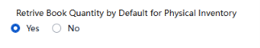

Ngatur apakah angka stok buku **otomatis diisi** sebagai nilai awal di kolom hasil hitung.

- Yes → kolom hasil hitung **otomatis terisi** angka dari sistem, petugas tinggal koreksi kalau beda
- No → kolom kosong, petugas input angka dari nol

### 12. Generate Gain/Loss Document from Counting Review

- **盘点复核生成盈亏单**

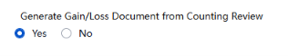

Otomatis bikin dokumen selisih (gain/loss) setelah review hasil perhitungan dari Physical Stock Check. *(yes = auto generate)*

### 13. Value of Gain/Loss Document Date

- **盈亏单据日期取值**

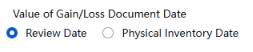

Tanggal yang dipakai di dokumen selisih.

- Review date → tanggal saat review
- Physical Inventory Date → tanggal saat hitung fisik dilakukan

### 14. Backflush in Inventory Gains Exceeds Limit

- **盘盈倒冲超量**

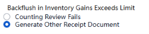

Apa yang terjadi kalau hasil hitung fisik lebih banyak dari yang seharusnya alias sistem (backflush over-limit).

- Counting Review Fails → review gagal, ga bisa lanjut
- Generate other receipt document → bikin dokumen penerimaan terpisah buat kelebihannya

### 15. Stocktaking Snapshot Generation Sequence

- **盘点快照生成顺序**

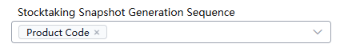

Urutan sorting saat sistem generate snapshot stok yang akan dipakai untuk melakukan pengecekan stock. 
Pilihannya: by Product code / Material Category / Product Category / Brand / Storage bin code / Mnemonic code. *(tinggal pilih mau diurutin berdasarkan apa)*

### 16. Default Range of Quick Stocktaking

- **快盘默认盘点范围**

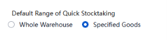

opname cepat, versi ringkas dari opname penuh.

Bedanya sama opname biasa: ga perlu bikin Stocktaking Plan dulu, langsung hitung fisik. Makanya disebut "quick."

Cakupan default saat quick count.

**Setting ini ngatur:** kalau lo buka Quick Stocktaking, defaultnya langsung hitung **seluruh gudang** atau **barang tertentu aja**.

- **Whole Warehouse** → default hitung semua material di gudang. Cocok kalau mau spot-check seluruh gudang secara cepat.
- **Specified Goods** → default hanya material yang lo pilih. Cocok kalau mau cek barang tertentu aja — misal barang mahal, barang yang sering selisih, atau barang yang baru masuk.

### 17. Calculate Business Occurred During Stocktaking

- **计算盘点期间业务发生数**

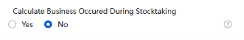

Hitung atau enggak hitung transaksi yang terjadi **selama proses stock opname berlangsung.** *(yes = transaksi di tengah opname tetap dihitung biar akurat)*

Ini njelasin apa yang terjadi kalau ada **transaksi masuk/keluar yang terjadi DI TENGAH proses stock opname**.

**Masalah yang diselesaikan:**

Bayangin lo lagi stock opname. Di saat yang sama, ada barang yang keluar/masuk gudang. Pertanyaannya: transaksi itu ikut dihitung atau diabaikan?

**Yes** → transaksi yang terjadi selama opname **ikut dihitung**.

Sistem otomatis ambil dokumen issue/receipt yang terjadi antara waktu mulai counting sampai review selesai, lalu ikutkan ke perhitungan gain/loss.

Hasilnya lebih akurat karena selisih stok yang ketemu udah memperhitungkan pergerakan barang yang terjadi selama opname berlangsung.

**No** → sistem **anggap ga ada transaksi** yang terjadi selama opname.

Artinya: sistem freeze — dianggap antara waktu counting plan dan real time itu ga ada pergerakan barang sama sekali.

**Kapan pakai Yes vs No:**

- **Yes** → gudang tetap aktif beroperasi saat opname (barang tetap keluar masuk). Ini lebih realistis buat warehouse yang ga bisa berhenti total.
- **No** → gudang beneran dihentikan saat opname (freeze semua transaksi). Lebih simpel tapi butuh kondisi operasional yang memungkinkan.

Nyambung juga ke parameter **Stocktaking Snapshot** (no.15)— snapshot itu diambil di awal opname sebagai "foto" kondisi stok, dan setting ini nentuin apakah pergerakan setelah snapshot ikut diperhitungkan atau tidak.

### 18. Warehouse Material Relationship

- **仓库物料关系**

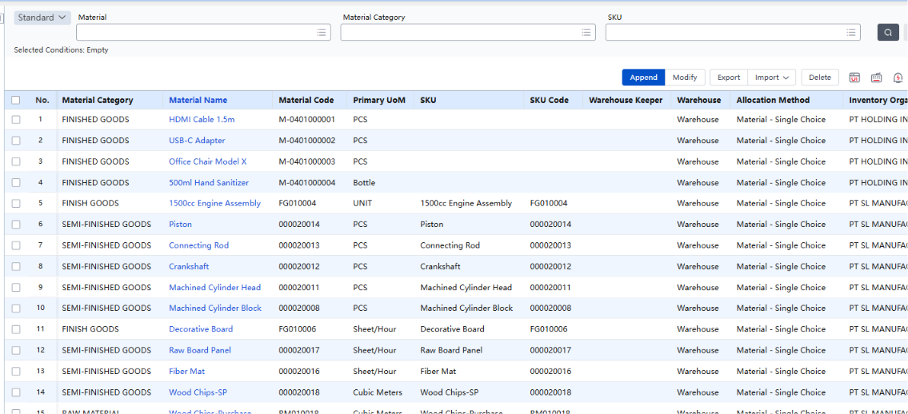

aturan: suatu material cuma boleh ada di 1 gudang. Tanpa mapping ini, parameter "Check warehouse-material relationship" ga ada gunanya karena ga ada data yang bisa dicek.

Nyambung langsung ke parameter No.1: **Check the warehouse for inbound and outbound based on the warehouse-material relationship**

Fungsinya: lo daftarin "material X hanya boleh masuk/keluar dari gudang Y". Kalau ada transaksi yang salah gudang, sistem bisa warning atau blokir — tergantung setting parameter (Prompt only / Strict control).

Allocation Method: "Material - Single Choice" yang muncul di semua baris — dugaan gua ini artinya satu material hanya bisa dialokasikan ke satu gudang spesifik (tidak bisa ke banyak gudang sekaligus).

Tapi ini perlu dikonfirmasi ke Willy karena gua belum yakin ada pilihan lain selain Single Choice.

### 19. Alur Stock Opname

Stocktaking Plan (rencanain: gudang, material, tanggal) → Snapshot (sistem bekukan angka 账存 sebagai patokan) → Physical Inventory 实盘 (hitung fisik di gudang) → Compare: Fisik vs 账存 sistem→ Ada selisih → Variance Doc → Adjustment + Jurnal → Tidak ada selisih → Selesai

**Istilah penting:**

- 账存 = stok menurut sistem/buku
- 实盘 = hasil hitung fisik
- 盈亏 = selisih (gain/loss)

## Calculation Rules, Check Rules of Available Qty and Available Rules Allocation

### 20. Konsep Dasar

**Available Qty ≠ Stok Fisik**

Stok fisik = jumlah barang yang beneran ada di gudang sekarang.

Available Qty = angka yang sistem hitung berdasarkan formula — bisa lebih atau kurang dari stok fisik tergantung rule yang dipakai.

**Formula dasarnya:**

Available Qty = Stok Fisik + Inbound Supply (PO coming) - Outbound Demand (SO reserved)

Berapa tepatnya? Tergantung rule yang dikonfigurasi. Rule yang berbeda = hasil yang berbeda dari kondisi stok yang sama.

**Dua Rule yang Bekerja Bersama**

| Rule | Fungsinya | Analogi |
| --- | --- | --- |
| Calculation Rule | Hitung BERAPA available qty-nya | Kasir yang hitung total belanjaan |
| Check Rule | Tentuin AKSI kalau qty tidak cukup | Security yang mutuskan boleh keluar atau tidak |

Keduanya harus dikonfigurasi dengan logika yang nyambung. Kalau Calculation Rule ketat tapi Check Rule = Do Not Check, sama aja tidak ada kontrol.

### 21. Calculation Rule — Hitung Berapa Available Qty

**Usage Scenario**

*Makin deket ke eksekusi fisik(harus ngirim secepatnya), makin ketat aturan hitungnya.*

| Scenario | Kapan | PO Coming Dihitung? | Tingkat Keketatan |
| --- | --- | --- | --- |
| Order | Sales bikin Sales Order baru | Ya — ikut dihitung | Paling Longgar |
| Shipping | Gudang proses pengiriman | Tidak dihitung | Sedang |
| Issue | Barang beneran keluar gudang | Tidak dihitung | Paling Ketat |

**Contoh PT Maju Elektronik (Stok 100, Reserved 30, PO Coming 20):**

| Scenario | Formula | Available Qty | SO 80 unit? |
| --- | --- | --- | --- |
| Order | 100 - 30 + 20 | 90 | Bisa |
| Shipping | 100 - 30 | 70 | Tidak bisa |
| Issue | 100 - 30 | 70 | Tidak bisa |

Kenapa harus beda? Kalau Order pakai aturan Issue (ketat) — sales kehilangan order karena sistem bilang tidak cukup padahal PO mau datang. Kalau Issue pakai aturan Order (longgar) — gudang eksekusi keluar barang yang belum ada fisiknya.

**S/D Date Matching**

**S/D = Supply / Demand.** Ngatur apakah tanggal Supply harus cocok dengan tanggal Demand.

| Setting | Artinya | Risiko |
| --- | --- | --- |
| Ignore Date (default YonSuite) | Semua supply dihitung available sekarang, mau datangnya kapanpun | PO bulan depan tetap dihitung untuk SO kirim minggu ini — bisa jadi barang belum ada pas mau kirim |
| Match Date | Supply hanya dihitung kalau datangnya sebelum atau sama dengan tanggal demand | Lebih akurat — sales tau dari awal kalau stok tidak cukup untuk tanggal tertentu |

Catatan YonSuite: S/D Date Matching di sistem defaultnya fixed Ignore Date. Konfirmasi ke Willy apakah bisa diubah ke Match Date.

**S/D Dimension Matching**

Ngatur di level mana sistem mengisolasi perhitungan stok.

| Setting | Artinya | Contoh |
| --- | --- | --- |
| Inventory Organization (default) | Hitung gabungan semua gudang dalam satu organisasi | Jakarta 70 + Surabaya 50 = Available 120. SO 100 unit bisa — tapi fisiknya kepisah 2 kota |
| Per Warehouse | Hitung per gudang masing-masing warehouse, bukan warehouse seluruh organisasi | Jakarta 70. SO 100 unit dari Jakarta tidak bisa (70 < 100) meskipun total 120 |

**Analogi:** Inventory Org = hitung total tabungan semua rekening. Per Warehouse = hitung per rekening masing-masing — rekening A tidak bisa pakai saldo rekening B.

### 22. Check Rule — Aksi Kalau Qty Tidak Cukup

Setelah Calculation Rule hitung available qty, Check Rule yang mutuskan: sistemnya ngapain?

| Handling Option | Artinya | Cocok Untuk |
| --- | --- | --- |
| Do not check | Tidak dicek sama sekali. Transaksi bebas jalan meskipun stok minus | Testing / kondisi sangat fleksibel |
| Excessive Prompt | Muncul warning tapi transaksi tetap bisa dilanjutkan. User dikasih tau tapi keputusan di user | Gudang yang butuh awareness tapi tidak mau blokir operasional |
| Strict Control | Blokir total. Kalau available qty tidak cukup, transaksi tidak bisa diproses | Kontrol ketat — tidak ada toleransi over-issue |

Pola 3 level ini konsisten di banyak setting YonSuite: Do not check / Warning / Strict Control. Kalau ketemu setting lain dengan 3 pilihan serupa, logikanya sama.

**4. Distribution — Wajib Sebelum Rule Berlaku**

Rule yang sudah dibuat tidak langsung berlaku — harus di-distribute dulu ke organisasi yang relevan.

| Rule | Distribute Ke |
| --- | --- |
| Calculation Rule | Inventory Organization |
| Check Rule | Sales Organization atau Inventory Organization |

**Analogi:** Lo sudah bikin SOP kerja — tapi SOP itu harus didistribusikan ke tiap cabang dulu sebelum mereka bisa jalankan. Tanpa distribusi, rule tidak efek apapun.

**5. Perbandingan Skenario — PT Maju Elektronik**

Kondisi: Stok fisik 100, Reserved 30, PO Coming 20. Sales mau bikin SO 80 unit.

**Skenario A — Calculation Longgar + Check Strict**

| Step | Detail |
| --- | --- |
| Calculation Rule | Order, Ignore Date, Inventory Org |
| Hasil Hitung | 100 - 30 + 20 = 90 (PO coming ikut dihitung) |
| Check Rule | Strict Control |
| Pengecekan | 90 >= 80? → YES |
| Hasil Akhir | SO 80 unit BISA diproses |
| Cocok Untuk | Tim sales yang aggressive, stok direncanakan jauh hari |

**Skenario B — Calculation Ketat + Check Warning**

| Step | Detail |
| --- | --- |
| Calculation Rule | Shipping, Match Date, Per Warehouse |
| Hasil Hitung | 100 - 30 = 70 (PO coming tidak dihitung) |
| Check Rule | Excessive Prompt |
| Pengecekan | 70 >= 80? → NO → muncul WARNING |
| Hasil Akhir | SO 80 unit dapat warning tapi tetap bisa dilanjutkan |
| Cocok Untuk | Gudang yang butuh awareness tapi tidak mau blokir sales |

**6. Ringkasan Setup — Rekomendasi Umum**

| Skenario | Date Matching | Dimension | Check Rule | Kenapa |
| --- | --- | --- | --- | --- |
| Order | Ignore Date | Inventory Org | Strict Control | Sales butuh fleksibilitas max saat terima order |
| Shipping | Match Date | Per Warehouse | Strict Control | Pengiriman harus realistis — barang harus ada, tepat waktu, di gudang yang benar |
| Issue | Match Date | Per Warehouse | Strict Control | Eksekusi — tidak ada toleransi |

Ini rekomendasi berdasarkan logika best practice umum. Setup aktual tergantung kebijakan bisnis klien — selalu konfirmasi ke Willy untuk implementasi nyata.

### 23. Available Qty Rule Allocation — Assign Rule ke Organisasi

Rule yang sudah dibuat (Calculation + Check) tidak otomatis berlaku. Harus di-assign dulu lewat halaman ini ke organisasi dan dokumen yang relevan.

**Konsep: Dua Level Setting**

| Level | Scope | Fungsinya |
| --- | --- | --- |
| Header | Per Organisasi | Assign Calculation Rule + Check Rule default untuk seluruh organisasi |
| Detail | Per Dokumen | Override rule untuk dokumen tertentu yang butuh aturan berbeda dari default |

**Analogi:** Header = peraturan umum perusahaan. Detail = pengecualian khusus per divisi. Kalau ada Detail, Detail yang dipakai. Kalau tidak ada, pakai Header.

**Aturan Distribusi**

| Tipe Organisasi | Bisa Dapat Rule Apa |
| --- | --- |
| Inventory Organization | Calculation Rule + Check Rule (keduanya) |
| Sales Organization (tanpa inventory) | Check Rule saja |

**Khusus Sales Order — rule-nya diambil dari dua tempat berbeda:**

- **Check Rule →** diambil dari Sales Organization
- **Calculation Rule →** diambil dari Inventory Organization

Dokumen lain (Issue, Shipping, Transfer, dll) → semua ambil dari Inventory Organization.

Inventory Organization di YonSuite = Business Unit yang dibuat di Digital Modeling. Bukan entitas terpisah — nama berbeda, entitas sama.

**Check Timing — Pintu Gerbang ke Tahap Berikutnya**

Timing nentuin di titik mana sistem berdiri di pintu dan ngecek available qty.

| Timing | Kapan Dicek | Artinya |
| --- | --- | --- |
| Save | Saat user klik Save dokumen | Paling awal — dokumen tidak bisa disimpan kalau qty tidak cukup |
| Submit | Saat user Submit ke approval | Dicek sebelum masuk workflow approval |
| Approve | Saat approver klik Approve | Dokumen bisa disimpan & disubmit, tapi tidak bisa final kalau qty tidak cukup |

**Analogi:** Timing = satpam di pintu berbeda. Save = pintu masuk gedung. Submit = lift sebelum naik ke lantai approval. Approve = meja tanda tangan final.

**7.5 Pattern Umum per Dokumen**

| Document Type | Check Rule | Timing | Logikanya |
| --- | --- | --- | --- |
| Issue Document | Strict Control | Save | Eksekusi langsung — harus dicek paling awal |
| Sales Shipment | Strict Control | Save | Mau kirim fisik — barang harus ada sekarang |
| Issue Application | Strict Control | Save | Permintaan keluar — langsung dicek saat dibuat |
| Sales Order | Strict Control | Approve | SO masih bisa revisi — cukup dicek saat final approve |
| Transfer Order | Strict Control | Approve | Mutasi antar gudang — dicek saat disetujui |
| Manufacturing Order | Do not check | Approve | Material produksi dikelola terpisah di modul Production |
| Subcontracting Order | Do not check | Approve | Sama seperti Manufacturing — dikelola di modul terpisah |

**7.7 Study Case — PT Maju Elektronik (Flow Lengkap)**

Kondisi: Stok 100, Reserved 30, PO Coming 20. Sales bikin SO 80 laptop.

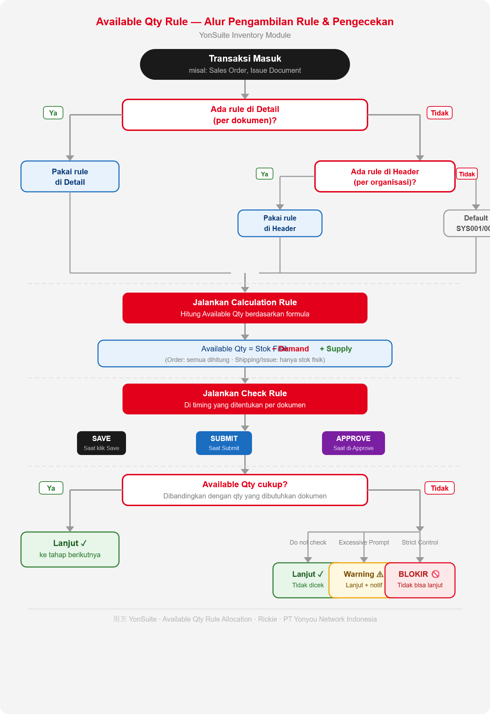

| Step | Dokumen | Timing | Rule | Hasil |
| --- | --- | --- | --- | --- |
| 1 — Sales bikin SO | Sales Order | Approve (belum dicek saat Save) | SYS003 Order scenario | SO tersimpan, belum dicek |
| 2 — Manager approve SO | Sales Order | Approve — sistem ngecek sekarang | 100-30+20=90 >= 80 → Lolos | SO di-approve, 80 unit ter-reserve |
| 3 — Gudang issue barang | Issue Document | Save — langsung dicek | 100-30=70 (PO tidak dihitung) >= 80? → NO | Issue DIBLOKIR, tidak bisa disimpan |
| 4 — Resolusi | — | — | Tunggu PO tiba → stok jadi 120 → Issue bisa jalan | Issue Document bisa diproses |

Kenapa SO lolos tapi Issue diblokir? Beda Calculation Rule — SO pakai Order scenario (PO ikut dihitung), Issue pakai Shipping scenario (PO tidak dihitung). Ini yang bikin available qty-nya beda di tiap tahap.

**8. Yang Perlu Dikonfirmasi ke Willy**

- **S/D Date Matching:** Fixed Ignore Date atau bisa diubah ke Match Date di YonSuite?
- **Available Qty Check Rules:** Handling options lain selain 3 yang sudah diketahui?
- **Custom Rule:** Kapan perusahaan perlu bikin custom rule selain preset SYS001-SYS005?
- **Check Timing override:** Kalau sistem blokir di Save, apakah user masih bisa override atau hard block?

## Inventory Issue/Receipt

### 24. Opening Inventory

- **期初库存**

Stok awal saat pertama kali setup sistem. Action: Add new, Approve/Unapprove. Harus add inventory period scheme dlu pada Business Unit

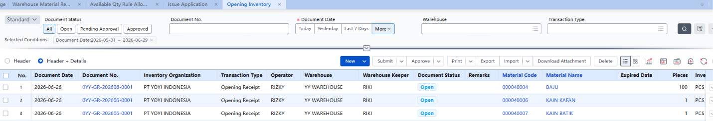

### 25. Issue Application

- **出库申请**

Permintaan pengeluaran barang. Push down bisa ke: Issue, Transfer, atau Lend (pinjam).

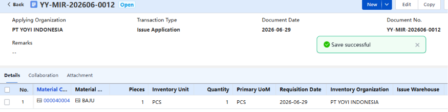

### 26. Purchased Goods Receipt

- **采购入库**

Barang masuk dari pembelian. Push down ke: Invoice (langsung generate invoice dari Good Receipt).

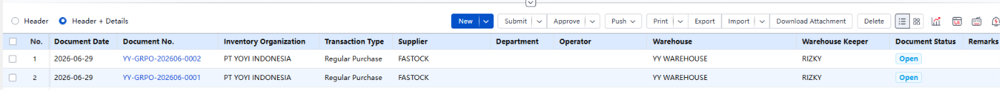

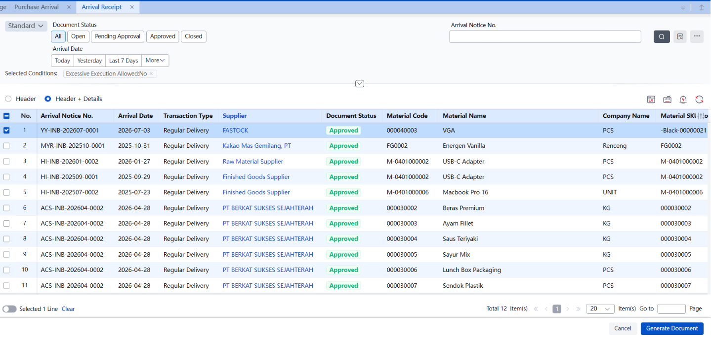

Untuk generate Purchased good receipt kita juga bisa generate dari **purchase arrival** (purchase arrival ada ketika kita ada bikin purchase order dan alurnya sudah sampai purchase arrival)

### 27. Other Goods Receipt

- **其他入库**

Barang masuk di luar jalur beli — termasuk Borrow-in receipt (barang pinjaman masuk) dan Lend-return receipt (barang yang dipinjamkan balik lagi). Biasanya dipakai ada material tambahan yang masuk yang diberikan client atau kondisi tertentu

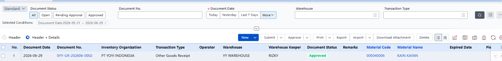

### 28. Product Issue

- **销售出库**

Barang keluar untuk penjualan. Push down ke: Invoice. **(ada di finance cloud)**

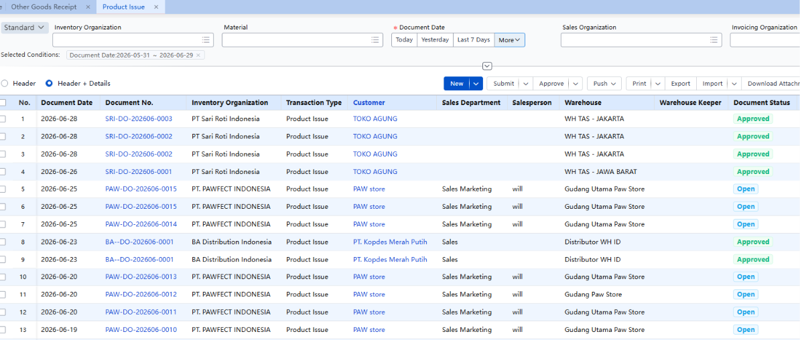

### 29. Matl Issue

- **材料出库**

Keluar material/bahan baku. Bisa dari: Add new langsung atau dari Issue Request (出库申请).

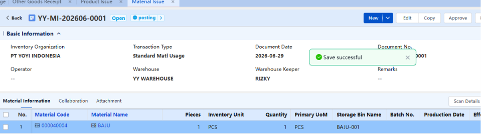

### 30. Other Goods Issue

- **其他出库**

Keluar barang di luar jalur penjualan — termasuk **Borrow-return issue** (kembaliin barang pinjaman), **Issue-request issue** (dari permintaan), **Issue-request return** (retur permintaan).

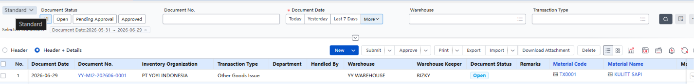

## Transfer

### 31. Transfer Application

- **调拨申请**

Permintaan mutasi barang antar gudang. Push down ke: Transfer Order. Butuh Approval

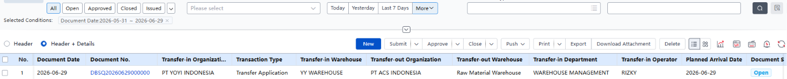

### 32. Transfer Order

- **调拨订单**

Order mutasi resmi setelah melalui Approval dari Transfer Application. Push down ke: Issue (出库 di gudang asal).

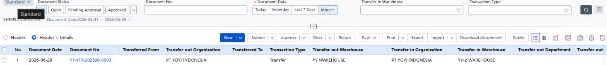

Bisanya dipakai di 1 organisasi yang memiliki 2 warehouse, tidak bisa transfer warehouse antar organisasi

### 33. Transfer-Out

- **调出**

Eksekusi keluar di gudang asal. **Push down ke: Receipt (调入 di gudang tujuan).**

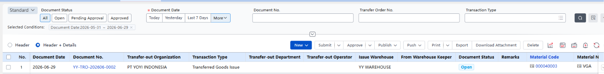

### 34. Transfer-In

- **调入**

Konfirmasi masuk di gudang tujuan. **Action: Add new Receipt, Approve/Unapprove.**

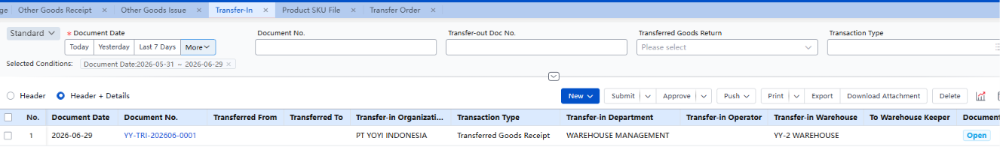

## Stocktacking

### 35. Closing Stocktaking

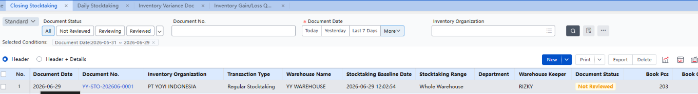

Audit tahunan yang melibatkan banyak departemen sekaligus.

Hitung fisik semua barang → bandingkan dengan sistem → selesaikan selisih.

**Bedanya dari Daily:** Ini **planned** — harus ada Stocktaking Plan dulu sebelum turun ke lapangan.

### 36. Daily Stocktaking

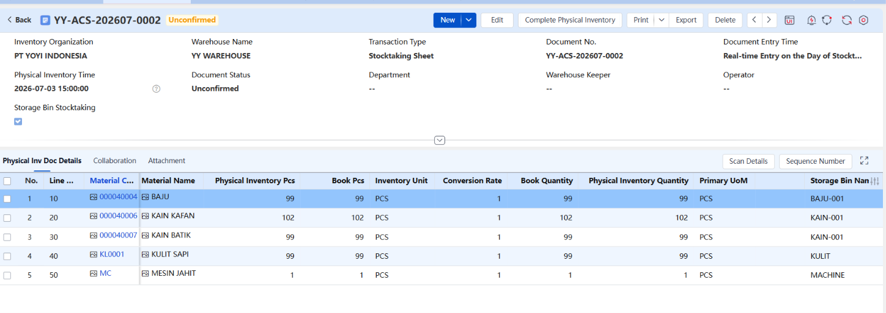

Pengecekan dadakan karena ada yang mencurigakan di rak, bukan audit terencana.
Prosesnya: Petugas langsung bikin Stocktaking Form tanpa perlu Stocktaking Plan dulu.
Dipakai untuk: Temuan dadakan — barang rusak, kurang, atau ada masalah kualitas yang perlu dicatat langsung.
Bedanya dari Closing: Tidak perlu plan — langsung eksekusi. Cocok untuk situasi yang tidak direncanakan.

**Result Jika ada yang minus**

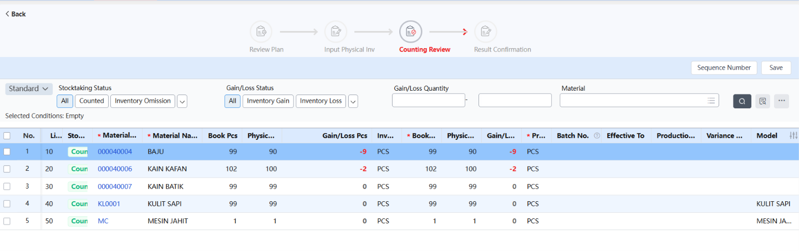

Report dari Selisih antara stok fisik dengan stok pada system, setelah itu klik save.

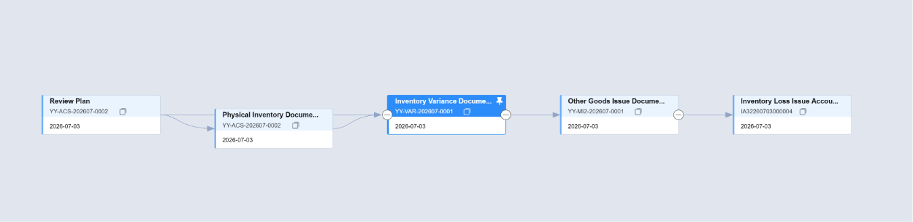

Setelah klik save biasanya jika kita melakukan pengecekan pada alur, akan ada alur “Other goods Issue Document (harus di approve juga supaya tercatat di event), yang menandakan adanya minus. Minus nulisnya Issue, Plus nulisnya Receipt. **Nyambung ke Daily Stocktaking**

### 37. Inventory Variance Doc

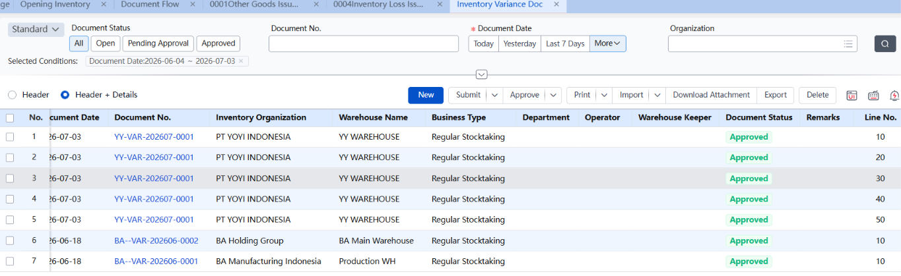

Dokumen resmi yang mencatat selisih antara hasil hitung fisik vs angka sistem.
Kapan dibuat: Setelah Final Inventory atau Daily Inventory selesai — kalau ada selisih.
Isinya: Qty fisik vs qty buku, selisihnya berapa, gain atau loss.
Perlu Approve: Ya — berbeda dari Opening Inventory yang langsung efektif saat Save. Variance Doc harus di-approve dulu sebelum sistem update stok.
Analoginya: berita acara resmi yang mencatat temuan selisih dan perlu ditandatangani sebelum diproses. **Nyambung ke Daily Stocktaking**

### 38. Inventory Gain/Loss Query

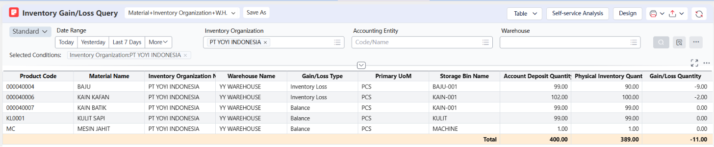

Reporting/query.

Dipakai untuk: Lihat semua gain/loss dalam periode tertentu — misal bulan Juni ada selisih apa aja.

Tidak ada action: Cuma query, tidak bisa bikin atau approve apapun dari sini. **Nyambung ke Daily Stocktaking**

## Inventory Adjustment

### 39. Stock Transfer

Pindahin barang dari Gudang A ke Gudang B masih dalam organisasi yang sama.

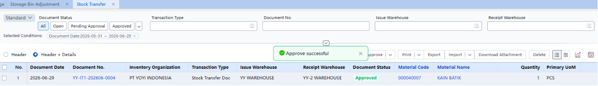

**4 skenario bisnis yang disebutin:**

- Optimasi layout gudang
- Penuhi demand regional
- Respons perubahan musiman
- Atasi stok berlebih/lambat

Note:

**Stock Transfer = Nama Kategori/Menu**

Stock Transfer itu **nama section/kategori** di modul Inventory — bukan nama dokumen transaksi.

Di dalamnya ada beberapa dokumen:

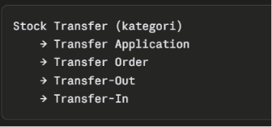

### 40. Storage Bin Adjustment

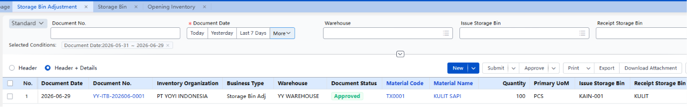

Perpindahan barang antar Bin bukan antar Gudang, skalanya kecil, Cuma pindah rak atau pindah laci saja.

## Borrowing/Lending

### 41. Lending Application

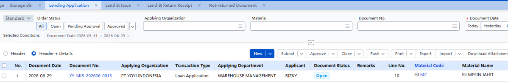

Pengajuan resmi mau minjemin barang. Ada approval dulu sebelum barang boleh keluar.
Setelah approve → auto generate **Lending Issue**.

### 42. Lending Issue

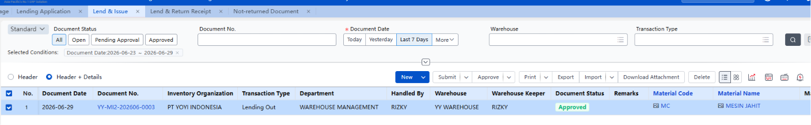

Eksekusi fisik — barang beneran keluar dari gudang ke peminjam. Ini yang catat stok berkurang. Dibagian ini setelah di approved maka transaksi akan selesai, untuk pengembalian bisa dilanjutkan ke fitur Lend & Return Receipt

### 43. Return to Inventory (Lend & Return Receipt)

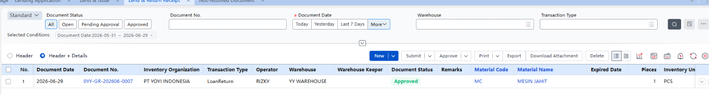

Barang yang dipinjam dikembalikan → masuk ke gudang lagi → stok bertambah otomatis.

### 44. Not-returned Doc

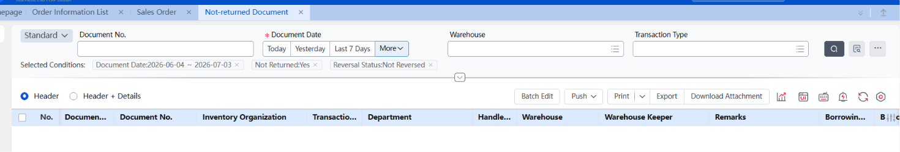

Bukan dokumen transaksi — ini **tracking/monitoring**. Bisa lihat: siapa yang masih pegang barang, sudah berapa lama, kapan expected return-nya.

## Report

### Real time Stock Checking

### 45. On-Hand stock Query (现存量查询) (SERING DIPAKAI)

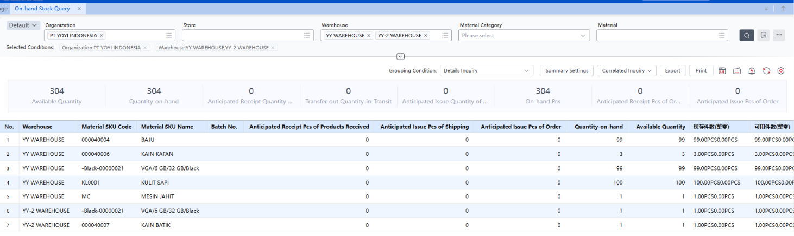

Cek stok yang ada sekarang + available qty. Bisa difilter dan digroup **per material, warehouse, batch, dll**. Bisa konversi unit (purchase unit, sales unit, inventory unit).

### 46. Product Receipt/Issue Summary (SERING DIPAKAI)

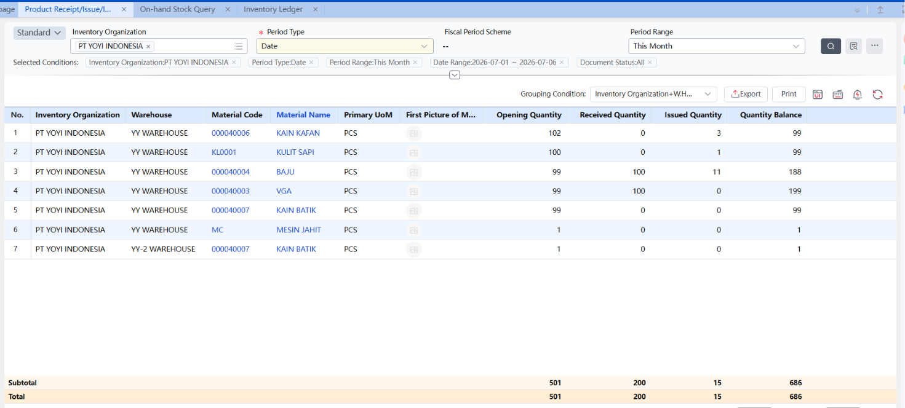

Summary Report Receipt/Issue/Inventaris Produk terutama mencatat transaksi masuk dan keluar material atau produk, serta situasi inventaris saat ini selama periode tertentu. Melalui tabel ini, user dapat menanyakan informasi ringkasan material/SKU mengenai saldo awal, penerimaan, pengeluaran, dan saldo akhir dalam jangka waktu tertentu, yang secara jelas menunjukkan status aliran setiap material.

### 47. Storage Bin Stock Qty Query (货位存量查询)

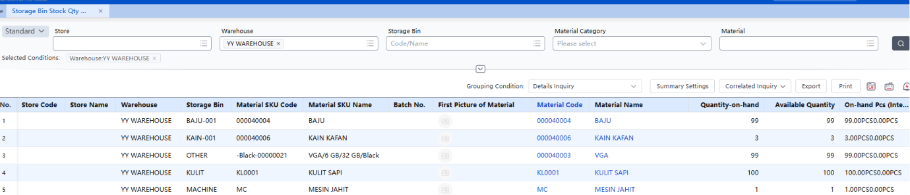

Sama kayak Stock on Hand, tapi sampai level **bin/lokasi**. Tau persis stok ada di bin mana.

**Note:** Stock on Hand = level gudang. Storage Bin = level rak/lokasi dalam gudang.

### 48. Inventory Ledger (SERING DIPAKAI)

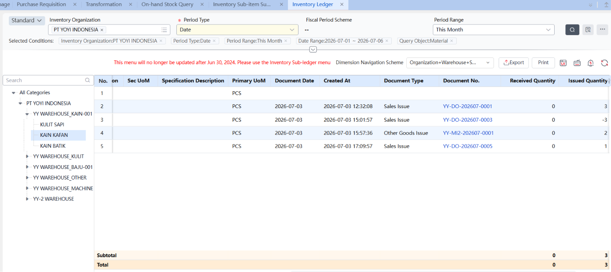

Pencatatan jenis keluar masuk dari suatu material (either dia sales issue, other good issue, atau receipt)

### Analysist & Alert

### 49. Stock Alert (库存预警)

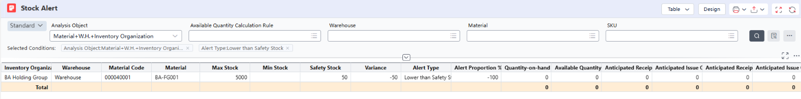

Cek apakah stok **terlalu banyak atau terlalu sedikit** dibanding indikator yang sudah diset:

- Safety Stock → batas minimum aman
- Maximum Inventory → batas maksimum
- Minimum Inventory → batas minimum

Kalau stok di luar range ini → muncul alert.

Masih bingung set safety stock biar bisa terinpur ke dalam stock alert.

### 50. Stock Analysis Details (存量分析明细)

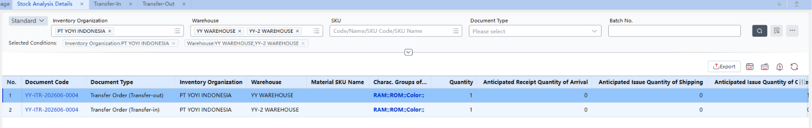

Analisa komposisi stok — dari mana stok itu berasal (expected input) dan ke mana akan pergi (expected output).

Nyambung dengan Transfer In dan Transfer Out stock.

### Transactions List/History

### 51. Issue/Receipt Query (New) (出入库查询) (SERING DIPAKAI)

Semua riwayat barang masuk dan keluar — diurutkan berdasarkan waktu, bisa filter per organisasi atau warehouse. Diinput ke dalam Opening Inventory juga akan tercatat disini.

### 52. Inventory Ledger (库存台账)

Buku besar inventory — detail perubahan qty dan nilai per periode. Isinya: saldo awal, barang masuk keluar, saldo akhir per material.

### 53. Goods Receipt/Issue/Inv Summary (收发存汇总)

Versi ringkas dari Inventory Ledger — summary saja, tidak detail per transaksi.

Note: Ledger vs Summary: Ledger = detail tiap transaksi. Summary = total masuk/keluar/saldo per periode.

**Gak mau ke-search (issue)**

### Outlook

### 54. Inventory Expectation/Outlook (库存展望)

Proyeksi stok atau overview stock yang dimiliki suatu organisasi— berapa available qty, supply, dan demandnya.

### 55. Inventory Expectation Detail (库存展望明细)

Versi detail dari Inventory Outlook— breakdown supply dan demand yang membentuk proyeksi itu dari mana.

**Note: Outlook** = angka keseluruhan. Detail = penjelasan dari mana angka itu berasal.

## Inbound & Outbound

1. Inbound (Purchase Receipt > AP, Other Good Receipt > tambahan, Product Receipt(dari produksi)) ; barang masuk gudang

Pada bagian Material creation ada kotak “Self Produced” ini yang berkorelasi dengan Product Receipt (Produk yang kita terima melalui produksi kita sendiri), jika tidak mencentang “Self produced”, maka Ketika menginput material pada menu product receipt, tidak ada akan material yang muncul pada menu.

1. Outbound (Sales Issue, Other Good Issue, Material Issue)

Sales Issue = Purchased Issue, pengiriman dari sales order

Other Good Issue = Input pengiriman barang diluar penjualkan

Material Issue = Input pengiriman barang diluar kebutuhan.

## Transformation

Digunakan Ketika kita ingin memisahkan atau menggabungkan suatu material tanpa mempengaruhi proses produksi. Fitur ini membantu kita melakukan adjustment material tetapi tetap tidak mengganggu data yg sudah ada.

1. Material Conversion **(TRANSFORM)**

Men-Convert suatu Material ke material lain (Material A jadi Material B)

Conversion Type:

- One to One : Dari A ke B
- Many to One : dari A1 A2 A3 jadi A+
- One to Many : dari A+ jadi A1 A2 A3

**Batch No Conversion**

Transaction type untuk mengubah atau menggabung batch number pada material yang sama.

**Fungsi**: **One-to-one** (ganti satu batch number ke batch number lain) dan **merging** (gabung beberapa batch jadi satu).

**Dibutuhkan kalau**: Perlu adjust kuantitas antar batch, atau re-combine batch. Contoh dari teks: industri makanan gabungin produk yang mendekati expired dengan batch lain biar shelf life-nya bisa diperpanjang untuk dijual.Assembly

**Assembly**

- **Apa**: Transaction type untuk gabungin beberapa material jadi satu material (kit).
- **Fungsi**: Bisa pakai BOM (Bill of Materials) atau tanpa BOM. Kalau pakai BOM, pilih parent part → component otomatis ter-populate di baris "Loose Parts". Untuk Assembly, **field allocation ratio component TIDAK perlu diisi**.
- **Dibutuhkan kalau**: Ada proses gabung komponen jadi produk utuh. Contoh dari teks: pabrik elektronik yang perlu assembly beberapa komponen jadi satu produk lengkap.

**Disassembly**

- **Apa**: Kebalikan dari Assembly — split satu material jadi beberapa material.
- **Fungsi**: Sama-sama bisa pakai BOM atau tanpa BOM. Bedanya dengan Assembly: **field allocation ratio component WAJIB diisi** — dan itu dihitung otomatis berdasarkan reference cost sub-component (bisa diubah manual), dengan syarat total allocation ratio harus = 100%.
- **Dibutuhkan kalau**: Butuh pecah satu unit jadi komponen-komponen terpisah. Contoh dari teks: pabrik elektronik disassembly satu unit jadi part-part individual. Catatan tambahan dari teks: hasil disassembly (allocation ratio + group number) tercatat di Other Goods Receipt, dan inventory-nya terhubung ke parent part berdasarkan group number untuk cost allocation.

**5. Trace Lead Conversion (Tracking Lead Conversion)**

- **Apa**: Transaction type untuk lock, release, atau transfer inventory berdasarkan tracking lead (customer, order, project).
- **Fungsi**: 3 metode konversi yang eksplisit disebut teks:
  - Empty → Occupied (**locked**)
  - Occupied → Empty (**released**)
  - A → B (**transferred**)
  - Catatan: kalau lead A dan B sama-sama kosong, **tidak bisa** dikonversi.
- **Dibutuhkan kalau**: Ada kebutuhan reserve material untuk customer/order/project tertentu sampai waktu tertentu (lock), lalu dilepas untuk produksi (release), atau realokasi material antar project sesuai progress (transfer). Detail tambahan: MTO material linked ke demand order number/line; WBS material linked ke WBS task.

**Difference Return**

**Apa**: Transaction type preset untuk return barang yang **dipinjam (borrowed/lending)**, di mana barang yang di-return itu dari **batch yang berbeda** dari batch asal peminjaman.

**Fungsi**: Return-nya **tidak mempengaruhi inventory** (without affecting inventory) — dan dari kutipan kedua, prosesnya bisa **return ke warehouse yang berbeda** juga.

**Dibutuhkan kalau**: Ada skenario **lending/borrowing** material (peminjaman barang), tapi pas mau dikembalikan, batch-nya udah beda dari yang dipinjam awal — dan itu terjadi di konteks **"unreturned loan orders"** (order pinjaman yang belum di-return).

Cost Area

Note: Jika GL tidak terposting itu bisa saja bermasalah di bagian Cost Area, karna dari warehouse kita belum dimapping ke Cost Area, jadinya system bingung apa yang mau di posting
