### Price Center

### 1. Price Adjusting Doc

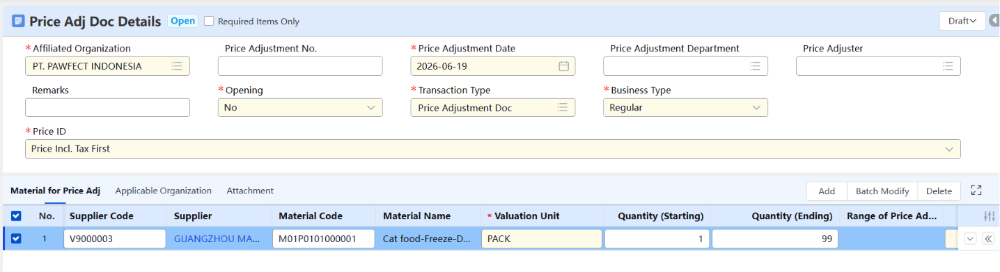

Kebutuhan Supplier untuk memberikan adjusting harga produk ke dalam sistem.

Approved = dari pihak client atau pembeli dapat approved/devote approve harga yang diberikan oleh supplier.

### 2. Price Catalog

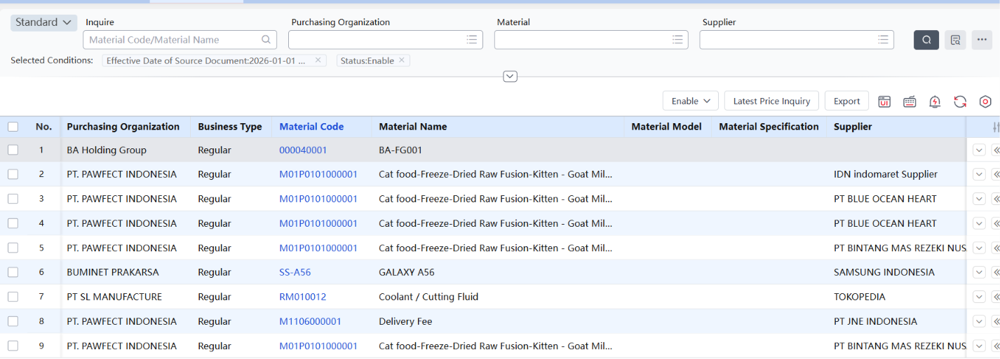

List produk yang berhasil melewati tahap Approved dari Price Adjusting yang diberikan.

Flow : Price Adj Doc > Price Catalog

## Purchase Parameter

### 3. 价格表价格来源

- **Price list Price source**
- **Tidak ada di settings (unavailable)**

### 4. 取价方式

- **Price Getting Method**

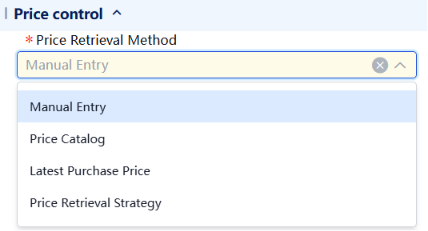

Menentukan bagaimana harga suatu barang akan diambil untuk kebutuhan purchasing, Contoh pilihan:

- Manual Entry = Input harga secara manuak
- Price Catalog = Mengikuti Price Catalog yang sebelumnya diberikan
- Lastest Purchase Price = Mengikuti harga pembelian terakhir
- Price Retrieval Starategi = Mengikuti strategi system pengecekan dan pencocokan secara bertahap

### 5. 定价可改

- **Pricing modifiable**

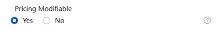

**Setting ini hanya relevan kalau settingan dari “Price Retrieval Method’ = Price Catalog (nyambung dengan no.4)**. Kalau pakai Manual Entry, settingan ini tidak berpengaruh.

Menentukan **apakah user boleh mengubah harga yang sudah otomatis diambil dari Price Catalog** saat transaksi berlangsung.

### 6. 实时取价

- **Real-time Price Retrieval**

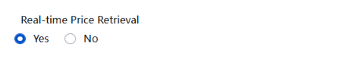

**Yes :** Setiap kali user buka/edit dokumen (PO, PR, dll), sistem langsung **ambil harga terbaru** dari sumbernya saat itu juga.

**No** : **Harga diambil sekali saja saat dokumen pertama kali dibuat**, tidak diupdate otomatis meski harga di katalog sudah berubah.

### 7. 最新采购价来源

- **Source of Latest Purchase Price**
- **(unavailable)**

Mengambil sumber harga barang berdasarkan transaksi terakhir

### 8. 最新采购价按供应商取价

- **Retrieve Latest Purchase Price by Supplier**
- **(unavailable)**

Mengambil suatu harga barang berdasarkan transaksi supplier terakhir.

### 9. 最高限价控制

- **Ceiling Price Ctrl**

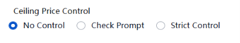

Batas harga maksimum yang boleh diinput untuk suatu material. Biasanya pada fitur ini ada ditentukan maksimal ceiling.

- **No Control :** Tidak ada batas harga — user bebas input berapapun.
- **Check Prompt :** Kalau harga melebihi ceiling, sistem kasih warning/peringatan — tapi user masih bisa lanjut dan save.
- **Strict Control :** Kalau harga melebihi ceiling, sistem blokir — user tidak bisa lanjut sampai harga diperbaiki.

### 10. 发票本币修改是否折算到原币

- **Convert to OC (Original Currency) after modifying FC of invoice**

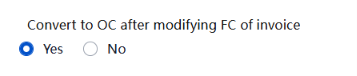

Settingan yang fungsinya supaya data currency selalu terupdate dengan benar.

- **Yes :** Kalau Functional Currency diubah → sistem otomatis hitung ulang nilai OC kita (mengikuti kurs) nilai plus = **Nilai currency lebih update**
- **No :** Kalau Functional Currency diubah → nilai OC tetap seperti semula atau tidak ikut berubah.

### 11. 生单汇率取值

- **Value of Ex. Rate in Doc Generation List**

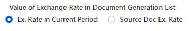

Cocok untuk : Perusahaan yang ingin nilai dokumen selalu mencerminkan kurs terkini

**Berhubungan dengan Document Conversion Rules (Generate dokumen)**

setting ini menentukan kurs kapan yang dipakai di dokumen baru itu.

- Ex. Rate in Current Period : Dokumen baru **pakai kurs periode saat ini** — **kurs hari ini waktu dokumen baru di-generate.**
- Source Doc Ex. Rate : Dokumen baru **pakai kurs dari dokumen asalnya** — kurs yang dipakai waktu **PO pertama kali dibuat.**

**Note: Push down dokumen** =

PO sudah diapprove → user klik "**Push**" → sistem otomatis generate **Arrive Doc** dari data PO itu. Jadi user tidak perlu input ulang data supplier, material, quantity, dll — semua otomatis terisi dari PO.

### 12. 允许超请购订货

- **Allow order Qty exceeding PR Qty**

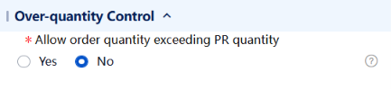

Kontrol apakah PO boleh lebih dri PR

- **Yes →** PO boleh ordernya lebih dari yang di-request di PR. Tapi ada batasnya, yaitu tidak boleh melebihi PR quantity × (1 + ceiling of over-PR %). Persentase ceiling-nya diambil dari material file.
- **No →** PO tidak boleh melebihi PR quantity sama sekali. Minta 100, order ke supplier maksimal 100.

**Note:** Biasanya kalau perusahaan punya kebiasaan order sedikit lebih banyak dari kebutuhan — misalnya untuk buffer stock, atau karena supplier punya minimum order quantity yang tidak bisa pas persis.

Kalau perusahaan mau **strict cost control** — setiap pembelian harus persis sesuai yang direquest, tidak boleh ada kelebihan tanpa approval tambahan.

Purchase Order vs Purchase Request (kedua ini wajib sama)

### 13. 允许超订单到货及入库

- **Allow arrival and receipt Qty exceeding order Qty**

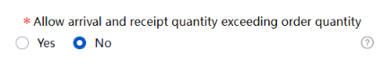

Kontrol apakah quantity barang yang datang (arrival) lalu masuk gudang (receipt) **melebihi quantity yang ada di PO.**

**Receipt VS Purchase Order** (Jumlah barang masuk inventory harus sama dengan jumlah pada PO)

- **Yes** → Arrival/Receipt **boleh melebihi PO quantity**, tapi tetap ada batasnya yaitu PO quantity × (1 + ceiling of over-receiving %). Ceiling-nya diambil dari material file dan bisa dimodifikasi per order.
- **No** → Arrival/Receipt **tidak boleh melebihi** PO quantity sama sekali.

Note: PR → PO → Arrival → Receipt

Arrival = barang fisik datang dari supplier, dicatat di sistem (Arrival Document)

Receipt = barang resmi diterima dan masuk inventory (Receipt Document)

### 14. 允许超到货实收

- **Allowed over-arrival and paid-in**

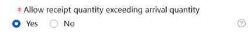

Kontrol apakah quantity barang yang masuk gudang (receipt) quantity-nya melebihi yang datang (arrival)

Arrival VS Receipt

**Yes** → Receipt **boleh melebihi Arrival**. Artinya barang yang dicatat masuk inventory bisa lebih banyak dari yang tercatat datang.

**No** → Receipt **tidak boleh melebihi Arrival**. Harus sesuai atau kurang dari yang datang.

### 15. 供应商供货控制

- **Supplier Supply Control**

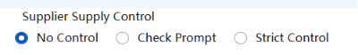

Kontrol seberapa ketat sistem mengatur apakah supplier boleh men-supply material tertentu atau tidak.

- **No Control** → Supplier mana aja boleh supply material apapun. Tidak ada pembatasan di sistem.
- **Check Prompt (fleksibel)** → Kalau supplier tidak terdaftar sebagai supplier resmi untuk material tertentu, sistem akan kasih warning/notifikasi, tapi transaksi tetap bisa dilanjutkan.
- **Strict Control** → Kalau supplier tidak terdaftar sebagai supplier resmi untuk material tertentu, sistem langsung blok. Transaksi tidak bisa dilanjutkan.

### 16. 采购发票审核时自动结算

- **Auto Settle upon Purchase Invoice Approval**

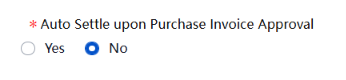

Apakah sistem otomatis melakukan settlement begitu Purchase Invoice diapprove.

- **Yes** → Begitu Purchase Invoice di-approve, **sistem otomatis langsung settle atau generate dokumen untuk Purchase settlement** (merekonsiliasi dokumen secara administratif — bukan berarti uang langsung keluar) tanpa perlu langkah manual lagi.
- **No** → Setelah Invoice di-approve, **settle-nya masih harus dilakukan manual** secara terpisah.

### 17. 是否自动业务关闭

- **Auto Close Doc**

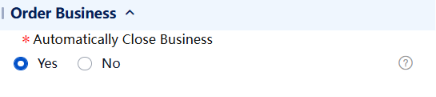

Sistem otomatis menutup/close suatu order/business ketika transaksinya sudah selesai atau sudah tercatat ke A/P.

- **Yes** → Kalau PO sudah fulfilled (semua barang sudah diterima, invoice sudah selesai), **sistem otomatis close PO** itu tanpa perlu manual.
- **No** → PO harus **di-close secara manual** oleh user.

Note: ada 4 Jenis close : Arrival Closing, Receipt Closing, Invoicing Closing, Payment Closing

### 18. 订单控制物料最小起订量

- **Control Min Order Qty of Matl**

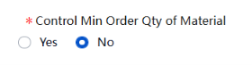

Apakah sistem **mengontrol minimum quantity order** sesuai yang diset di material file.

- **Yes** → Kalau material punya minimum order qty (misalnya minimal beli 50 unit), sistem akan enforce aturan itu. **Tidak bisa order di bawah minimum.**
- **No** → Minimum order qty di material file diabaikan, **bisa order berapapun.**

### 19. 订单控制物料采购倍量

- **Control Matl Purchase Multiple of Order**

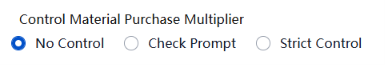

Mengontrol **apakah quantity order harus kelipatan tertentu** sesuai yang diset di material file.

- **No Control** → Bisa order berapapun, tidak harus kelipatan.
- **Check Prompt** → Kalau order tidak sesuai kelipatan, sistem kasih warning tapi tetap bisa lanjut.
- **Strict Control** → Harus persis kelipatan, kalau tidak sistem blok.

## Opening

### 20. 期初采购入库单

- **Opening Purchased Goods Receipt Doc**

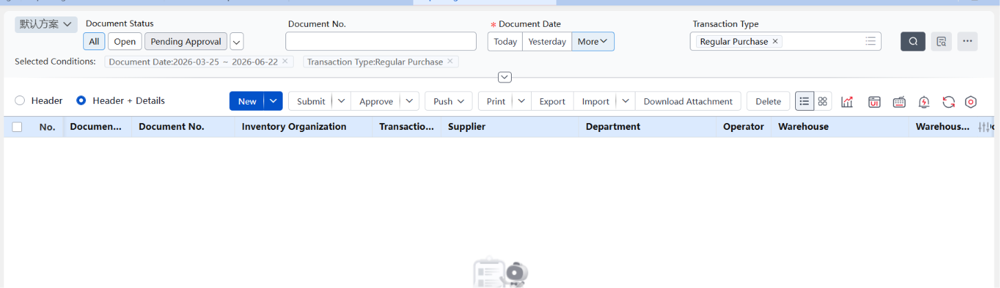

Fitur untuk **mencatat saldo awal barang yang sudah diterima tapi belum selesai diproses secara administratif di sistem** — biasanya dipakai saat pertama kali implementasi ERP (go-live).

Situasi penggunaan — hanya saat go-live implementasi ERP, khususnya ketika client baru migrasi dari sistem lama ke YonSuite. Tujuannya agar data stock dan hutang ke supplier di sistem langsung akurat dari hari pertama, tanpa ada transaksi yang "bolong" atau tidak tercatat.

Stock yang ud masuk, tapi belum jadi AP

### 21. 期初采购发票

- **Opening Purchased Invoice**

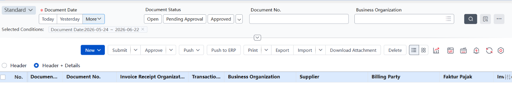

Gunanya untuk mencatat saldo awal tagihan dari supplier yang sudah ada sebelum sistem aktif, tapi belum tercatat di sistem yang baru (baru pindah system).

Saat go-live, perusahaan mungkin punya hutang ke supplier yang belum dibayar dari transaksi sebelum migrasi. Hutang itu harus diinput ke sistem supaya catatan keuangan akurat. **(case penggunaan mirip dengan Opening Purchased Goods Recipt Doc)**

Stock yang ud masuk, udah jadi AP

## Purchasing

### 22. 请购单

- **Purchase Requisition**

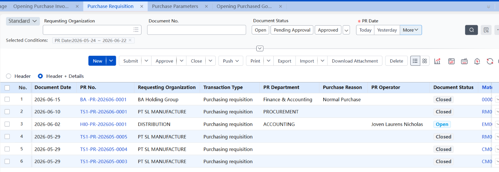

Dokumen internal, dari departemen lain request ke department purchasing.

Belum ada transaksi ke supplier sama sekali.

### 23. 采购订单

- **Purchase Order**

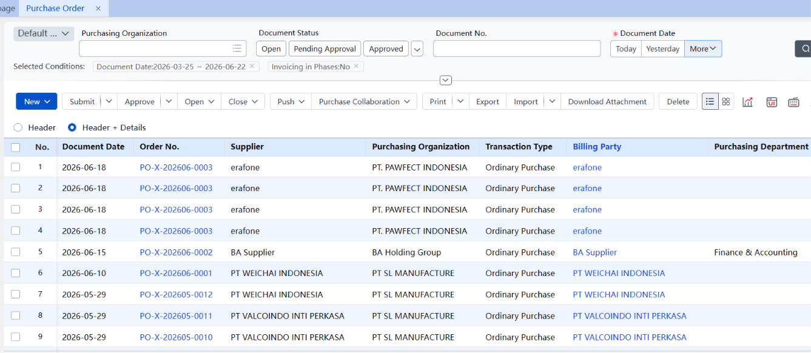

Dokumen resmi pemesanan barang ke supplier. **Titik awal** transaksi purchasing.

Pada saat bikin bikin New atau Push dari Purchase Request, untuk Transaction Type bisa pilih “Purchase Weighing – order arrival”

### 24. 到货单

- **Arrive Doc**

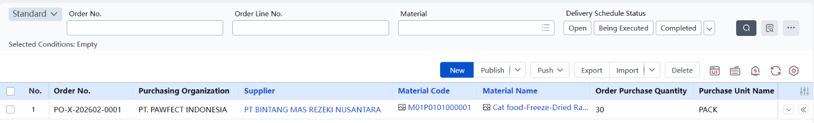

Dokumen **pencatatan barang datang.** \*Belum masuk inventory (Receipt).

### 25. Pricing Settlement

Proses pencocokan antara harga tercatat di PO dengan invoice supplier

### 26. 采购发票

- **Purchase Invoice**

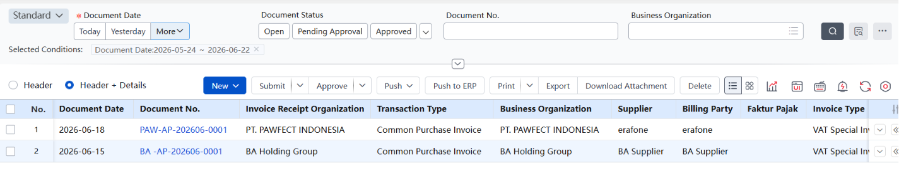

Dokumen **tagihan resmi dari supplier yang harus dibayar**.

### 27. 手工费用

- **Manual Settlement**

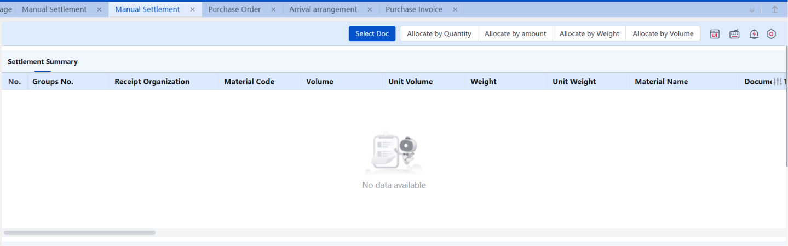

Proses **settle biaya tambahan** yang diinput manual.

### 28. 费用折扣结算

- **Expense Disc Settlement**

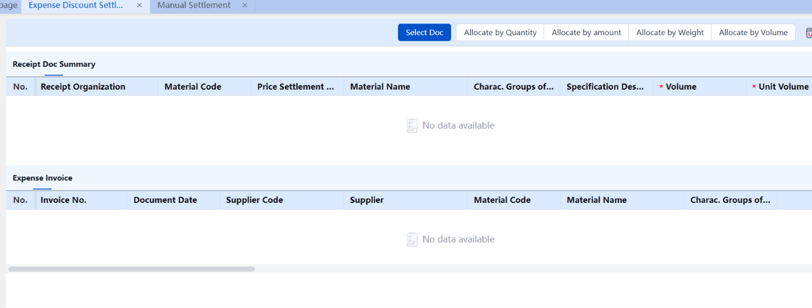

Proses **settle diskon** atau **biaya khusus** yang sudah disepakati dengan supplier.

### 29. 采购结算单

- **Puchase Settlement Doc**

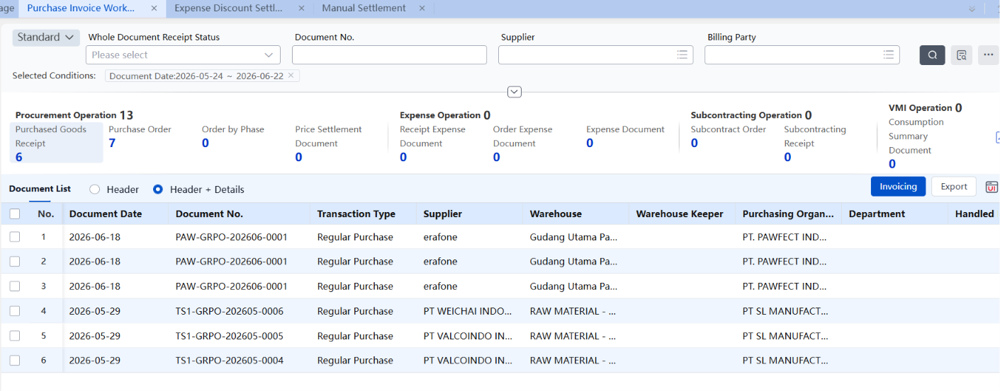

Dokumen **rekonsiliasi/pencocokan** dokumen antara PO, Arrive Doc, dan Invoice sebelum bayar. **(Connect dengan auto settle upon purchase invoice approval)**

**Karna harga sama, jadi step settlement tidak muncul. (note)**

## Report

### 30. 请购执行进度表

- **PR Execution Progress**

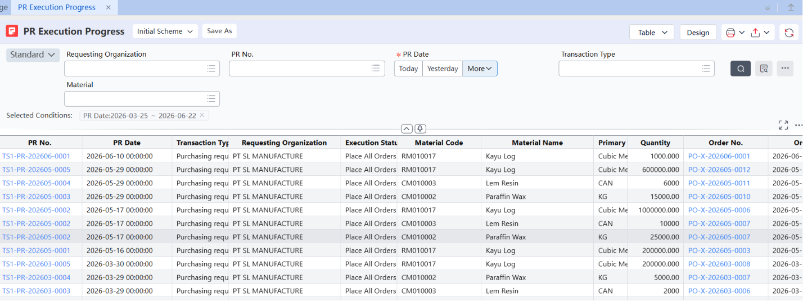

Laporan **progress tracking** dari **setiap Purchase Requisition**.

Monitoring proses Purchase Requisition

### 31. 请购统计

- **PR Statistics**

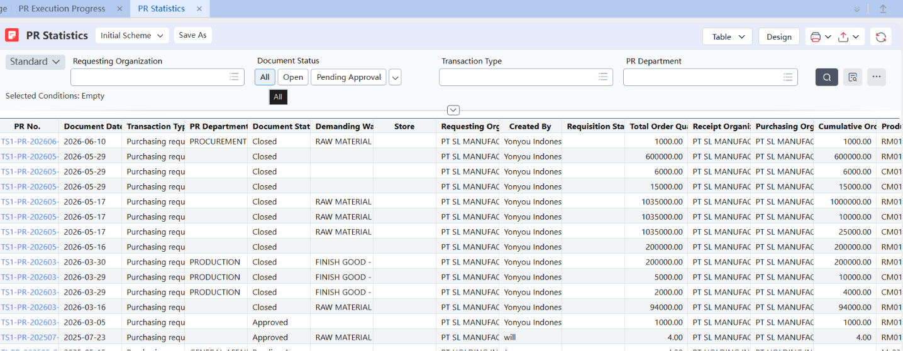

**Laporan statistik/rekap semua PR dalam periode tertentu.** Berapa banyak PR yang masuk, nilainya berapa, dari departemen mana saja.

Pengecekan PR pada bulan/periode tertentu itu ada berapa banyak.

### 32. 采购订单预警和报警

- **PO Alert & Alarm**

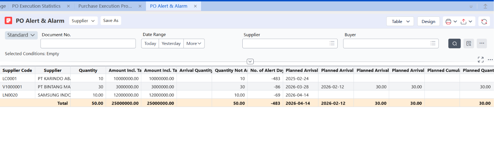

**Laporan peringatan untuk PO yang bermasalah** — misalnya PO yang hampir jatuh tempo tapi barang belum datang, atau PO yang melebihi budget.

### 33. 到货统计

- **Arrival Statistics**

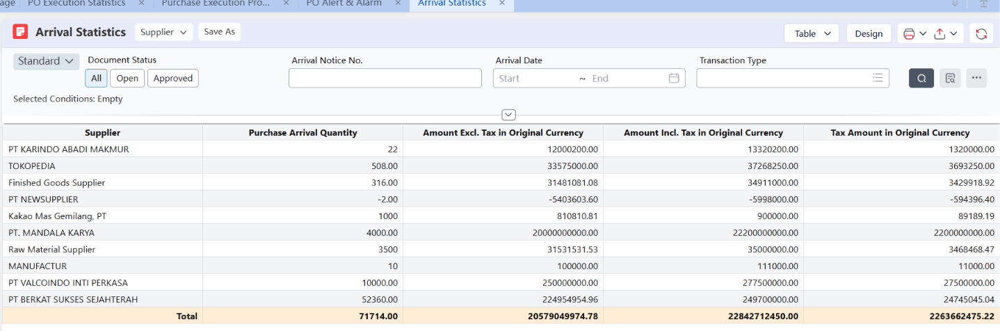

Laporan rekap barang yang sudah datang dalam periode tertentu. Dari supplier mana, material apa, biaya berapa.

### 34. 入库统计

- **Receipt Statistics**

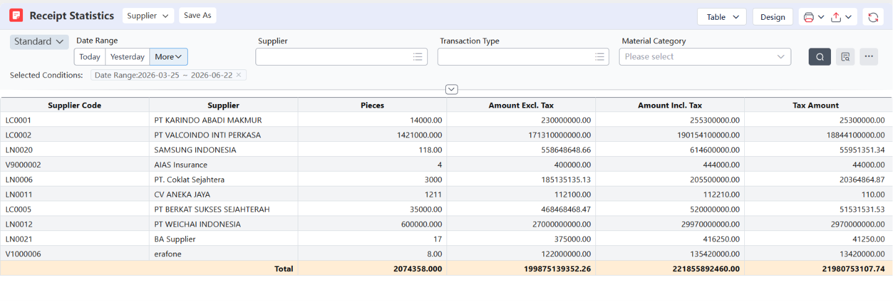

**Laporan rekap barang yang sudah masuk ke inventory.** Mirip Arrival Statistics tapi fokusnya ke barang yang sudah resmi masuk gudang.

### 35. 发票统计

- **Invoice Statistics**

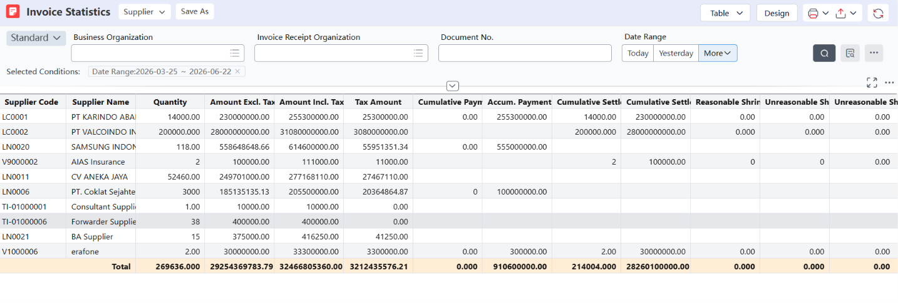

**Laporan rekap semua invoice dari supplier.** Berapa total tagihan, sudah dibayar berapa, masih outstanding berapa.

### 36. 采购结算余额表

- **Purchase Settlement Balance (PALING SERING DIPAKAI)**

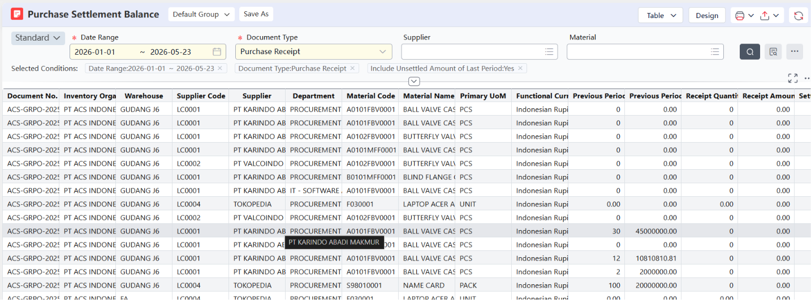

**Laporan saldo settlement purchasing** — menunjukkan transaksi mana yang sudah settled dan mana yang masih outstanding/belum selesai.

Note: settled = sudah terselesaikan (selesaikan pesanan)

### 37. 未完业务明细表

- **Outsourcing Settlement Balance Report**

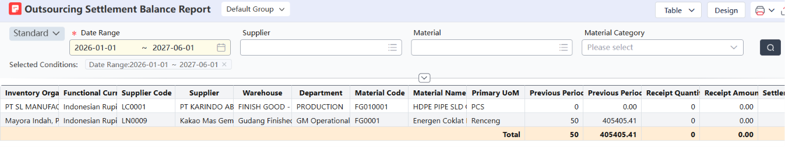

**Laporan detail transaksi yang belum selesai/completed.** Bisa berupa PO yang belum fully received, invoice yang belum dibayar, dll.

Note Tambahan:

1. PR → PO → Arrive Doc → Purchase Receipt → Purchase Invoice → Confirmation A/P → Payment
2. Settled ≠ Paid. Settled = dokumen sudah cocok dan selesai secara administratif di sistem. Paid = Pembayaran aktual (transfer uang) diproses terpisah di Finance/Treasury module.

## REPORT PALING SERING DIPAKAI

### 38. 采购订单执行统计表 (PALING SERING DIPAKAI)

- **Purchase Order Execution Statistics**

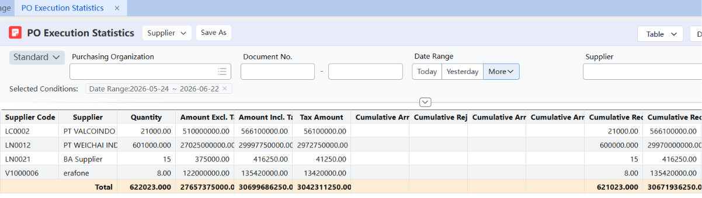

Laporan statistik eksekusi PO — Mengecek qty dan nominal yg pernah kita order dari berbagai supplier

### 39. Uncomplete Business Details (PALING SERING DIPAKAI)

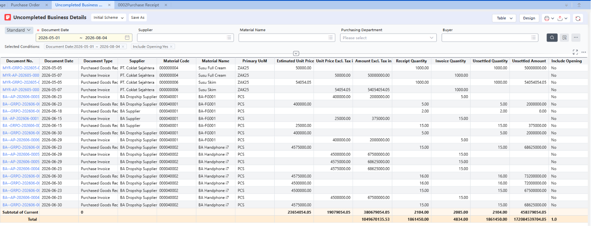

Track purchase yang belum settle, maka disini dibutuhkan untuk di-push ke purchase settlement

### 40. 采购执行进度表

- **Purchase Execution Progress Schedule**

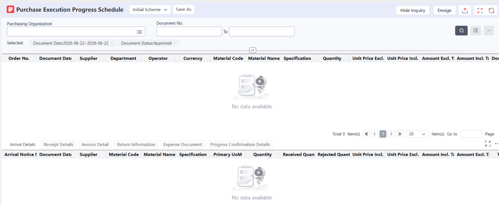

**Laporan progress detail per PO** — mirip PR Execution Progress tapi khusus untuk **PO.** Tracking dari PO sampai barang diterima.

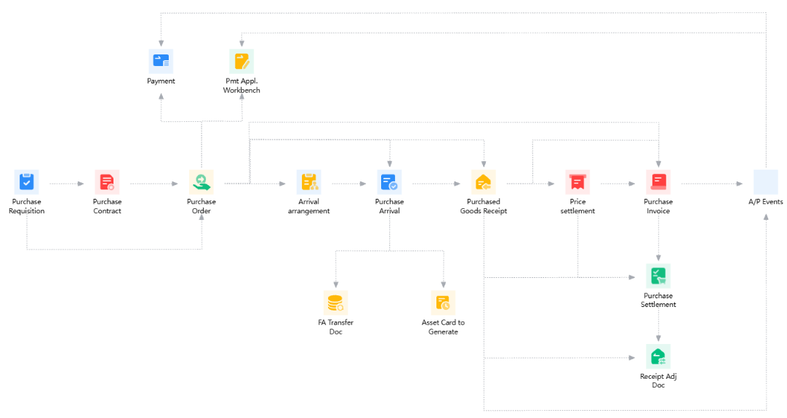

Note:

Selalu Approved – Push down. Service purchase pilih transaction type nya Service Purchase, setelah di approve langsung push ke Purchase Invoice tanpa goods receipt dll karna dia jasa bukan item.

Return receipt after return purchase order – return purchase invoice
