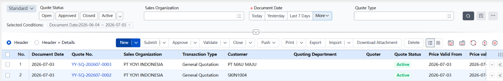
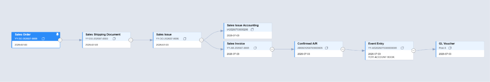
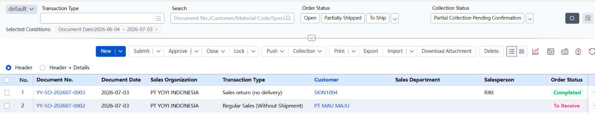
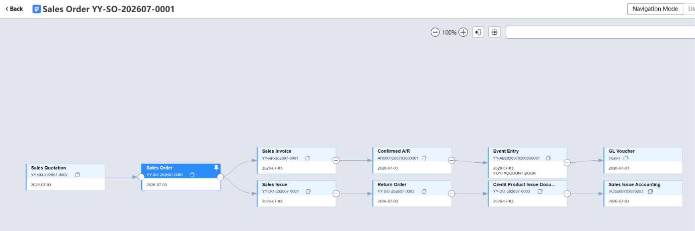
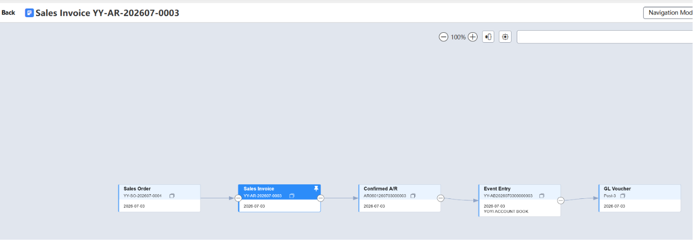
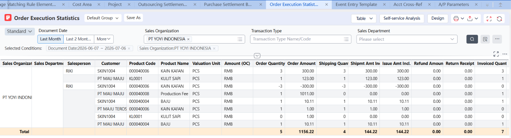
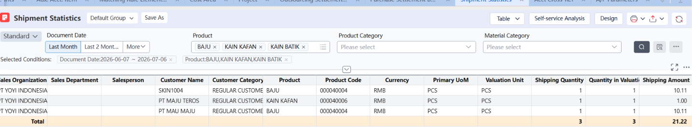

## Sales Basic

### 1. Sales Quatation

After approve sales quotation, kita harus lanjut validate, validate, after validate, kita bisa push down ke Sales Order. Setelah di Sales Order, customer juga sudah confirm, bisa ke tahap approval sales order dan hingga seterusnya

Note: Jika GL tidak terposting itu bisa saja bermasalah di bagian Cost Area, karna dari warehouse kita belum dimapping ke Cost Area, jadinya system bingung apa yang mau di posting

### 2. Sales Order

Core dari semuanya, dari sini kita bisa lihat sales order kita sudah ditahap mana. Kalau ada problem dll, bisa cek mulai dari sales order dan track Document Flow-nya.

### 3. Sales Return

Sales Return bisa mulai di-Generate dari Sales Order, pengisian harus minus, flow approval sama seperti Sales Order normal yang sampai ke tahapa Sales Invoice.

### 4. Sales Service

Sama seperti Sales Order biasanya, Cuma yang ini tidak perlu issue dan receipt, karna yang dijual  jasa. Untuk sales service langsung dimulai dari Sales Order, skip step Sales Quatation.

## Report

### 5. Order Execution Statistics

Ini laporan yang nge-track eksekusi Sales Order per baris produk — bandingin Order Quantity/Amount vs Shipment Quantity/Amount vs Invoiced Quantity, jadi kita bisa lihat progress satu SO dari order → kirim → invoice. Fungsinya: buat monitoring gap antara apa yang di-order, apa yang sudah dikirim, dan apa yang sudah di-invoice.

### 6. Shipment Statitstics

Ini laporan rekap pengiriman barang (Shipping Quantity & Shipping Amount) per produk, customer, dan sales org dalam periode tertentu. Fungsinya: buat lihat volume dan nilai barang yang sudah keluar gudang secara actual, dipecah per customer/produk — bisa jadi dasar cross-check ke Sales Invoice atau ke Cost Area/Inventory.
